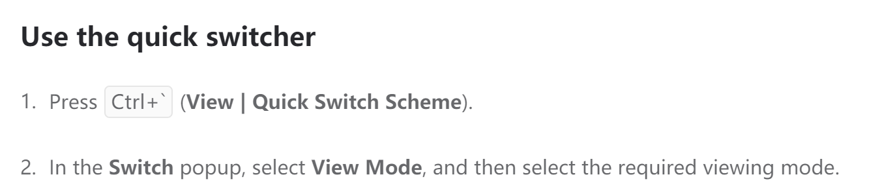
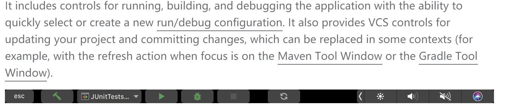
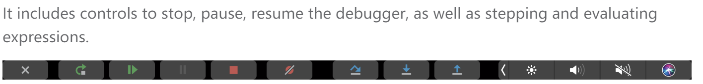

# idea

插件安装：**Settings/Preferences** dialog Ctrl+Alt+S under **Plugins**

观看模式：full screen /distract free/presentetion

帮助栏相应功能

在debug时帮助栏会变化

很多时候我只是想问，能否让孩子拥有自我驱动的积极学习方式，而非仅仅将沉重的期待背负在孩子身上，将他固化在家庭代际传递里那看似不可或缺实则微不足道的位置上