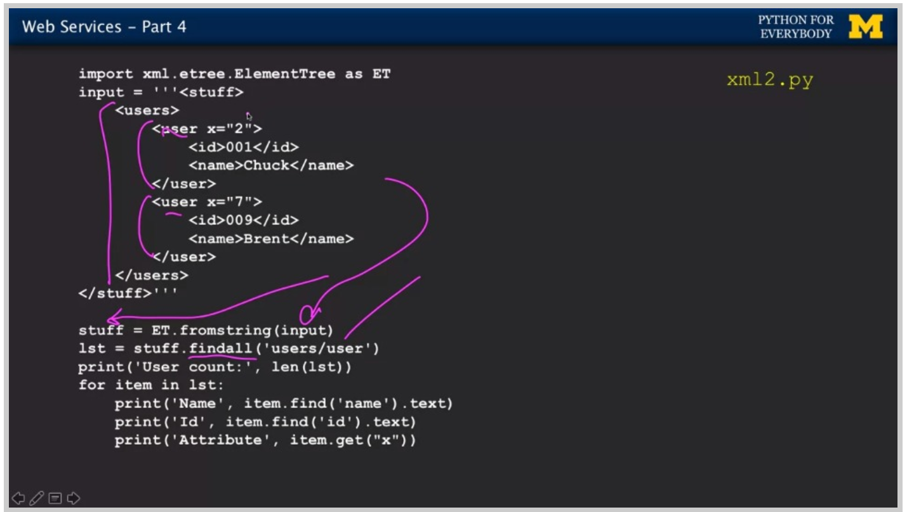

## regular expression

### 基本形式：

正则表达式的基本形式：

正则表达式的基本方法：

应用实例：

^表示的是在需要匹配的内容的开头，.表示的是任意字符，*表示的是出现任意次数，后面的：是正常字符必须要被匹配

\S表示的是任意除了空格之外的字符就可，+表示的是前面的字符需要出现大于等于一次

### 运用正则表达式提取数据：

[]中的内容表示为在这个范围中均可，后面的+号表示一个或多个，findall()方法是找出所有符合条件的项，最后用list的形式表示出来

#### greedy matching

一般来说正则表达式的提取方法为greedy match，即有满足条件的项时，用最多的可能满足的字符来确定那一项，如果加了？，则为non greedy match，即为最少的可能满足的字符

#### String extraction

正则表达式match了所有条件后，可以用()来选择想要提取的字符串

#### 取出寻找的字符周围的项：

使用两次split进行提取

正则表达式：

#### 表示正常字符：

如果有一些特殊字符有特殊含义，可以通过\来使其正常的match

## Network and sockets

### networked technology

在python中建立sockets

sockets首先在本地电脑中建立联系，然后再向服务器端发送请求，请求包括服务器区域和端口

TCP协议的端口，http为80

python的网络传输在于应用和传输两层，不涉及到底层

### HTTP

http，给服务器发送请求，从服务器接收信息如HTML,图片，文件等

#### http请求形式：

#### GET请求：

#### http的完整形式：

- program建立socket，类似于接口的形式，通过sockets和外部服务器连接
- 通过get和http的实际地址，将其encode获得信息
- 获得的信息再decode，最后呈现出来

### HTTP获取数据实例

可以从命令行来通过http获取数据

- 先建立telnet（一个不安全的传输请求），建立的方式是告诉其域名和端口
- 然后再输入HTTP的GET请求即可获得文件

也可以通过python文件进行获取：

直接命令行运行python文件即可

### Using the developer console to explore http

对于HTTP的GET请求，通过浏览器的console network查看相应的结果

HTTP请求显示：

- 200时为成功
- 404时为not found
- 302时为没有找到，但是会给一个跳转到正确页面的链接

对于GET返回的形式也有：HTML/TEXT/JPG等格式，浏览器会根据不同的格式进行展示

## Programs that surf the world

### Unicode characters and strings

#### String的ord()方法

对于string来说，其ord方法能够输出其ascii码

#### Unicode编码方式

unicode编码方式有多种，目前公认的编码方式是UTF-8，这种编码方式的长度是可变的，他有8位、16位、32位等，以八个为一个单元，然后确定这个unicode到底是几位，来进行表示，同时UTF-8能够和ASCII码兼容

#### Bytes and strings

对于Python中的string和bytes，是不相同的，bytes通过一个一个字节进行表示，str是acsii码和UTF-8，bytes通过decode()转化成string，string通过encode()转化成bytes

### Retriving web pages

#### urllib库

对于urilib库进行导入，同时将获取的bytes decode，然后对于string进行strip操作，即获取的一个string为一行

对于string进行split操作，使其分开成word，将word和其出现的频率制成一个数组，输出该数组

也可以获取html文件

### Pasing web pages

#### beatiful soup库

使用beatiful soup，对于获得的html形式进行解包，获取html相应标签中的内容

使用库说明 ；

- 将bs4解包放在该python文件相同目录下方便import
- beatiful soup解包后，对于相应的链接下的内容进行获取

### Summary

## Web services and XML

### Data on the web

主要为XML和json两种传输形式，XML是较为传统的传输形式，json为最近出现的传输形式

文件中的data strcuture能serialize成为XML和JSON，然后再deserialize进入另一个程序

### extensible markup language(XML)

#### XML基本格式：

XML标签为树状构成，倒数第二层节点后还有attribute和text作为其叶节点

#### XML相应概念

- tag为元素
- attribute为相应元素的性质

#### 日期格式：

### XML schema

#### XSD

- 通过XSD data type来规范XML的传输协议
- 确定XML相应elelment的中间文字内容的种类，如String/data等

- 可以通过XSD来确定XML文件中相应元素最多出现多少次和最少出现多少次

#### XSD数据结构

#### XML validation

### Parsing XML

使用ElementTree库对于XML进行解包

- 使用find方法找到相应元素，可以输出其text和再通过get方法获得其attribute

- 也可以通过findall方法找到所有的对应的元素，以list的形式返回，返回的相当于时XML的子树的序列，也是XML形式

- 可以直接寻找该元素的attribute，也可以在该元素中再寻找其余子元素，获得其子元素的text和attribute

  

## JSON  and the REST Architecture

### JavaScript Object Notation

json有两种基本格式，第一种为最外层为一个对象，第二种为最外层为多个对象组成的列表

### Service oriented approach

service oriented基本为用一种共通的数据传输模式进行交流，然后每一个部分完成一个特定的服务，最终组成一个完整的系统

### Geojson api

#### 基本格式

程序的基本逻辑为使用urllic库进行html的读取，然后用json进行分解

#### 具体代码实现

json.dumps(js,indent=4)方法：展现json的内容，同时每一行的缩进为4

