# 离散数学

### 第一章

主要概念：

### 第二章：逻辑

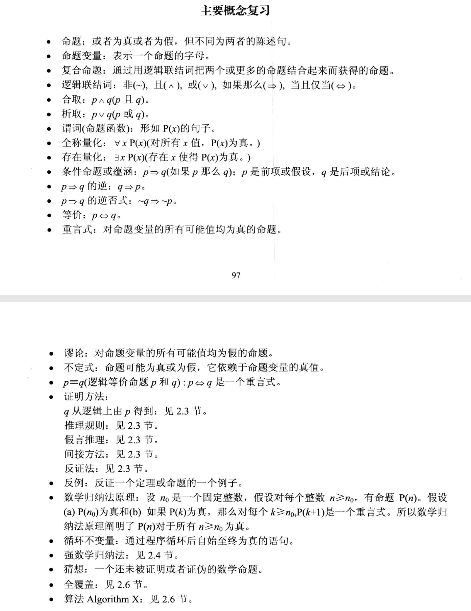

基本复习概念：p=>q真假性与~p∪q相同

### 第三章：计数

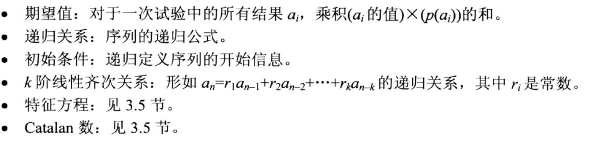

基本复习概念：排列组合；鸽巢原理（存在性证明）；概率；递归——特征根方程

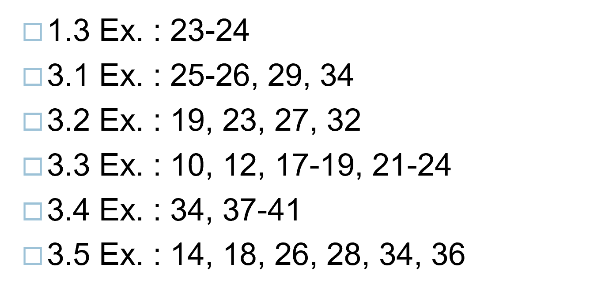

### 第四章：relation and direction

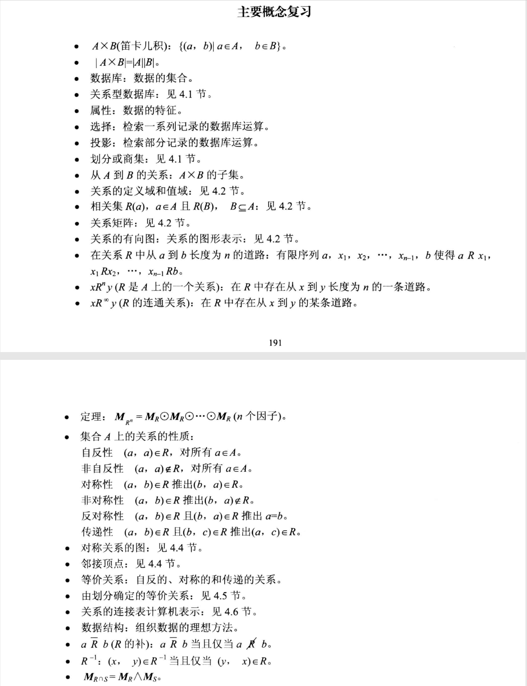

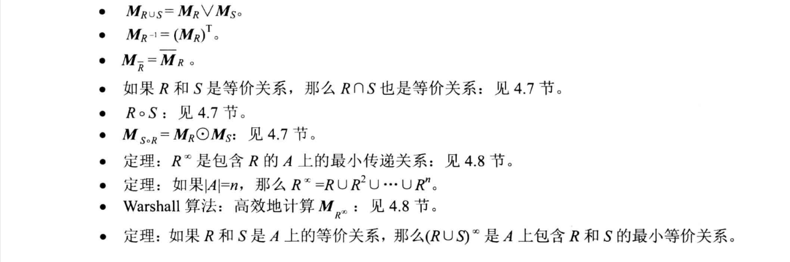对称关系的矩阵是：该矩阵的转置与该矩阵相等（双向通道）

非对称关系的矩阵是：Mij=0，则Mji=1；并且有Mii=0（单向通道，无环）

反对称关系的矩阵是：Mii=1或0，且Mij若i不等于j，则必有Mij=0或者Mji=0（单向通道，可能有环）

传递关系：当M平方包含M时，这个矩阵表示的关系就有传递关系

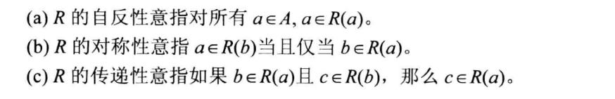

#### data structure of relations and graphs

1. 通过链表来表示的方式

   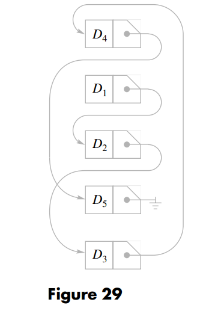

2. 通过二维矩阵表示（因为二维矩阵能够表示relation，因此能够表示关系的指向）

3. 通过两个数组来表示edge的指向——数组分别储存edge的头和尾，还有一个数组储存NEXT来表示edge的变化（类似于链表的地址位），也可以对每一个节点增加一个VERT数组，在VERT数组的相应索引下，储存了离开该节点的一个edge的标号（没有指向其他节点的节点的该VRET位为0），根据NEXT和VERT的配合，能够遍历完离开某一节点的所有edge

   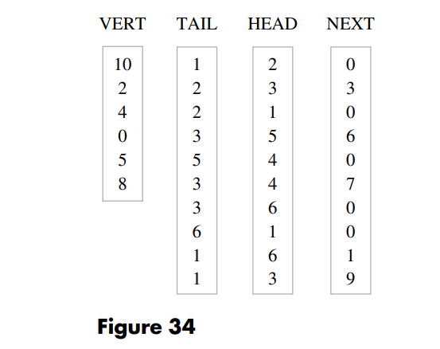

算法：

1. 判断是否具有传递性：（对于二维数组进行操作）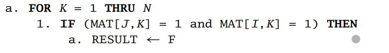

   算法复杂度：

   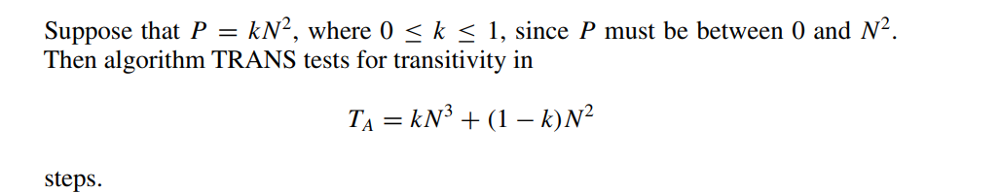

2. 在数组表示的方式中，添加edge的算法

   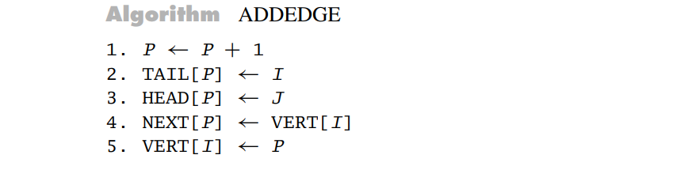

   （头和尾都增加，同时next也增加一位，将next的这一位指向vert[i]指向的那个edge，再将新增加的next赋给vert[i]）

3. 在数组表示的方法中，检测是否有transive性质的算法：

   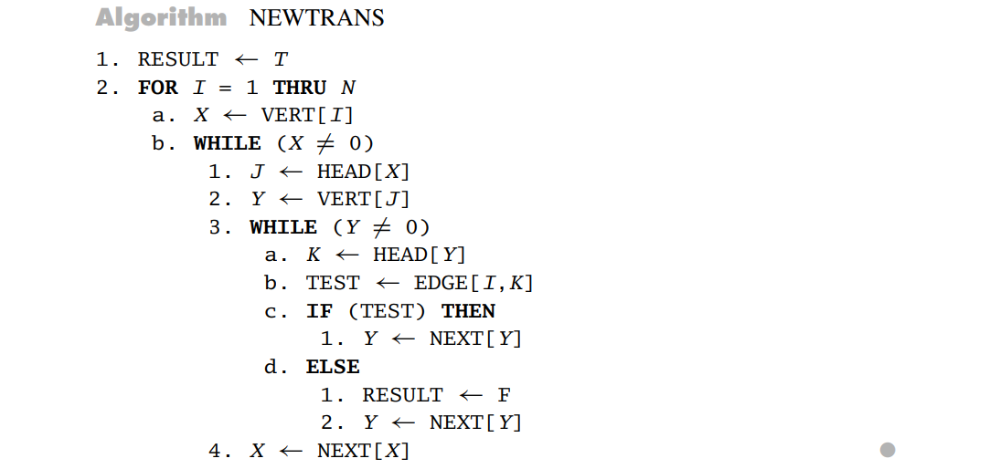

   当edge数量较多时，用二维数组比较好；当edge数量较少时，用多个数组较好

#### operations on relations

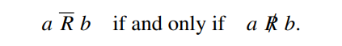

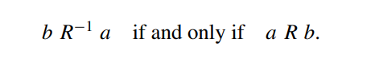

则：

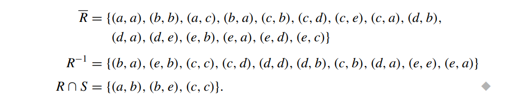

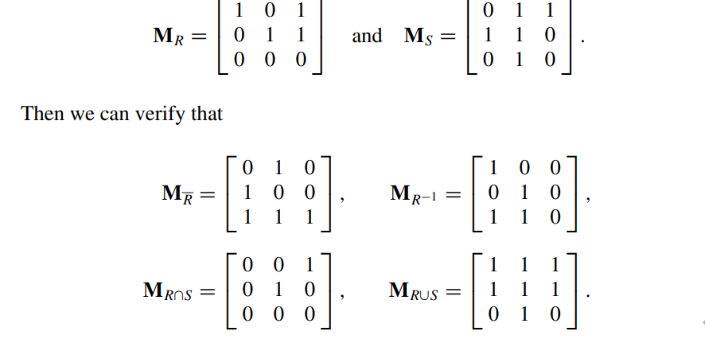

对于R和S的关系，有如下操作：

THEOREM 1

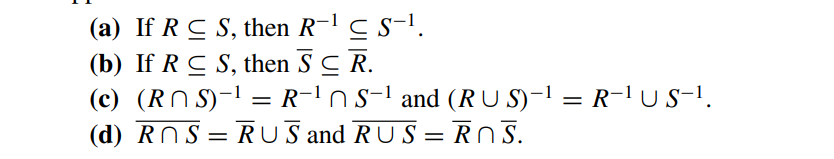

THEOREM 2

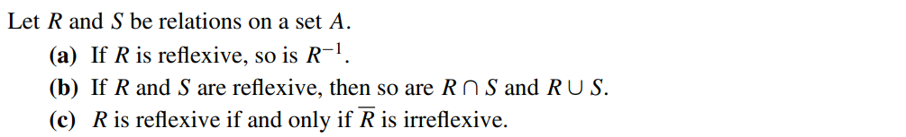

THEOREM 3

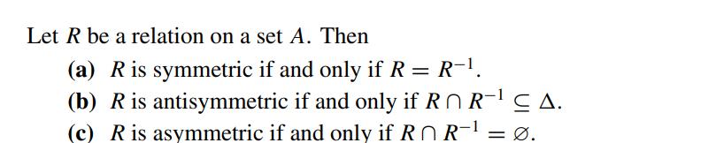

THEOREM 4

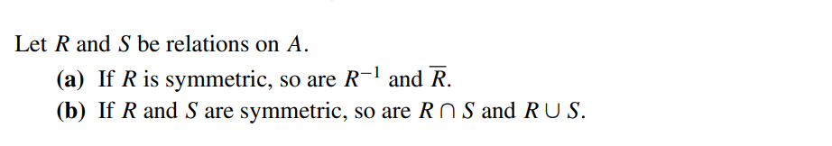

THEOREM 5

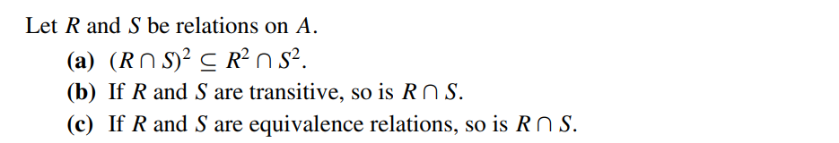

Composition

THEOREM 6

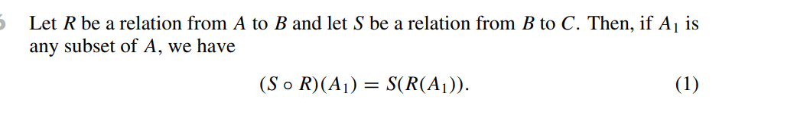

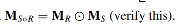

Closures：让R补充成满足自反性，对称性和传递性后补充的关系最少的一种R

THEOREM 7

矩阵乘法可交换

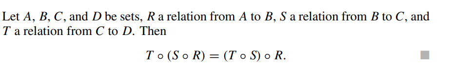

THEOREM 8

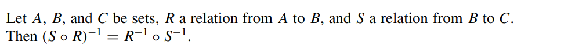

#### Transitive closure and Warshall's algorithm

##### Warshall algorithm

W算法即对于方向矩阵，从n=2开始不断扩展直到n=N，且扩展的方式从n-1到n时为Mn-1*Mn-1+Mn-1，最后直到扩展到N

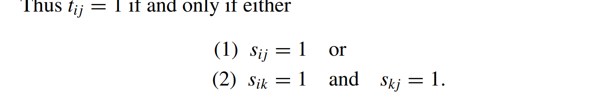

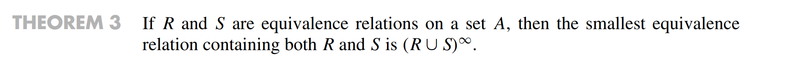

### 第五章：函数

#### functions

mappings transformations

labeled digraph:所有的节点和edge都有实际意义的有向图

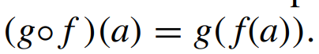

everywhere difined :定义域满

onto：值域满

one to one：一一对应，函数值不重复

invertible function：反函数

THEOREM 1

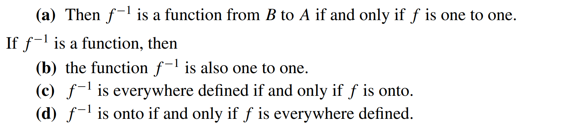

THEOREM 2

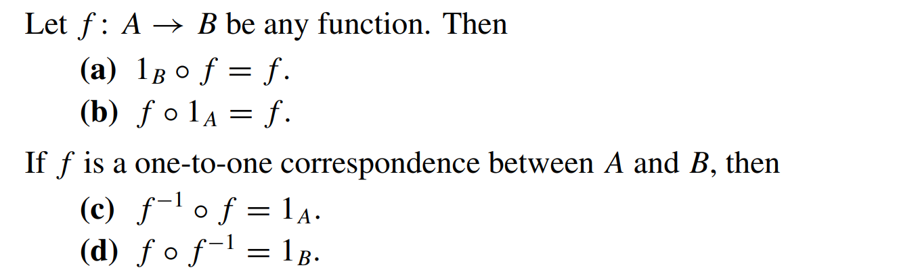

THEOREM 3

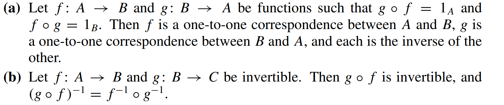

THEOREM 4

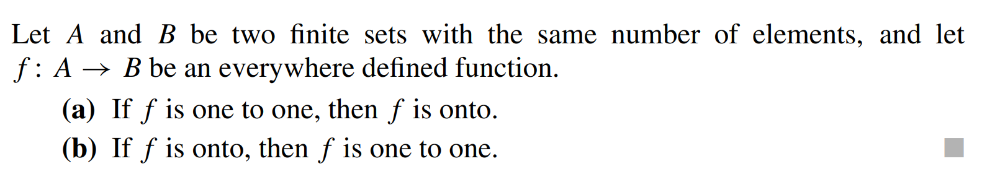

#### functions for computer secience

特征函数：

在cs中使用的函数主要有：

- 基本的对应函数
- 向上取整:ceiling function
- 向下取整：floor function 
- 幂函数 base 2 exponential function，对数函数
- Boolean fuction返回值是一个bolean类型

##### Hash function

创建一系列的链表，以及通过函数的对应方式决定新加入的元素应该添加到哪个链表上，同时这个函数也能够决定在哪个链表上搜索想要的元素

- hash function的基本原理是，将元素储存在链表后，控制每个链表的大小相同，所以一般通过取模的方式来决定元素在哪个链表中（模相同的结果在同一个链表）
- 如果又出现了一个元素，且此时链表的元素已经满了，需要一个解决collision的方式，基本的解决collision的方式有：在该链表后强制加入现在的元素/将key分成几个部分之后再储存

##### Fuzzy Set

比较模糊的函数表示方式，往往表示一个范围，如0<f(x)<1，则此时f为一定程度的关于x的fuzzy函数

- fuzzy函数会定义两个最值，然后在中间的值通过x-min/(max-min)来定义其程度
- 定义程度的函数可以改变

##### Fuzzy Set Operations

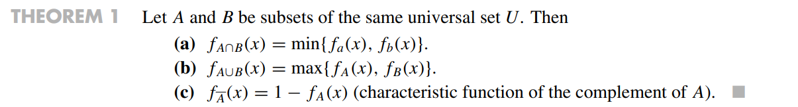

#### Growth of functions 

大O表示法：O(f)即为增长速度大于O(f)的，一般去找最小的关于f的大O表示

same order:同阶，O(f)=g,O(g)=f,同时有lower order  /higher order

 big-theta ：同阶，即增长速度相同

关于增长速度的判定：

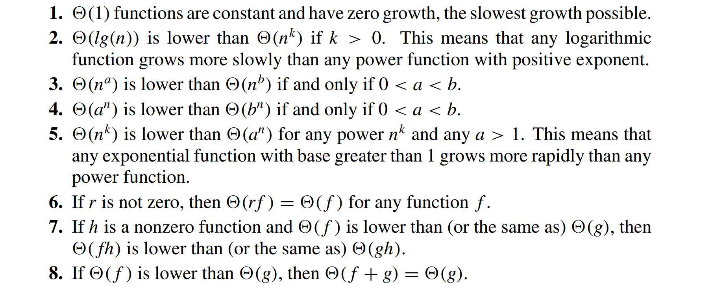

#### permutation function

permutation：对于自身的映射，这种映射是对每个自身的元素进行一个映射，是一个一一对应关系

两个permutation的结合也是一个permutation

THEOREM 1

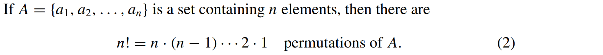

同时cycle permutation拥有的元素相同时，其对应关系与顺序无关

当两个cycle permutation都属于同一个集合且两个cycle permutation没有公共交集元素时，被称为是disjiont

THEOREM 2

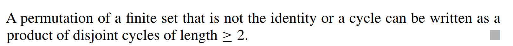

transposotion：长度为2的cycle

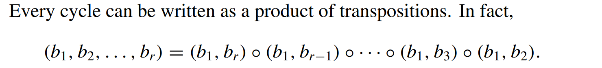

Corollary 1

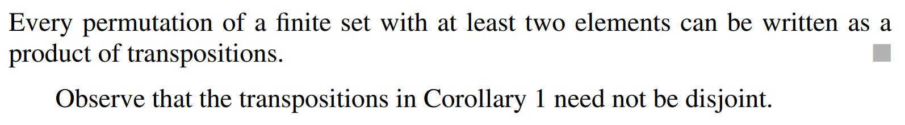

THEOREM 3

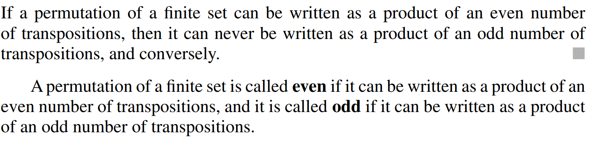

THEOREM 4

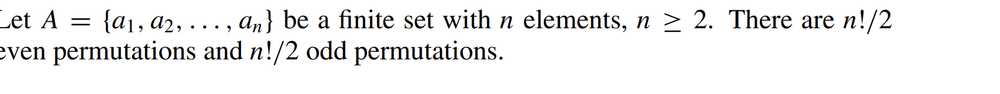