# 离散数学

### 第一章

主要概念：

### 第二章：逻辑

基本复习概念：p=>q真假性与~p∪q相同

### 第三章：计数

基本复习概念：排列组合；鸽巢原理（存在性证明）；概率；递归——特征根方程

### 第四章：relation and direction

对称关系的矩阵是：该矩阵的转置与该矩阵相等（双向通道）

非对称关系的矩阵是：Mij=0，则Mji=1；并且有Mii=0（单向通道，无环）

反对称关系的矩阵是：Mii=1或0，且Mij若i不等于j，则必有Mij=0或者Mji=0（单向通道，可能有环）

传递关系：当M平方包含M时，这个矩阵表示的关系就有传递关系

#### data structure of relations and graphs

1. 通过链表来表示的方式

   

2. 通过二维矩阵表示（因为二维矩阵能够表示relation，因此能够表示关系的指向）

3. 通过两个数组来表示edge的指向——数组分别储存edge的头和尾，还有一个数组储存NEXT来表示edge的变化（类似于链表的地址位），也可以对每一个节点增加一个VERT数组，在VERT数组的相应索引下，储存了离开该节点的一个edge的标号（没有指向其他节点的节点的该VRET位为0），根据NEXT和VERT的配合，能够遍历完离开某一节点的所有edge

   

算法：

1. 判断是否具有传递性：（对于二维数组进行操作）

   算法复杂度：

   

2. 在数组表示的方式中，添加edge的算法

   

   （头和尾都增加，同时next也增加一位，将next的这一位指向vert[i]指向的那个edge，再将新增加的next赋给vert[i]）

3. 在数组表示的方法中，检测是否有transive性质的算法：

   

   当edge数量较多时，用二维数组比较好；当edge数量较少时，用多个数组较好

#### operations on relations

则：

对于R和S的关系，有如下操作：

THEOREM 1

THEOREM 2

THEOREM 3

THEOREM 4

THEOREM 5

Composition

THEOREM 6

Closures：让R补充成满足自反性，对称性和传递性后补充的关系最少的一种R

THEOREM 7

矩阵乘法可交换

THEOREM 8

#### Transitive closure and Warshall's algorithm

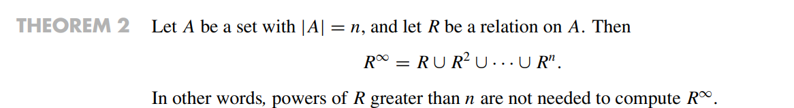

##### Warshall algorithm

W算法即对于方向矩阵，从n=2开始不断扩展直到n=N，且扩展的方式从n-1到n时为Mn-1*Mn-1+Mn-1，最后直到扩展到N

### 第五章：函数

#### functions

mappings transformations

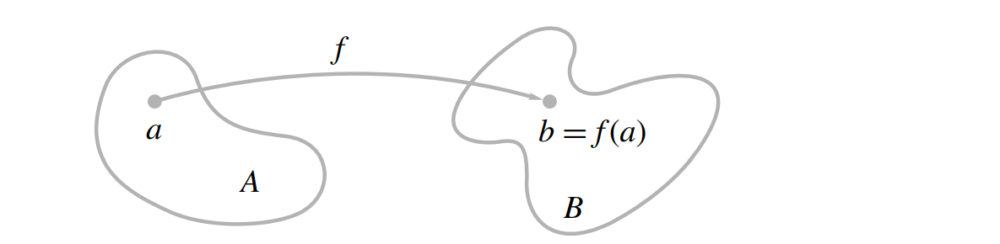

labeled digraph:所有的节点和edge都有实际意义的有向图

everywhere difined :定义域满

onto：值域满

one to one：一一对应，函数值不重复

invertible function：反函数

THEOREM 1

THEOREM 2

THEOREM 3

THEOREM 4

#### functions for computer secience

特征函数：

在cs中使用的函数主要有：

- 基本的对应函数
- 向上取整:ceiling function
- 向下取整：floor function 
- 幂函数 base 2 exponential function，对数函数
- Boolean fuction返回值是一个bolean类型

##### Hash function

创建一系列的链表，以及通过函数的对应方式决定新加入的元素应该添加到哪个链表上，同时这个函数也能够决定在哪个链表上搜索想要的元素

- hash function的基本原理是，将元素储存在链表后，控制每个链表的大小相同，所以一般通过取模的方式来决定元素在哪个链表中（模相同的结果在同一个链表）
- 如果又出现了一个元素，且此时链表的元素已经满了，需要一个解决collision的方式，基本的解决collision的方式有：在该链表后强制加入现在的元素/将key分成几个部分之后再储存

##### Fuzzy Set

比较模糊的函数表示方式，往往表示一个范围，如0<f(x)<1，则此时f为一定程度的关于x的fuzzy函数

- fuzzy函数会定义两个最值，然后在中间的值通过x-min/(max-min)来定义其程度
- 定义程度的函数可以改变

##### Fuzzy Set Operations

#### Growth of functions 

大O表示法：O(f)即为增长速度大于O(f)的，一般去找最小的关于f的大O表示

same order:同阶，O(f)=g,O(g)=f,同时有lower order  /higher order

 big-theta ：同阶，即增长速度相同

关于增长速度的判定：

#### permutation function

permutation：对于自身的映射，这种映射是对每个自身的元素进行一个映射，是一个一一对应关系

两个permutation的结合也是一个permutation

THEOREM 1

同时cycle permutation拥有的元素相同时，其对应关系与顺序无关

当两个cycle permutation都属于同一个集合且两个cycle permutation没有公共交集元素时，被称为是disjiont

THEOREM 2

transposotion：长度为2的cycle

Corollary 1

THEOREM 3

THEOREM 4

### 第六章：Order Relations and Structures

#### partially ordered sets

##### partial order:

对于集合A的关系R,如果R是reflective antisymmetrick transitive的时候，则称其为partial order

poset：集合A

eg:

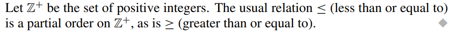

dual: poset(A,R-1)是poset(A,R)的dual，R-1是R的dual

comparable：当A,B能够用一种方式中，则A，B是comparable的

- 在一个poset中，不是所有的元素都能够被比较，如果所有的元素都能被比较，则被称为linear ordered set

THEOREM 1

##### lexicographic：

- 先判断a，当a相等时，再判断b

- 对于多维的lexicographic有：

- 也称为dictionary list，其顺序和字典很相似，且有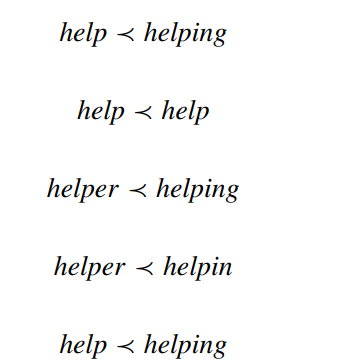，即长度小也满足该关系

THEOREM 2

除了自反之外，没有其他的环（因为有偏序作用）

hasse diagram:简化后没有方向的关系图，如下图5（简化的过程为将指向图中有串联性的多余箭头去掉）

- 对于一个poset的hasse diagram H，其dual poset的hasse diagram是颠倒过来的H

##### Topological sorting

对于一个partial order，将其表示成线性的序列成为topological sorting

##### isomorphism

一个partial order到另一个partial order的一一对应映射

- 两个isomorphic 的posets有一样的hasse diagram
- 对于任意一个hasse diagram图，当图中所有的a被f(a)所替代后，仍然是个hasse diagram

#### Extremal elements of partially ordered sets

THEOREM 1

通过最小元素来判断拓扑排序的算法：

THEOREM 2

great element——unit element

least element——zero element

upper bound：一个元素是一个集合的上界，least upper bound：最小上届

lower bound ：一个元素是一个集合的下届，grateset lower bound：最大下届

THEOREM 3

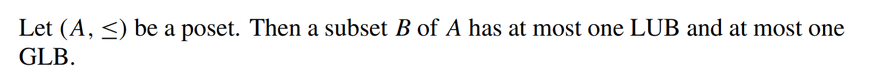

THEOREM 4

即A和isomorphic的A‘的上界下界有一一对应关系

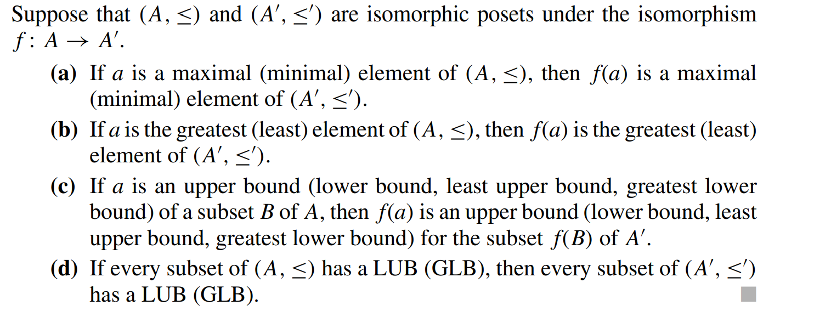

#### Lattices

定义：一个每两个元素组成的子集都拥有一个最小上界和一个最大下届的poset

jion: LUB({a, b}) ，用a ∨ b表示

meet:GLB({a, b})，用 a ∧ b表示

（两个元素有明确的上界和下届或者两个元素可以比较）

THEOREM 1

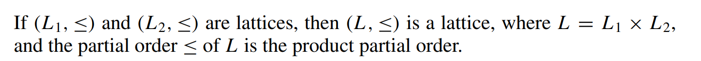

- 对于一个lattices的子集，其子集可能是lattices，也可能不是

##### isomorphic lattices：

就是对应关系后的lattice

##### properties:

THEOREM 2

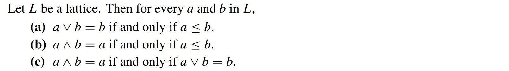

THEOREM 3

THEOREM 4

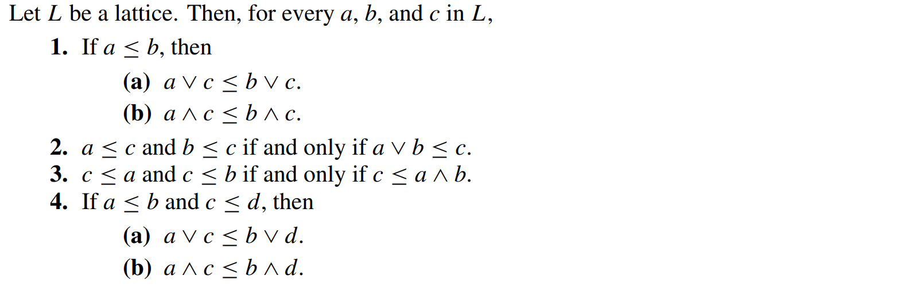

##### bounded

当一个lattices既含有最大元素也含有最小元素时，被称为bounded

THEOREM 5

同时lattices可能有distributed 的性质

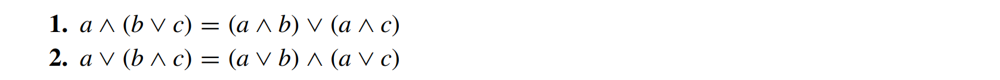

THEOREM 6

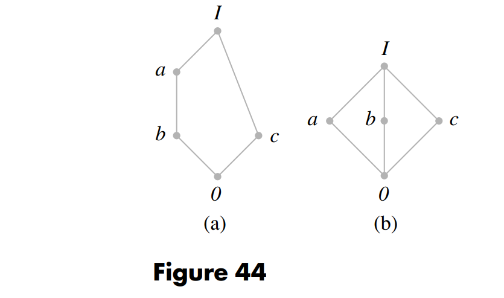

即如果一个lattice的hasse图的映射是上图两种映射中的一种，则是不distrubuted的

THEOREM 7

 Dn：定义为由可除性形成的lattice

#### Finite Boolean Algebras

THEOREM 1

理论的本质在于：集合的属于关系所形成的lattice只和集合的元素数量和集合之间元素的属于关系有关，和集合里面元素的本质无关

这样的集合形成的哈希图称为Bn，Bn的节点数量一定为2n

与Bn能够对应的lattice称为Boolean Algebra

THEOREM 2

如果n是几个不同的素数的乘积，那么Dn是Boolean algebra

THEOREM 3 substitution rule for boolean algebras

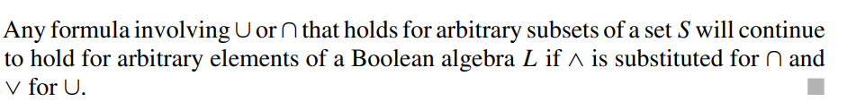

因此有：

THEOREM 4

#### Boolean polynomial

=>用boolean多项式来形成逻辑电路

gate: x ∧ y   inverter： x'

逻辑电路的表示

#### Circuit design

通过boolean函数的特性设置电路

THEOREM 1

THEOREM 2

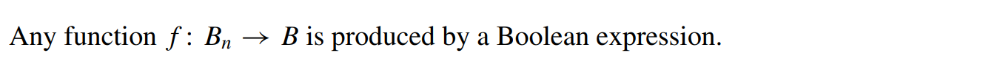

##### Karnaugh map 

x为0的项用x'表示，为1的项为x表示，y相同，矩阵的值为f的值

对于B3进行三维分析：

当f可知时，其三维表示为：

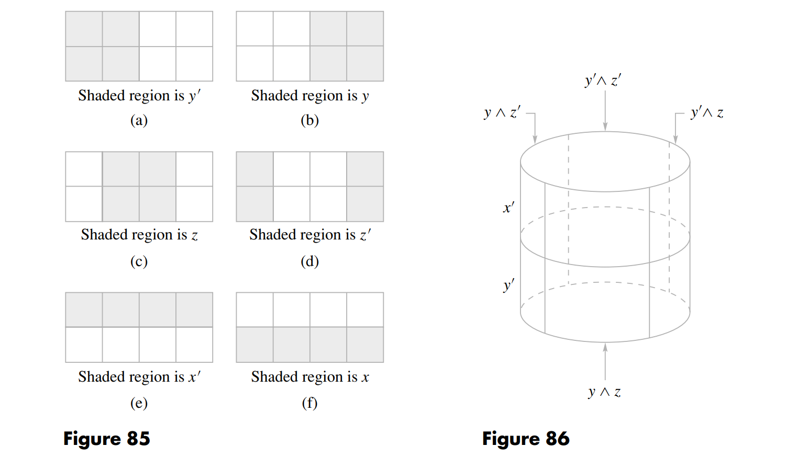

同理，四维如图所示：

##### minterm

通过最小的组成元素所表达出来的布尔代数，如

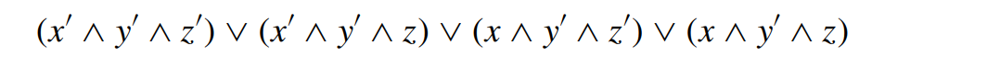

#### Review

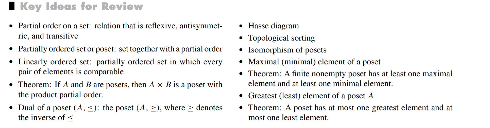

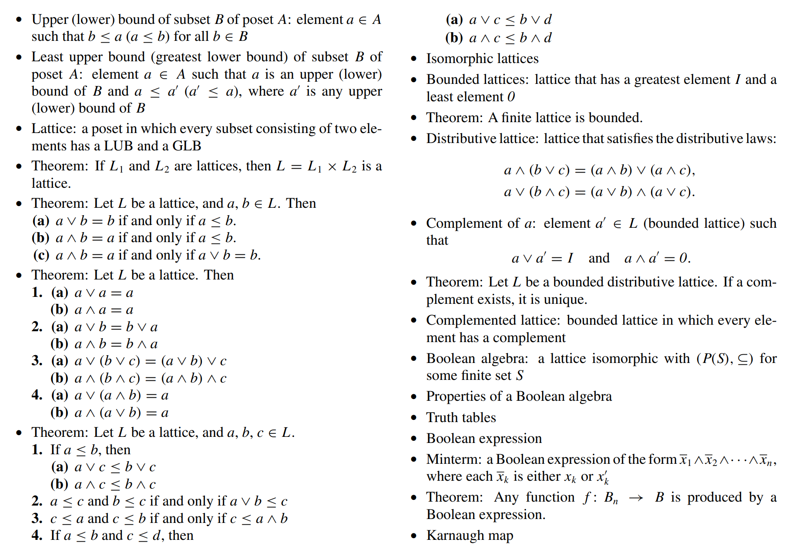

### 第七章：树

#### Trees

定义：一棵树中有一个节点，这个节点到任意其他节点都有路径，但这些节点都不能到这个根节点

父节点：parent

子节点：offspring 

兄弟节点：siblings

叶节点：leaves 

THEOREM 2

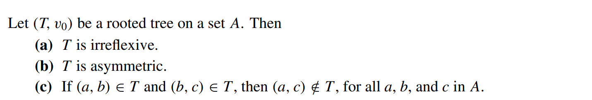

对于一个树，除了它的叶节点，其他的所有节点都含有n个子节点，则被称为complete n trees

THEOREM 3

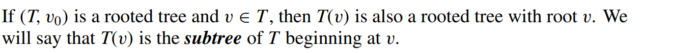

