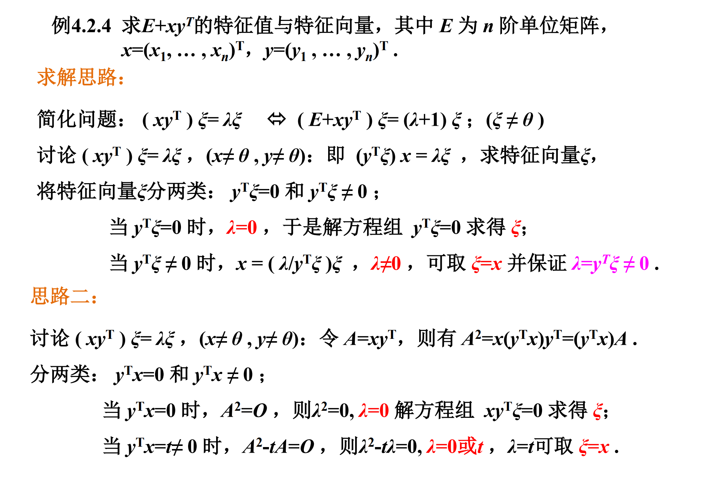

## 行列式

### n阶行列式

2阶行列式：ad-bc

3阶行列式：

- 高阶行列式不能用对角线法则计算

- 行列式可用于计算方程的解

行列式余子式概念：行列式中除去该元素所在的行和所在的列剩下的部分

#### 上三角行列式和下三角行列式：

对角线以下/以上全为0的行列式

#### 对角行列式：

只有对角才有具体值的行列式

- 上三角行列式，下三角行列式，对角行列式的值全为对角的值的乘积

#### 转置行列式：

行列式行与列交换后的行列式

- AT=A,则有aij=aji
- 行列式与它转置行列式的值相等

### 行列式性质

1. 行列式与它转置行列式的值相等

2. 行列式交换两行（列）i,j之后，符号变为其（-1）i-j

   - 两行（列）相等的行列式值为0
   - 行列式可以按任意一行（列）展开
   - 行列式对应两行成比例，行列式为0

3. 

4. 行列式任意一行（列）的公因子可以提到行列式外面

5. 行列式某一行（列）的所有数都可以表示成两列之和，则行列式也可以表示成两行列式之和

   

6. 将行列式任意一行乘k加到另一行（列）上去，行列式值不变

7. 

8. 

### 克莱姆法则

### 行列式计算方法：

1. 注意使用行列式的减法（或者乘k再减）,来消去行列式中的值

   

2. 把行或列全部加到同一行/把行或者列的部分行加起来

   

3. 化成三角形再展开

   

4. 递推式最终从D1推到Dn

   

5. 将行列式分为两个或多个行列式进行计算

   

## 矩阵

### 矩阵的定义和运算

#### 矩阵的基本概念：

向量：可以认为是只有一行或者一列的矩阵

零矩阵和零向量：

对角矩阵：只有对角线上有非零值的矩阵，通常记做diag(a1,a2,a3,a4...)

转置矩阵：将行与列互换之后的矩阵

- 行列式只有方阵才有

#### 矩阵的运算：

矩阵的运算有两种

- 矩阵的初等变换

- 矩阵的算术运算

  - 加法运算：同类型的矩阵才能进行加法

  - 数乘运算

  - 乘法运算（有结合律，分配率，没有交换律），有|A||B|=|AB|

    

    

    左乘对角矩阵为行作用，右乘对角矩阵为列作用

    矩阵乘法也没有消去率：

    

矩阵的多项式：

- 对于一元的矩阵多项式，有f(a)g(a)=g(a)f(a)的交换律
- 
- 

### 分块矩阵

### 相似矩阵

### 求特征值和特征变量

相似矩阵有着相同的迹和相等的行列式

### 正交矩阵

向量内积：向量点乘

向量正交：向量内积为0

向量组正交：两个向量组之间所有的行向量两两分别正交，正交向量组必线性无关

#### 施密特正交化

线性无关向量组可以构成等价的正交向量组，且正交向量组是线性无关组的线性表示

施密特正交化：先正交化，再单位化

正交矩阵：ATA=E

- 若A，B均为正交矩阵，则AB也为正交矩阵

#### 实对称矩阵的对角化：

实对称矩阵：AT=A

- 实对称的特征值均为实数
- 实对称矩阵属于不同特征值的特征向量相互正交
- 若A是实对称矩阵，存在同阶的对角矩阵P使得PTAP为实对角矩阵

求实对称矩阵的基本方式：

1. 解特征值
2. 求特征向量
3. 特征向量单位化

向量正交：内积为0

向量夹角：正常方法计算的向量夹角

正交向量：两个向量组之间的行向量两两分别正交

