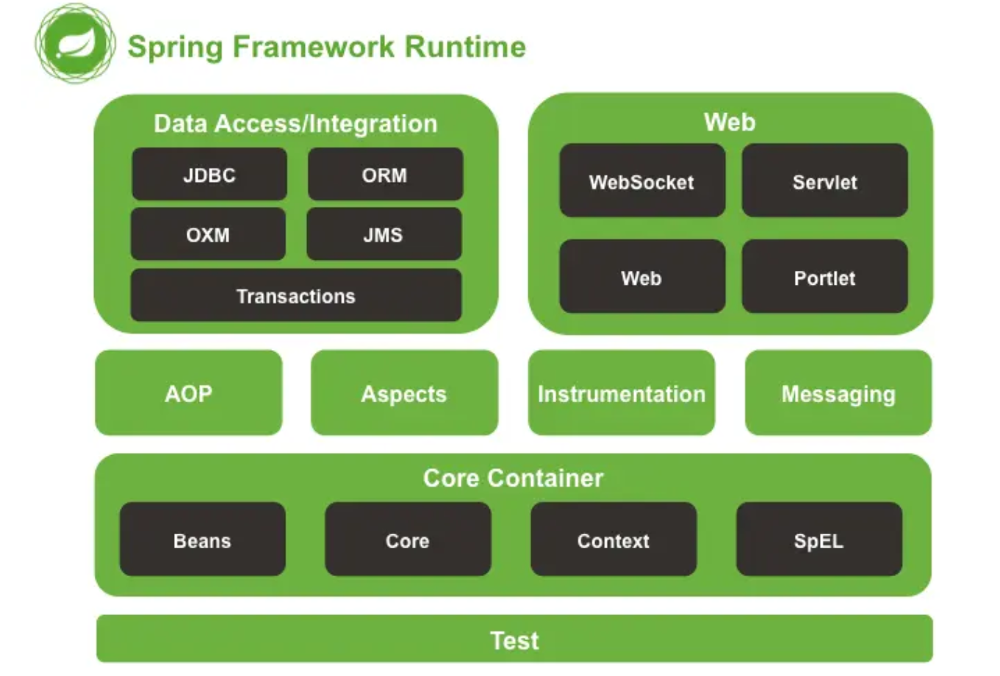
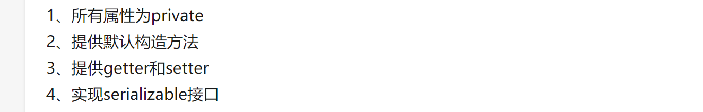

spring

why spring

- AOP

  AOP（行为抽离）

  将共同的行为提取出来，针对行为本身进行编程，这些行为做成各个模块进行依赖注入（OOP是针对动作执行的一个角色进行编程）

  在spring中隔离各个业务部分

- IOC

  IOC反向控制：（对象的关系）

  早期的java是通过对象引用的形式来进行依赖的注入，耦合度过高，

  不是对象从容器中查找依赖，而是容器在对象初始化时不等对象请求就主动将依赖传递给它

  依赖关系由spring来控制

- 三方无缝集成（一些其他的框架类似于hibernate、 Jakarta Struts）

to what 

- 解耦合
- 声明式事务

架构结构、组成

本质是处理对象之间的关系

把对象包装在bean中，通过对bean进行关系的处理（Bean factory）——IOC模式

对象关系的导入可以直接通过配置文件

模块除了自身的功能之外还有其余的功能实现，这些功能的相同部分=>做成模块来进行依赖的注入，因此形成了较低的耦合度=>面向切面

Spring Core（核心容器）：

核心容器提供 Spring 框架的基本功能。核心容器的主要组件是 BeanFactory，它是工厂模式的实现。BeanFactory 使用控制反转 （IOC） 模式将应用程序的配置和依赖性规范与实际的应用程序代码分开。

Spring Context（上下文）：

Spring 上下文是一个配置文件(java/XML/注解？)，向 Spring 框架提供上下文信息。Spring 上下文包括企业服务，例如：JNDI、EJB、电子邮件、国际化、校验和调度功能。

Spring AOP：

通过配置管理特性，Spring AOP 模块直接将面向切面的编程功能集成到了 Spring 框架中。所以，可以很容易地使 Spring 框架管理的任何对象支持 AOP。Spring AOP 模块为基于 Spring 的应用程序中的对象提供了事务管理服务。通过使用 Spring AOP，不用依赖 EJB 组件，就可以将声明性事务管理集成到应用程序中。

Spring DAO：

JDBC DAO 抽象层提供了有意义的异常层次结构，可用该结构来管理异常处理和不同数据库供应商抛出的错误消息。异常层次结构简化了错误处理，并且极大地降低了需要编写的异常代码数量（例如打开和关闭连接）。Spring DAO 的面向 JDBC 的异常遵从通用的 DAO 异常层次结构。

Spring ORM：

Spring 框架插入了若干个 ORM 框架，从而提供了 ORM 的对象关系工具，其中包括 JDO、Hibernate 和 iBatis SQL Map。所有这些都遵从 Spring 的通用事务和 DAO 异常层次结构。

Spring Web 模块：

Web 上下文模块建立在应用程序上下文模块之上，为基于 Web 的应用程序提供了上下文。所以，Spring 框架支持与 Jakarta Struts 的集成。Web 模块还简化了处理多部分请求以及将请求参数绑定到域对象的工作。

Spring MVC 框架：

MVC 框架是一个全功能的构建 Web 应用程序的 MVC 实现。通过策略接口，MVC 框架变成为高度可配置的，MVC 容纳了大量视图技术，其中包括 JSP、Velocity、Tiles、iText 和 POI。

模块除了自身的功能之外还有其余的功能实现，这些功能的相同部分=>做成模块来进行依赖的注入，因此形成了较低的耦合度=>面向切面

（eg:人物没有加血功能，但是设定一个门，门有一个功能为这个人物走过了这个门，就能加300点血）

java bean

BeanFactory 接口，它是工厂设计模式的实现，允许通过名称创建和检索对象。BeanFactory 也可以管理对象之间的关系

