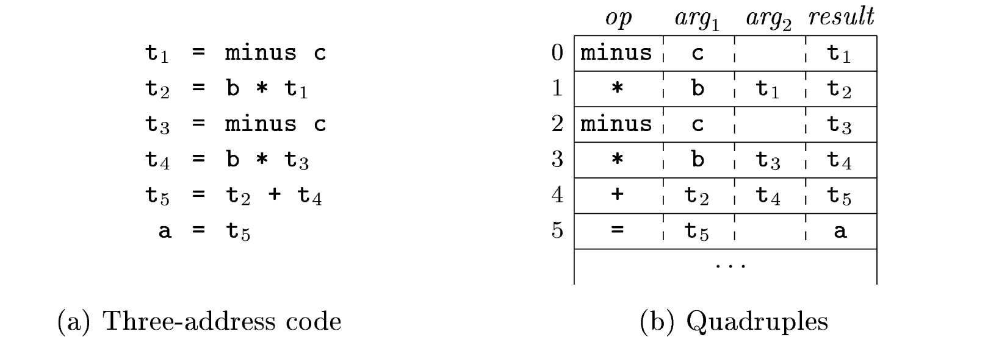
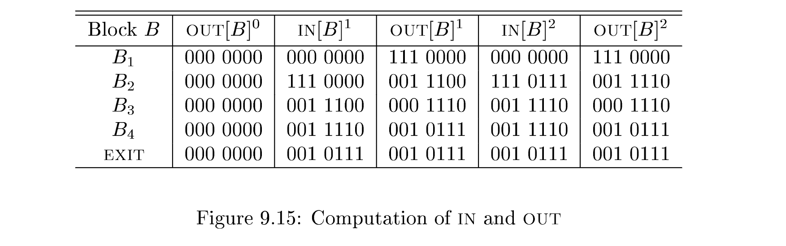

### Three address code

在等式左边最多只能有一个operator

#### Address and instructions

address的可能形式：

- a name 
- a constant
- a compiler-generated temporary

三地址操作的形式：

- x=y op z

- x=op y 形式转换

- x=y copy

- 跳转：go to L

- 有条件跳转：if x goto L and ifFalse x goto L

- 有条件跳转： if x relop y goto L（条件中有两个地址符）

- 过程的调用和嵌套：

  

  n记录在call p,n中的实际参数，因为调用可以是嵌套的

- indexed copy instrcutions :x = y[i] and x[i] = y

- 对于指针的处理：x = & y, x = * y, and * x = y

对程序段指定标签的方式：

指令的三种实现形式

#### Quadruples

有四个组成部分：op,arg1,arg2,andresult

特殊规则：

表示方法：

#### triples

三个组成部分：op,arg1,andarg2

其结果提交到position(0)，其在编译过程中得到的结果在triple的结构中自动排列

在quadruples中移动一条指令影响不大，但是在triple中移动一条指令时，因为存储位置的变化而且args来源是由存储位置决定的，因此影响比较大

triple的非直接表示法：（感觉很直接啊？）

#### Static single-assignment form

使用独立下标的模式来进行表示：

使用-function来对不同的控制流的结果进行返回（返回对应的控制流的结果）

### Basic blocks and flow graphs

将立即码分成basic blocks——最大的有顺序的三地址码

- 流的控制只能在每个basic block开始的时候进入，其中不能有跳转
- 在离开block的时候不能暂停或者分支（在block指令的最后有可能）

#### basic blocks

leader为一个basic blocks的第一行

1. 三地址码的第一条为一个leader
2. 跳转的target指令为一个leader
3. 紧接着跳转指令的指令为一个leader

通过对于leader的定义，将程序分为了不同的basic blocks

如图，一条指令可能为多个block的leader

#### Next-use information

对于一个i版块后用的j版块，i版块中计算出的变量x被j版块使用，此时称x is live at statement i

如何确定一个变量是否是live的以及接下来的使用信息：

1. 对于一个模块B，扫描其后面的声明，如果在i中遇见了B中的变量，则对其进行联系
2. 对于x=y+z，将x设置成没有联系（x没有被使用），将y,z设置成有联系，并且在“i:x=y+z”中有联系

#### flow graphs

当版块B和C之间有edge时，则应有

- B的跳转指向C
- C在原来的顺序中紧跟在B的后面，且B不是以无条件跳转结尾

对于添加的entry和exit节点，entry节点和整个程序的第一条指令有edge，exit和最后一个版块的结尾指令有edge

如图：

#### Loops

对于一个flow中的循环，如果L包含一个e :loop entry

- 除了e之外，在循环之中没有其他项是对外界的出口
- 所有在L中的节点没有空路径，全都在L中，最后经过e

### The principal sources of optimization

#### cause of redandency

在一些高级的数据结构诸如二维矩阵Aij中，编译器在访问时常常会造成多余的访问，因此需要编译器自行进行优化

#### A running example：quicksort

c代码：

汇编语言代码：

对于每次数组的访问，在汇编语言中都要进行一次乘法和一次数组提交访问，因此造成访问时间过长

#### Semantics-Preserving Transformations

基本的形式：

- Common-subexpression elimination
-  copy propagation
-  dead-code elimination
-  constant folding

#### Global Common Subexpression

在一个程序中，对于数组的访问需要进行一个乘法和一个数组访问提交

local common subexpression是当一个块中重复出现数组索引，进行一次计算即可

global common subexpression是当如果一个块中要重复前文已经提到过的数组的索引，则不用再进行乘法

（之前使用过的数组中的值，也可以直接使用，无需再用中间变量进行替换）

——全局的子表示指的就是在全局范围内能够重复使用的值（当其值在中间没有被改变时）

#### Copy propagation

如下图时候可以通过创建多余的copy值来进行操作，相比于再次计算一个表达式，使用copy会较快

#### Dead code elimination

在后文不使用该变量时，变量表达式可以被删除或者被常数替代

constant folding：在编译时对于一个表达的追溯，如果这个表达的值为一个固定值就直接使用固定值

（进一步改善了copy propagation留下的问题）

#### Code Motion

对于一个loop，最好能够减少循环中间的指令数量，即使需要增加循环外的指令数量

code motion：将在循环中与循环数无关的表达在循环外就进行执行（就是在循环版块的前一个版块进行）

EG；

#### Induction variables and Reduction in Strength

优化LOOP：在循环中找出递归的变量（类似于for循环中的i）并且优化他们的计算

strength reduction：将代价更高的乘法，换为加法

同时在循环中有多个induction 变量时，可以消除到只有一个induction变量，优化成如下图所示：

- 因为优化的关系为j=j-1和t4=t4-4，所以始终有t4=4*j
- 因此对于i和j的用途：判断B4的输出即可以直接转换成判断t2>=t4即可
- 此时i和j成了dead variable，所以循环中间的式子被删除

### Introduction to Data-flow analysis

#### The data-flow abstraction

- 在一个basic block内，（在下一个statement声明之前）程序指针保持相同
- 在B1和B2之间如果有edge，程序指针在B1的最后statement之后马上跳转到B2的第一个statement的指针

从point1到pointn的路径：

简单的数据流抽象：

reaching definitions:沿着某种paht到达某个程序指针

在数据流中，对于一个变化的变量值，其在某一个特定的指针处变量值可能是一定的

#### The data-flow analysis schema

transfer function:相当于进行copy

- 能够在执行过程中进行信息propagete
- 执行路径能够反过来进行

**控制流限制**

- 在basic block内的控制流满足：

  

#### Data-flow schemas on Basic blocks

在一个basic block中，数据流的值的变化为：IN[B]andOUT[B]

如果一个basic block中，其路径为S1....Sn，则有fB=fsn○...○fs2○fs，即basic block的数据流是由其内部的statement构成的数据流建立起来的

当数据流颠倒后：

（考虑解决控制流和transfer限制的问题，但是没有考虑不安全的transformation）

#### Reaching definitions

在一个特定的指针p，此时程序知道x被定义为什么（编译器确定x是否为常数，调试器确定x能否为一个没有被定义的变量以及x在p处是否被使用）

kill ：在路径中，如果变量有了新的定义则被kill掉（如果在指针p之前最后d处被修改，则d为last defined的地方）

经常有变量有别名，为了安全考虑，程序假设变量没有别名

关于变量的kill:

在一个指针处中修改了变量的值，在程序中其他修改相同变量值的指针全被kill

conservertive:假设一个definition能够达到所有的指针，即使它达不到

**definition的transfer function：**

对于一个basic block 的transfer function:

**downward exposed:**称一个definition为downward，是当其修改的变量值在相同的basic block中接下来不被修改时

所以gen-kill表中，一个gen集合即为所有downward的指针的合集

**Control flow equations**：

**Interative algorithm for reaching definitions**

- 
- 

Algorithm

当for循环中还有change发生时，

data-flow中节点的数量为while循环的上限

算法的具体实现：

在第二轮之后，所有B的in和out都不发生改变，因此算法停止

#### Live-variable analysis

对于数据在寄存器中的使用，如果数据是dead状态，则不存在寄存器中，如果寄存器是满状态，那么数据也倾向于替换储存dead变量的寄存器

对于所有被B defined的值，在B刚开始的时候该变量就处于了dead状态

形成的equotation为：

- 所有的变量在程序结束时都处于dead状态
- 在一个程序开始时为live状态的变量为在其被redefined之前使用的变量或者没有被defined变量
- 出程序时为live状态的变量为下一个版块进入时为live状态的变量

**live-variable analysis**算法：

#### available expressions

对于一个表达式，称其为avalible时为在定义了x+y后到指针p之间，x和y没有被重新定义，此时称x+y为available的

kill x+y:给x或者y重新定义值

generate x+y:给x+y的值重新进行计算

对于一个block B,其关于关系式的equation为：

为了安全考虑，一般相信expression是unavailable的，这样只是防止了优化， 但是如果相信expression是available的，就会增加不必要的变化，因此使用∩

#### Summary

