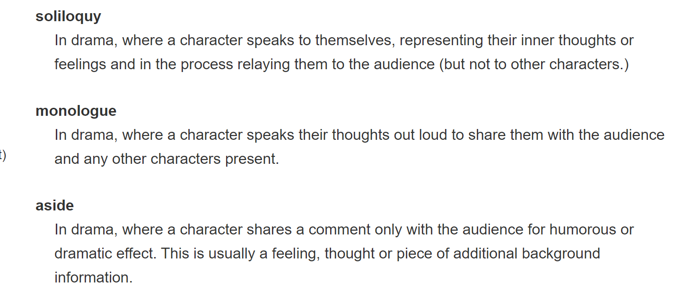
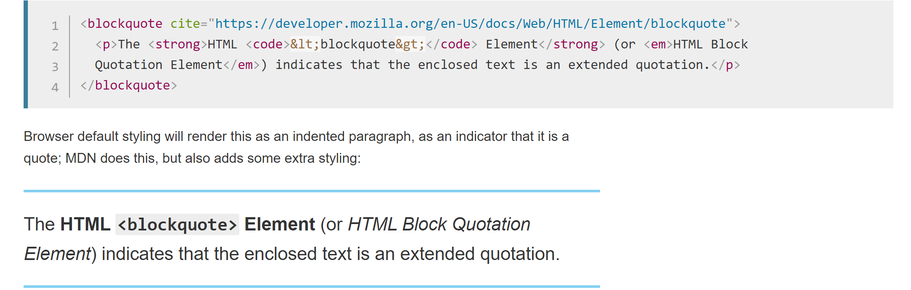
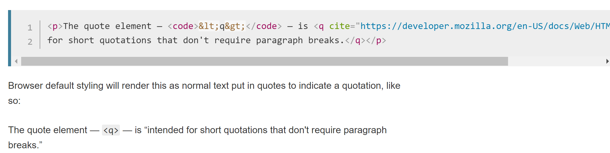
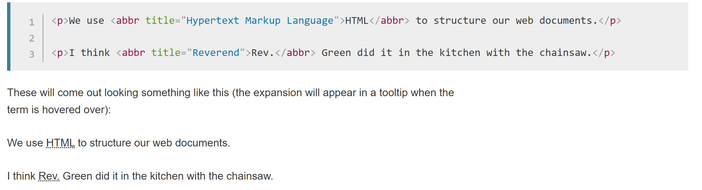
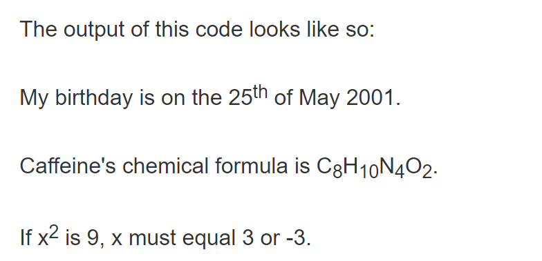
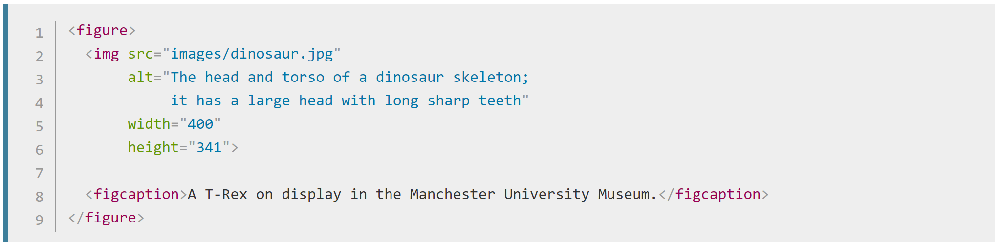
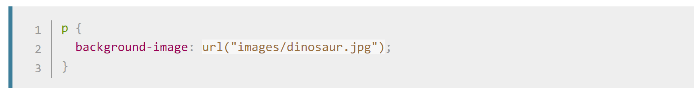

# html笔记

- 以.html和.htm结尾的文件，用文本编辑器编辑，完成后直接用浏览器打开，不需要编译。

- 浏览器通过向服务器发出请求，发出的文件由服务器发出（相同的域名即是同一份文件），并有同一份的解析标准。

- XML scheme definition是一套约束xml文件的约束标准

- DTD也是一套约束标准

- W3C制定html规范：世界万维网联盟=>W3C school

#### 系统架构：C/S架构（客户端与服务器）

大部分数据保存在客户端，大部分功能在本地上，只需要从服务器上下载少量信息，因此访问速度较快/升级维护工作量较大

#### B/S架构（浏览器与服务器）

Browser客户端、WebApp服务端和DB端构成所谓三重架构，主要业务逻辑服务器端实现

B到S，S到DB，DB再到B

客户端包含的逻辑很少，被称为瘦客户端

​          BS客户端可以直接放在广域网上，通过一定的权限控制即可实现多客户访问的目的，交互性较强，无需升级客户端

​         在速度和安全性上需要花费大量的设计成本

### Html编写

Html表格：table标签实现表格 （主要用作布局；先把表格画出来，再往表格里面填数据；现代网页用table比较少，用div比较多）

#### html文本

《dl》是description list，《dt》是description term，《dd》是description definition，基本的表现形式如下：

```html
<dl>
  <dt>soliloquy</dt>
  <dd>In drama, where a character speaks to themselves, representing their inner thoughts or feelings and in the process relaying them to the audience (but not to other characters.)</dd>
  <dt>monologue</dt>
  <dd>In drama, where a character speaks their thoughts out loud to share them with the audience and any other characters present.</dd>
  <dt>aside</dt>
  <dd>In drama, where a character shares a comment only with the audience for humorous or dramatic effect. This is usually a feeling, thought, or piece of additional background information.</dd>
</dl>
```

最后的呈现形式如下：



- <blockquote>

  《blockquote》



- inline quotation：（好像就是对文本加了个引号）<q>



- <cite>引用（将文本换成斜体）

所有的引用都是需要有cite属性，后面跟链接

- <abbr>标签：缩写



- 上标和下标<sup>、<sub>



- 《br》 line break/《hr》 horizontal rules

- 《main》html页的主要部分，在《body》中
- 《article》和《section》都是能够构成一类内容的标签（没有实际意义？）
- 《header》\《nav》\《footer》是页面不同位置的标签
- 无语义标签：《div》（多行标签）、《span》（内嵌标签）

#### Color属性的值有以下几种写法：

\1.       颜色的英文名称

\2.      六进

\3.       RGB(255,255,255)

 

Tr=table row

Td=table data 数据单元格

Hr 横线

Center 居中

Br 空行                                                            

Align属性：设置是否居中，居左，居右 可用于table,tbody,tr,td

Th表头标签，可将文字居中加黑

<font>标签:修饰字体，拥有size和color两种属性

Rowspan=”” 合并行 同时下一行的同一列地方没有数据

Colspan=””  合并列

#### 设置背景颜色：body标签的bgcolor

#### 设置背景图片：

body标签的background =”同级目录下的图片文件夹/图片名.jpg/gif”或者”网络图片网址” 可以通过weight 和height属性来控制图片大小 title属性可以对图片命名 

Alt属性是图片找不到时显示的标签



《figcaption》图内标题，会在图下方显示文字

用css表示背景图片：



#### 超链接：

- 网络连接格式<a href="网络路径或者本地路径">文本或者图片的形式即</a>

- 超链接锚点：首先对锚点做标签修饰<a name="ten">第十章第十回合</a>

- 对超链接作修饰<a name="#ten">第十章第十回合</a>

```html
<a href="https://download.mozilla.org/?product=firefox-latest-ssl&os=win64&lang=en-US"
   download="firefox-latest-64bit-installer.exe">
  Download Latest Firefox for Windows (64-bit) (English, US)
</a>
```

可以在超链接下加download，表示下载文件的请求，且有对于文件的默认文件名设置

 

#### 标题字

从h1到h6代表字号，h1为最大字号，h6为最小字号

#### 预留格式：

<pre>标签，标签中间的所有格式被保留

#### 列表标签：

有序标签和无序标签

有序列表标签为 li

无序列表标签为ul

有序列表标签为<ol  type=>有序列表前有数字序号   type属性可设为A/i（罗马数字）

#### Html字体格式标签：

i斜体字  b粗体字  ins插入字  del删除字  sup右上角字体  sub右下角字体 

#### Html表单：

采集数据然后向服务器提交表单数据进行相关处理。

表单标签：Form

表单属性：name表单的名称

​          Action提交表单请求的路径

​          Method提交表单的方式：get默认值  post相对get来说是安全的，因为用post提交的表单参数在地址栏中看不见。

 

&nbsp；是空格

#### input标签中的type属性：

text为文本输入框，password为密码输入框，radio为单选框，且必须保证同一题的name属性一致；checkbox多选框,name属性值必须保持一致；submit为提交给服务器，该提交按钮默认提交当前所在的表单，且有value属性为按钮所示文字（使用submit必须放在form表单里面）；reset重置属性；button属性即为提交请求，发生事件

​               Name属性

​               Value属性：在单选框，多选框中代表本选框的内容

​               Checked属性：默认选择

#### select标签

（整个选择框）中有<option>标签（选项），option标签含有value属性，selected属性为默认选中

《textarea》多行文字表单标签 有cols 和rows属性（行和列）


Html可视为一棵树，每个标签可视为一个节点，任何一个节点都有id属性。javaScript通过对id的操作实现增删改查

#### Div和span

都是图层

图层一般用在布局方面，每个图层为独立的单元，div和span会相互嵌套，div修饰文字会独占一行

#### Html框架：

开辟窗口		

- iframe框架（写在body里面）

- Frameset框架（写在head里面），通过cols=    ;rows=    来控制frame的大小，同时frame在frameset标签里面表示框架，frame中的超链接target可指向其他版面（通过其他版面的name 属性）