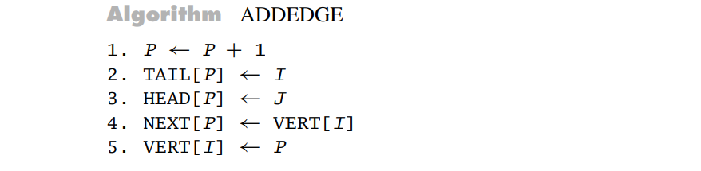
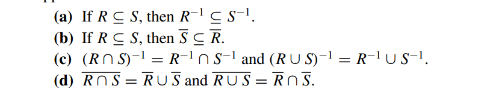
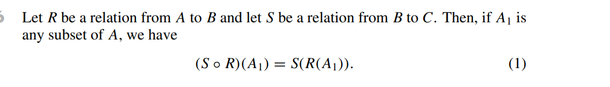
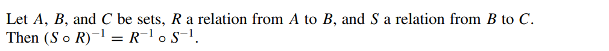
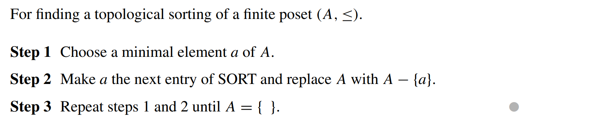
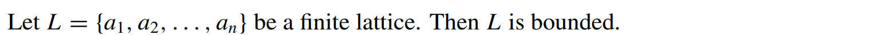
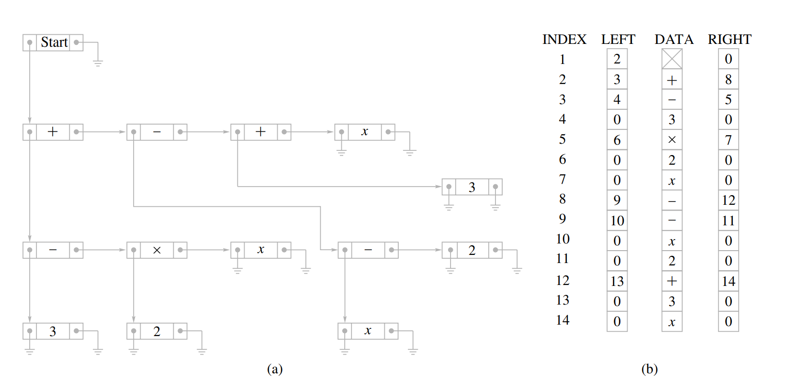
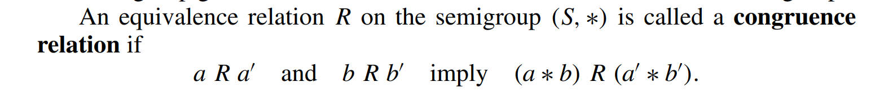
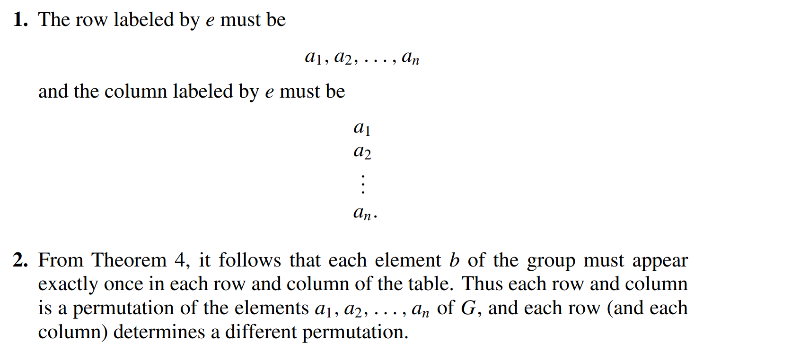

# 离散数学

### 第一章

主要概念：

### 第二章：逻辑

基本复习概念：p=>q真假性与~p∪q相同

### 第三章：计数

基本复习概念：排列组合；鸽巢原理（存在性证明）；概率；递归——特征根方程

### 第四章：relation and direction

对称关系的矩阵是：该矩阵的转置与该矩阵相等（双向通道）

非对称关系的矩阵是：Mij=0，则Mji=1；并且有Mii=0（单向通道，无环）

反对称关系的矩阵是：Mii=1或0，且Mij若i不等于j，则必有Mij=0或者Mji=0（单向通道，可能有环）

传递关系：当M平方包含M时，这个矩阵表示的关系就有传递关系

#### data structure of relations and graphs

1. 通过链表来表示的方式

   

2. 通过二维矩阵表示（因为二维矩阵能够表示relation，因此能够表示关系的指向）

3. 通过两个数组来表示edge的指向——数组分别储存edge的头和尾，还有一个数组储存NEXT来表示edge的变化（类似于链表的地址位），也可以对每一个节点增加一个VERT数组，在VERT数组的相应索引下，储存了离开该节点的一个edge的标号（没有指向其他节点的节点的该VRET位为0），根据NEXT和VERT的配合，能够遍历完离开某一节点的所有edge

   

算法：

1. 判断是否具有传递性：（对于二维数组进行操作）

   算法复杂度：

   

2. 在数组表示的方式中，添加edge的算法

   

   （头和尾都增加，同时next也增加一位，将next的这一位指向vert[i]指向的那个edge，再将新增加的next赋给vert[i]）

3. 在数组表示的方法中，检测是否有transive性质的算法：

   

   当edge数量较多时，用二维数组比较好；当edge数量较少时，用多个数组较好

#### operations on relations

则：

对于R和S的关系，有如下操作：

THEOREM 1

THEOREM 2

THEOREM 3

THEOREM 4

THEOREM 5

Composition

THEOREM 6

Closures：让R补充成满足自反性，对称性和传递性后补充的关系最少的一种R

THEOREM 7

矩阵乘法可交换

THEOREM 8

#### Transitive closure and Warshall's algorithm

##### Warshall algorithm

W算法即对于方向矩阵，从n=2开始不断扩展直到n=N，且扩展的方式从n-1到n时为Mn-1*Mn-1+Mn-1，最后直到扩展到N

### 第五章：函数

#### functions

mappings transformations

labeled digraph:所有的节点和edge都有实际意义的有向图

everywhere difined :定义域满

onto：值域满

one to one：一一对应，函数值不重复

invertible function：反函数

THEOREM 1

THEOREM 2

THEOREM 3

THEOREM 4

#### functions for computer secience

特征函数：

在cs中使用的函数主要有：

- 基本的对应函数
- 向上取整:ceiling function
- 向下取整：floor function 
- 幂函数 base 2 exponential function，对数函数
- Boolean fuction返回值是一个bolean类型

##### Hash function

创建一系列的链表，以及通过函数的对应方式决定新加入的元素应该添加到哪个链表上，同时这个函数也能够决定在哪个链表上搜索想要的元素

- hash function的基本原理是，将元素储存在链表后，控制每个链表的大小相同，所以一般通过取模的方式来决定元素在哪个链表中（模相同的结果在同一个链表）
- 如果又出现了一个元素，且此时链表的元素已经满了，需要一个解决collision的方式，基本的解决collision的方式有：在该链表后强制加入现在的元素/将key分成几个部分之后再储存

##### Fuzzy Set

比较模糊的函数表示方式，往往表示一个范围，如0<f(x)<1，则此时f为一定程度的关于x的fuzzy函数

- fuzzy函数会定义两个最值，然后在中间的值通过x-min/(max-min)来定义其程度
- 定义程度的函数可以改变

##### Fuzzy Set Operations

#### Growth of functions 

大O表示法：O(f)即为增长速度大于O(f)的，一般去找最小的关于f的大O表示

same order:同阶，O(f)=g,O(g)=f,同时有lower order  /higher order

 big-theta ：同阶，即增长速度相同

关于增长速度的判定：

#### permutation function

permutation：对于自身的映射，这种映射是对每个自身的元素进行一个映射，是一个一一对应关系

两个permutation的结合也是一个permutation

THEOREM 1

同时cycle permutation拥有的元素相同时，其对应关系与顺序无关

当两个cycle permutation都属于同一个集合且两个cycle permutation没有公共交集元素时，被称为是disjiont

THEOREM 2

transposotion：长度为2的cycle

Corollary 1

THEOREM 3

THEOREM 4

### 第六章：Order Relations and Structures

#### partially ordered sets

##### partial order:

对于集合A的关系R,如果R是reflective antisymmetrick transitive的时候，则称其为partial order

poset：集合A

eg:

dual: poset(A,R-1)是poset(A,R)的dual，R-1是R的dual

comparable：当A,B能够用一种方式中，则A，B是comparable的

- 在一个poset中，不是所有的元素都能够被比较，如果所有的元素都能被比较，则被称为linear ordered set

THEOREM 1

##### lexicographic：

- 先判断a，当a相等时，再判断b

- 对于多维的lexicographic有：

- 也称为dictionary list，其顺序和字典很相似，且有，即长度小也满足该关系

THEOREM 2

除了自反之外，没有其他的环（因为有偏序作用）

hasse diagram:简化后没有方向的关系图，如下图5（简化的过程为将指向图中有串联性的多余箭头去掉）

- 对于一个poset的hasse diagram H，其dual poset的hasse diagram是颠倒过来的H

##### Topological sorting

对于一个partial order，将其表示成线性的序列成为topological sorting

##### isomorphism

一个partial order到另一个partial order的一一对应映射

- 两个isomorphic 的posets有一样的hasse diagram
- 对于任意一个hasse diagram图，当图中所有的a被f(a)所替代后，仍然是个hasse diagram

#### Extremal elements of partially ordered sets

THEOREM 1

通过最小元素来判断拓扑排序的算法：

THEOREM 2

great element——unit element

least element——zero element

upper bound：一个元素是一个集合的上界，least upper bound：最小上届

lower bound ：一个元素是一个集合的下届，grateset lower bound：最大下届

THEOREM 3

THEOREM 4

即A和isomorphic的A‘的上界下界有一一对应关系

#### Lattices

定义：一个每两个元素组成的子集都拥有一个最小上界和一个最大下届的poset

jion: LUB({a, b}) ，用a ∨ b表示

meet:GLB({a, b})，用 a ∧ b表示

（两个元素有明确的上界和下届或者两个元素可以比较）

THEOREM 1

- 对于一个lattices的子集，其子集可能是lattices，也可能不是

##### isomorphic lattices：

就是对应关系后的lattice

##### properties:

THEOREM 2

THEOREM 3

THEOREM 4

##### bounded

当一个lattices既含有最大元素也含有最小元素时，被称为bounded

THEOREM 5

同时lattices可能有distributed 的性质

THEOREM 6

即如果一个lattice的hasse图的映射是上图两种映射中的一种，则是不distrubuted的

THEOREM 7

 Dn：定义为由可除性形成的lattice

#### Finite Boolean Algebras

THEOREM 1

理论的本质在于：集合的属于关系所形成的lattice只和集合的元素数量和集合之间元素的属于关系有关，和集合里面元素的本质无关

这样的集合形成的哈希图称为Bn，Bn的节点数量一定为2n

与Bn能够对应的lattice称为Boolean Algebra

THEOREM 2

如果n是几个不同的素数的乘积，那么Dn是Boolean algebra

THEOREM 3 substitution rule for boolean algebras

因此有：

THEOREM 4

#### Boolean polynomial

=>用boolean多项式来形成逻辑电路

gate: x ∧ y   inverter： x'

逻辑电路的表示

#### Circuit design

通过boolean函数的特性设置电路

THEOREM 1

THEOREM 2

##### Karnaugh map 

x为0的项用x'表示，为1的项为x表示，y相同，矩阵的值为f的值

对于B3进行三维分析：

当f可知时，其三维表示为：

同理，四维如图所示：

##### minterm

通过最小的组成元素所表达出来的布尔代数，如

#### Review

### 第七章：树

#### Trees

定义：一棵树中有一个节点，这个节点到任意其他节点都有路径，但这些节点都不能到这个根节点

父节点：parent

子节点：offspring 

兄弟节点：siblings

叶节点：leaves 

THEOREM 2

对于一个树，除了它的叶节点，其他的所有节点都含有n个子节点，则被称为complete n trees

THEOREM 3

#### Ordered trees

eg:

positional trees:每一个节点的子节点有固定的配列顺序和位置的树

##### Binary positional trees as data structures

linked lists and double linked lists

double linked lists的演示图：

double linked list的重点在于其左指针和右指针都可以指向不同的节点，因此形成了一个树状

##### Huffman code tree

霍夫曼树形成的代码，0表示往左，1表示往右，最终由01串形成代码串

#### Tree searching 

遍历树，进行树的搜索

##### 前序

线性表示的prefix/polish form

 

通过前序搜索实现算术树的遍历，然后得出prefix/polish form

##### inorder和postorder

infix notation中序遍历生成的线性表示

postfix /reverse polish后序遍历生成的线性表示

##### 多节点树的搜索方法：

通过左子女右兄弟的方法遍历节点——linked list representation of T

#### Undirected trees

simple：当一颗树中的一个edge不会被其他的两个或者多个edge替代时，称这课树为simple，如果这条路径是一个环，则成为simple cycle

acyclic：对于一个对称关系，被称为acyclic是在其不含有simple cycle时

THEOREM 1

THEOREM 2

THEOREM 3

将树变为simple的办法：从undirected tree中移除树节点，直到最后的树中再移除任何一个节点都变得不connected

##### merge

对于非simple的树中的节点进行merge的merge操作：

需要的条件为merge后的节点，其进入的节点数为之前两节点数相加，出的节点为之前两节点数的出节点相加

在矩阵中进行的操作即为：将该节点对应的矩阵的两行相加，两列相加，合成新的一个矩阵

##### Prim's algorithm

#### Minimal spanning trees

weighted grapg:edge标有数量的图表

distance between vetices

nearest neighbor of vertex

##### minimal spanning trees:

一个undirected tree，且其edge之和最小

##### Prim's algorithm

基本逻辑为：从一个节点开始，把这个节点所有相邻且不形成环的节点加入，最后直到这课树囊括所有节点

也是greedy algorithm的一种

THEOREM 1

##### Kruskal's algorithm

对于所有的边，选取其中的n-1条，每一条边增加时都不能形成环，最后形成完整的最小生成树

### 第八章 ：graphs

#### Graphs

基本概念

- graph——vertices——edges
- 用（V,E,γ）来表示图中一个局部的关系 
- degree of vertices
- loop
- isolated vertex
- adjacent vertices
- circuit:circle
- simple circuit

##### **(Vπ,Eπ)path：**

- 在该路径中所有的节点都是相邻的，且是通过Eπ中的边依次相邻的
- 每个节点都只在该节点序列中出现一次

##### 特殊图表

##### subgraph / quotient graph

subgraph:子图，对于一个graph，其disconnected的子图为一个component

quotient graph：对于在一个图中的equivalance relation（两个相连通的节点都可以看做为一个equivalance relation），将其中的节点都合并起来，然后将其和其他节点之间的关系表示出来，如figure 15是figure 14的quotient graph

#### Eular paths and circuits

eular path：在路径中每个edge只出现一次且至少出现一次的path

eular circuit：eular path组成的circuit

——欧拉路径的本质应为在一个图中，找出能够遍历完所有图的edge且不出现重复edge的path

THEOREM 1

基本证明逻辑为：若所有的节点都有偶数条边，则在对所有的节点使用了一条边之后，也能够对所有的节点使用剩余的没有使用的边来组成另一条path

THEOREM 2

欧拉路径的本质也是欧拉循环再添加edge，如果添加成了有多个odd degree的节点，则无法形成欧拉路径

##### FLEURY'S ALGORITHM

通过行走edge，然后将走过的edge移除，再将edge被遍历完的isolated的节点移除，直到走完所有的节点

#### Hamiltonian paths and circuits

amiltonian paths：路径中每个节点出现一次

hamiltonian circuit：成环的hamiltonian path

THEOREM 1

相同意义表达为：

THEOREM 2

基本

#### Transport network

##### transport network

1. 存在一个源节点source,in-degree为0
2. 存在一个最终的节点sink，out-degree为0
3. Cij被称为是edge的capacity

##### flow

Fij是指一个图中相对应的edge的流量，流量不超过容量

- 对一个节点来说，流进的流量等于流出的流量
- 流量不能储存、创造、凭空消失·

##### the labeling algorithm

寻找一个图中能有的最大流量的算法

- 将与source节点连接的所有节点标定为[Ej，1]（j为节点的编号）
- 对于与source节点连接的一个节点，对其进行标定，标定的方式为[Ek,j]，Ek取的是ekj的容量和Ej两个中小的哪一个（从1流向j的节点的流量，不会再增加，同时也不可能超过其容量），将这个节点连接的所有二重节点标定完之后，再标定与source节点连接的所有节点
- 重复操作，一层一层标定节点，直到所有节点完成标定
- 如果此时sink节点被标定了，则需要对于sink节点被标定的某一前一个节点，溯回到source节点，在这个路程中的所有边的capacity都减去该路径给予sink节点的流量，然后再重复最开始的过程
- 一直到sink节点最终不会再被标记，则减去的所有流量即为回路的最大流量

##### cut

cut的定义是将一个图分为两个部分，一个部分包含sink，一个部分包含source，如果将一些edge斩断后，sink的那个部分没有流入，source的部分没有了流出，则这个容量即为the capacity of cut

#### Matching problem

##### multiple source and sink

当有多个源或者多个sink的时候，构建一个supersink和supersource,连接到所有的源或者所有的sink，则构成了labelling algorithm匹配的形式

##### The matching problem

matching function：一种任意的匹配关系，需要是从一个集合到另一个集合的一一对应关系

M compatible with R：如果M被包含于R，则有M（a）所对应的b，全有a R b

matching problem:对于一个A R B，找到最大的满足compatible with R的M

THEOREM 1

对于一个关系R中存在match 一一对应的情况：

如果存在一个matching，则必有对于每个集合中的元素，其R(X)>=1，且应该有R(X)总包含的元素大于M(x)的元素

#### Coloring graph

将color一一映射到不同的点上，为coloring the graph of G using n colors

chromatic number of G:对于一个图进行染色使用的最少颜色数量

##### Chromatic Polynomials

chromatic polynomail:PG(n)是使用n种或更少颜色时，能满足的G染色的所有方法

THEOREM 1

THEOREM 2

意思是一个图的标图方法是由一个部分的图的标图方法数乘以一个节点的标图方法数，再减去仅有的这个部分标图方法数

（这个部分是将这个节点merge后的部分）

### 第九章：semigruops and group

#### binary operation revisited

binary operation:

- 对于所有的元素均有定义
- 对于每一个pair，其结果应有一个确定值

##### Table

commutative:交换律

associative:结合律

idempotent:自反性

#### Semigroups

semigroup即为一个非空的集合和一个具有结合律关系的操作方式，(S, ∗)

a*b是a b的product

free semigroup:A*即为A中元素形成的有限序列，字幕可以重复出现，·其实即为两个字母串相加

THEOREM 1

##### identity

##### monoid

——subsemigroup/submonoid

##### isomorphism and homomorphism

一般来说，在两个数学结构之间的isomorphism保留了这两个数学结构最特别的特质

同时f-1即为逆向的isomorphism的映射

判断是否为isomorphism

THEOREM 2

homomorphism

当去除掉isomorphism的一对一映射和满射的性质后，即为homomorphism

THEOREM 3

THEOREM 4

THEOREM 5

#### Products and quotients of semigroups

THEOREM 1

congruence relation:

THEOREM 2

Corollary 1

当R是一个congruence relation on (S,*)时，满足一个quotient semigroup(S/R,  )

THEOREM 3

​	THEOREM 4

f的逆函数：

#### Groups

##### Group定义

Abelian

THEOREM 1

THEOREM 2

THEOREM 3

THEOREM 4

##### Table

在群的table中可见，每一个行所对应的值都是没有重复的

##### Example:旋转三角中线

定义f和g如图（类似于路线的起点和终点）

此时生成的群S为：

此时s被称为：group of symmetries of the triangle

s是群，因此s是associative的，但是s不是abelian的

##### Subgroup:

trival subgroup:{e}

THEOREM 5

Z6(Z函数即为S/R中将a=b(mod 6)生成equavalence的函数)

#### Products and quotients of group

THEOREM 1

THEOREM 2

Corollary 1

coset:

The left coset of H in G determined by a is the set aH = {ah | h ∈ H}. 

The right coset of H in G determined by a is the set Ha = {ha | h ∈ H}

THEOREM 3

对于normal subgroup 有aH=Ha

THEOREM 4

kernel：

#### Other mathamatical structure

##### Rings

对于环(S, +, ∗)，有两个二元操作符，*对于+是distributive的

当对于*的计算为associative时，该计算为环

commutative ring:If ∗ is associative and commutative, we call (S, +, ∗) a commutative ring. 

monoid：If (S, ∗) is a monoid, then (S, +, ∗) is a ring with identity

THEOREM 1

##### Fields

F is a field if every nonzero element x in F has a multiplicative inverse

THEOREM 2

##### Fermat's Little Theorem

THEOREM 3

### 第十章：Gruops and coding

#### Coding of binary information and Error detection

message：从有同时限字母表生成的有限字母序列

word：0 1序列

在传输过程中会因为noise发生信息错乱，因此需要encoding function（扩展字位）来保证error detection和correction

detects k error:如果在x和xt有k个或者更少的位不相同时，此时xt不是一个word

weight：一个word中1的个数

##### Parity check code

##### Hamming distance

##### minimum distance

就是在Bm中不相同的encoding结果最小的

THEOREM 1  properties of distance function

THEOREM 2

如果其minimum distance为k+1，则其任意两个元素之间至少都有k+1个位不一样，因此有k位或者更少的不一样时肯定为错误word

#### gruop code

THEOREM 3

+号为异或，·号为交，

THEOREM 4

THEOREM 5

x为：（这样保证了x*H后每一项都是为双数的，因此结果为0）

