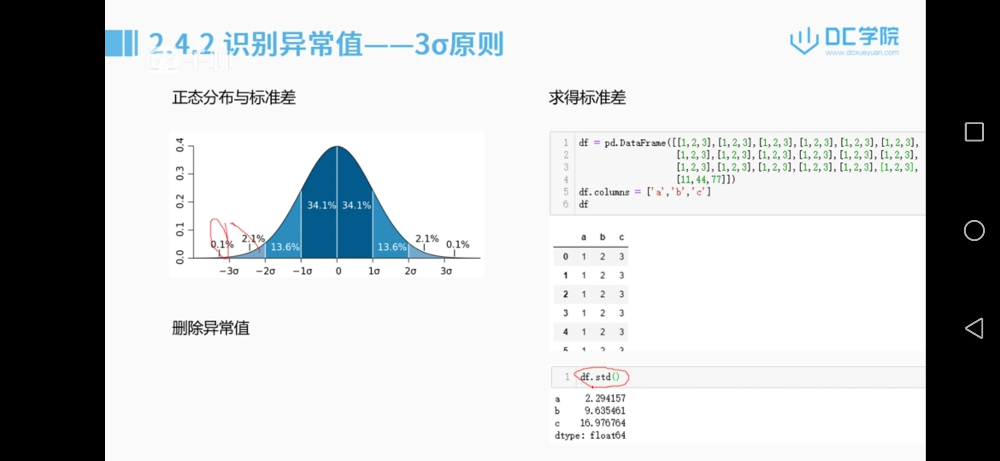
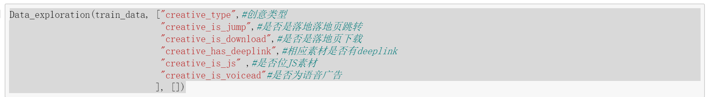
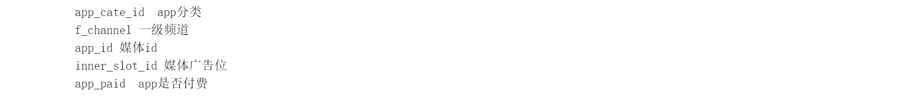
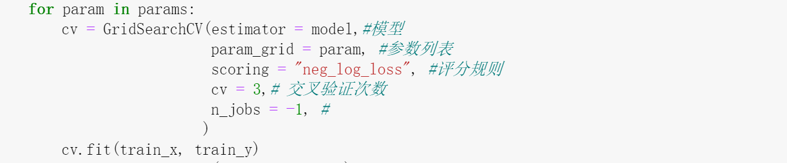
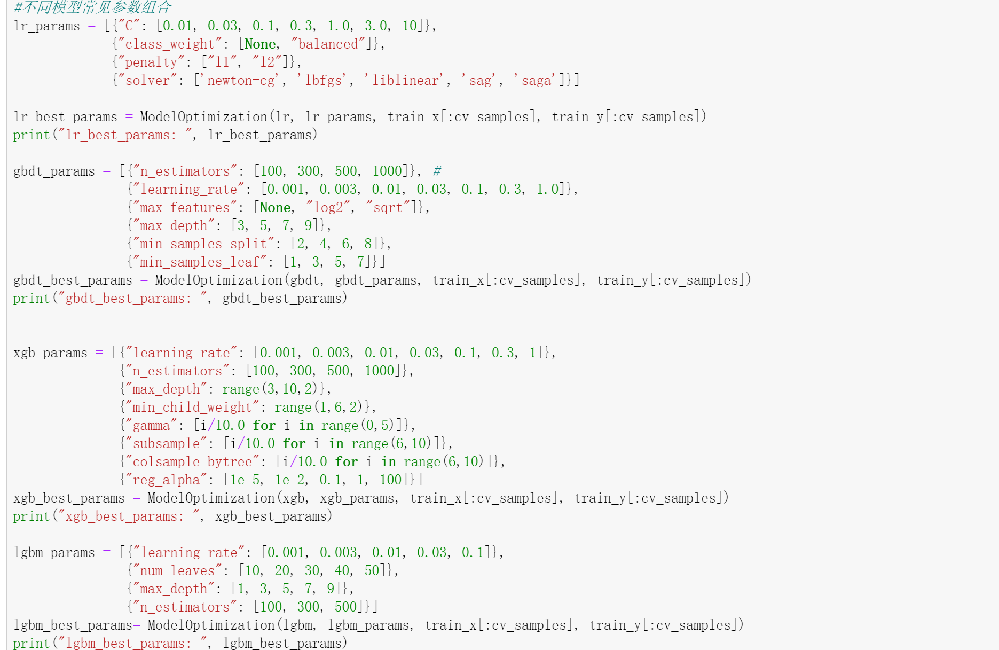
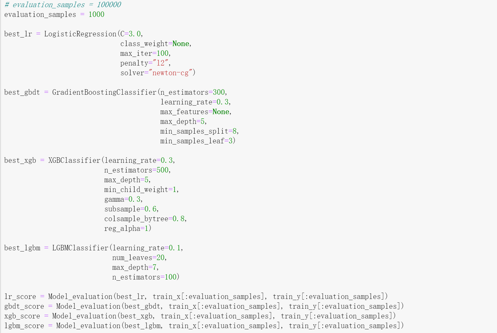
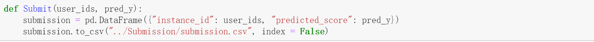
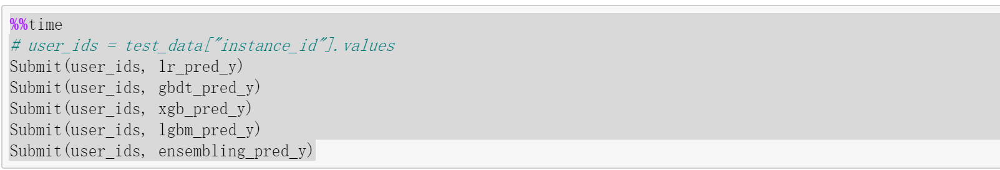

# 大数据项目

### 工程流程：

课题背景和目标——评估准则——认识数据——分析、预处理——特征工程——基于模型测试和优化——预期效果——记录模型和结果

### 认识数据和分析预处理：

#### 重复值、异常值处理：

import pandas as pd

import munpy as np

np.nan——数据缺失

缺失处理：df.dropna()(默认行删除)/df.dropna(axis=1,inplace=true)（将Nan行删除）

填充处理：df.fillna(-1)/df.fillna(df.mean())/df.fillna(method='pdf')(前一个值对后一个值做填充)/df.fillna(method='bfill')(后一个值对前一个值做填充)/df.interpolate()（插值法填充？）

删除重复行：x=x.drop_duplicates()

#### 特征缩放：

why特征缩放：平均所有的特征对于值的影响

怎么做特征缩放：

使用min max normalization方法

```py
from sklearn.preprocessing import MinMaxScaler

mm=MinMaxScaler(feature_range=(0,1))

data=mm.fit_transform(data)
```

均值缩放：

```py
import numpy as np
import pandas as pd
data=
df=pd.DataFrame(data)
(df-np.mean(df))/(np.max(df)-np.min(df))
```

标准化缩放：

```py
from sklearn.preprocessing import StandardScaler
std=StandardScaler()
data=
data=std.fit_transform(data)
data
```

#### 样本不均衡：

解决样本不均衡：

- 增加样本中数量较少的类别的数量

```python
(复制小样本数据)
from imblearn.over_sampling import RandomOverSampler
ros=RandomOverSample(random_state=0)
X_resampled,y_resampled=ros.fit_sample()X,y

print(sorted(Counter(y_sampled).items()))

(通过一定的规则生成新变量)
from imblearn.over_sampling import SMOTE(通过少数类样本的特性生成新的样本), ADADYN
X_resampled,y_resampled=SMOTE(kind='boderline1').fit_sample(x,y)

print(sorted(Counter(y_resampled).items()))
```

- 减少样本中数量较多的数量

```python
(减少一些多数类)
from imblearn.under_sampling import RandomUnderSampler
ros=RandomUnderSample(random_state=0)
X_resampled,y_resampled=ros.fit_sample()X,y

print(sorted(Counter(y_sampled).items()))

(根据新的样本生成一些样本替换多数样本)
from imblearn.under_sampling import ClusterCentroids
cc=ClusterCentroids(random_state=0)
X_resampled,y_resampled=cc.fit_sample(x,y)

print(sorted(Counter(y_sampled).items()))
```

- 设置权重（通常设置成与样本量成反比）
- 集成方法（分成多组样本进行训练，每组样本包含所有少数类样本和多数类样本的抽样）

```python
from imblearn.datasets import make_imbalance
ratio={}
X.resampled,y_resampled=make_imbalance(X,y,ratio=ratio)
print(sorted(Counter(y_sampled).items()))
(按ratio的比例抽取)
```

生成不平衡的样本

```python
from sklearn.datasets import make_classificaiton
form collections import Counter
x,y=make_classification(...)
Counter(y)
```

#### 识别异常值：

- 简单的统计分析
- 3 原则（正态分布：距离平均值3 之外的概率不超过0.003）



- 箱形图（大于或小于箱型图上界或者下届的数值为异常值）


- 聚类分析（基于密度的聚类方法，用于离群点检测）


### 特征工程

#### 特征处理：

##### 特征类型：

数值型（连续型和离散型），类别型（文本类型，枚举类型），时间型，文本类型，图形类型

##### 数值类型处理：

###### 连续变量的离散化——分箱

```python
bin_range=
bin_names=
df[]=pd.cut(np.array(df['Age'],bins=bin_ranges))
df[]=pd.cut(np.array(df['Age']),bins=bin_range,lable=bin_names)
```

###### 连续变量的离散化——自适应binning

```python
#基于四分位数的二进制方案
quantile_list=[0,.25,.5,.75,1]
quantiles=dt['income'].quantile(quantile_list)

#可视化这些分位数
fig,ax=plt.subplots()
df['income'].hist(bins=30,color='#A9C5D3',
                  edgecolor='black',grid=False)
for quantile in quantiles:
    qvl=plt.axvline(quantile,color='r')
```

##### 类别特征处理：

###### LabelEncoder:

```python
#对不连续的数字或者文本进行编号
from sklearn.preprocessing import LabelEncoder
x_data=pd.DataFrame()
x_data['gender']=np.array['male','famale','male','male','female']

le=LableEncoder()
le.fit(['male','female'])
x_data['gender_encode']=le.transform(x_data['gender'])
```

###### one-hot：

```python
#将离散的特征取值扩展到欧式空间(距离的计算或者相似度的计算)
from sklearn import preprocessng
enc=preprocessing.OneHoteEncoder(categories='auto')
df=pd.DataFrame(...)
enc.fit(df)
array=enc.transform(...).toArray()
```

##### 时间特征的提取：

```python
from pandas import to_datatime
a=np.array([...])
data=pd.DataFrame()
data['时间']=a

data['month']=data['时间'].apply(lambda x:int(x.split("-")[1]))
data['day']=data['时间'].apply(lambda x:int(x.split("-")[2]))
```

#### 特征构建：

1. 把已有的特征进行组合转换，组合的方式（一元，二元，多元算子）可以由用户自行定义，也可以使用库中自带的函数
2. 根据业务分析创建特征

##### 多项式：

```python
from sklearn.preprocessing import PolynomialFeatures
df=pd.DataFrame(np.random.randint(1,10,16),reshape(4,4))

poly=PolynomialFeatures(degree=2,interaction_only=True)
data=poly.fit_transform(df)
pd.DataFrame(data)
```

#### 特征选择

1. 过滤式：根据特征的方差或者相关系数对特征进行重要程度排序，方差越大，与目标变量相关系数越高，则特征越重要
2. 包裹式：每次选择一个效果最好的特征/每次删除一个效果最差的特征
3. 嵌入式：
   1. lasso回归，通过L1正则化，对特征进行选择
   2. GBDT，Xgboost，在不同数据抽样，不同样本抽样所得到的诸多蛋壳决策树中，重要的特征会有更高的概率出现在树中

##### SelectKBest运用：

```python
from sklearn.datasets import load_digits

form sklearn.features_selection import SclectKBest,chi2
x,y=load_digits(return_x_y=True)
x.shape
x_new=SelectKBest(chi2,k=20)fit_transform(x,y)
x_new.shape
#shape是被优化过的（进行特征选择过的）
```


## 项目实际应用：广告点击率预测

特征工程：70%工作量

模型优化：sklearn和python调参优化

字段介绍：基本类型+媒体信息+用户信息

评估准则：对数损失


- 导入数据集
- 训练集作出数据的基本处理方式，然后通过测试集判断结果
- pd.read_csv（通过特定分隔符读取文档文件）


### 了解数据

（直接划出每个字段不同特征值的平均点击率，每一个字段不同特征值的样本分布）——

基本逻辑大致为先通过数据的可视化了解数据的特征，然后选取相应的特征方式处理数据

- 特征分布为1，则没有处理的必要/如果样本量比较不均衡，使用分组将样本量比较少的特征组合成一个特征

- 画出所有特征——python画图的基本代码

- 数据的可视化分析：

  - **城市/省份**

     虽然有些地区的总的样本量较低，但平均点击率还是接近于平均水平；同时，虽然有些城市的总样本量很高，但平均点击率并不够高。有些地区的点击率确实远低于另外一些地区。 

  - **运营商信息**

     1. 运营商的数据比较有趣，有一类运营商的点击率和样本量都比较低！这类比较显著的差异，都可以作为特征。
     2. nnt 是联网类型，同样可以看出，有些联网类型的样本量特别多，但平均点击率并不突出；同时注意到，有个类别的联网类型，样本量和点击率都非常低！比如类别 5。

  - **设备信息**（pandas中apply和lambda表达式进行处理）

     1. 这三个字段都是关于机型的信息，model与make都没有脱敏，可以看到make字段中有HuaWei、Xiaomi、OPPO、Apple 等，而 model 则是更加详细的机型信息，比如 HUAWEI-CAZ-AL10、Redmi Note 4、OPPO+R11s等，它们的种类特别多。简单分析，机型类信息有一定的价值，但如此多的种类，可能会导致有些机型的样本数量非常小，也就不适合拿来做特征。
     2. 事实上，model 就是 make 信息的细化，我们可以粗略使用 make 的信息，然而我们发现，make 有许多不同的种类，使用 train_data['make'].unique()命令统计一下，发现有 3000多种不同的品牌，这个数值有点太大了。深入查看这个字段的内容，会发现里面有很多其实属于同一个品牌，比如会有“iPhone8,1” 、 “iPhone7,2”这样的字段，以及“vivo Y31A”、“vivo Xplay3S”这样的字段，所以，make 字段最好是不要直接使用，需要将同一品牌的不同机型进行合并。 在此，为了对 make 有更好的理解，我们将同一品牌的描述进行合并，比如“iphone5”、“iphone6”“77iphone8plus”都会被重命名为“apple”。

  - **操作系统信息**

      'os',"os_name","osv"这三个字段的关系非常紧密。事实上，从图中也可以看出，os 和 os_name 其实是一致的，考虑其中一 个即可；而 osv，可暂时不予考虑，因为它的种类比较多，且不少操作系统版本的总样本量也比较少 

  - 广告主信息

    1. 不同的广告主是否有不同的吸引力。从上图中可以看出，有些广告主的吸引力确实比较强，而有些广告主，既没有吸引较多的广告量，也没有客观的点击率。
    2. 再看广告主所在的行业(advert_industry_inner)，也明显是一个较为显著的特征。此处我们需要注意下，当我们查看这个字段时，发现它是两组数字的组合，如 102400_102401、101900_101902，故可以考虑在创建特征的额时候，对它进行拆分。

  - 时间信息（提取周期性的东西，使用apply和lambda）

- 广告创意内容

  

  1. 广告创意的样式和广告创意的类型，不同的创意类型也都有较大的差异。尤其是 creative_type 中紫色的类型，差异与其它类型非常明显。
  2. 观察广告创意的属性，包括是否有 deeplink、是否是落地页跳转 is_jump、是否是落地页下载is_download、是否为 js 素材和是否为语音广告 is_voicead。
  3.  广告创意还有长度与宽度的差别，从字面上看，我们应该用散点图来观察它们的情况，但事实上，设计师们在设计宣传页的时候，为了更好地适配手机设备，通常会有一些固定的尺寸；如图，我们发现，在某些尺寸下，确实得到的点击率会比较高。 

  **结论**：最后两个属性（js 和 voicead）在训练集中都只有一个种类，因此也就失去了价值(可以去掉)，其它5个的分布情况如图，都有非常显著的差异，因此也应该是个不错的特征。

- 媒体信息

  有明显的分隔符：尝试对于分隔符进行分割，然后处理信息

  通过原始特征生成新的特征

  

  1. app_apid 在训练集中只有一个类别值及所有广告都是False的(可以考虑去掉特征)

  2. "app_id","inner_slot_id"需要进一步观察

  3. 媒体的广告位，广告位的类别特别多，且大多广告位的数量都非常稀少，可以看出这个不太具有参考性。然而，当我们查看这个字段的内容，会发现它有一定的特点，如下：

     ```
     iqy_1000000000381-1-15-15、
     iqy_1000000000381-1-15-30
     xf_275C061483984E075832A4373BDDF27B
     ```

     前面的那个内容是有很多规律可循的，因此，我们可以尝试做一些处理，取出“_”前的那些字母即可(不以具体广告位计算,只计算具体渠道)

  4.  可以考虑删除原始特征媒体广告位(inner_slot_id),使用inner_slot_id1 

- 用户信息

  不需要进行特殊处理
  
  逗号分割，拆分开逗号，用其他的编码方式进行编码，然后保存并代入训练
  
  

### 数据预处理

- 缺失值处理
- 异常值处理
- 重复值处理
- 离散字段处理

进行存储和删除后，按照训练集的行列的维度，得到测试集和训练集的样本数（可通过索引值获得相应的数据）

得到特征矩阵，针对特征矩阵做特征工程


### 特征方程

1. 创建特征
2. 根据广告行业（根据下划线划分特征）
3. 对广告位的Id进行重构，取出前面的特征值进行重新整合
4. 通过labelEncoder方式对特征进行编码
5. 对数值特征进行标准化
6. 针对用户特征（文本数据），通过持平矩阵的方式实现特征转换
7. 特征选择：selectKBest


### 模型

#### 创建模型：

1. 逻辑回归
2. gbdt
3. xgb
4. lgbm

#### 模型调用：

- 封装模型调参的方法（将模型所有可能的参数进行枚举，找到最优的模型）
- 获得模型组合的最优参数
- 常用参数：GridSearchCV/RandomSearchCV
- 根据模型默认的参数来判断最优的模型
- 通过模型做交叉验证
- 根据模型做数据的预测

##### GridSearchCV:

自动调参，输入参数，给出最优化的结果和参数，适合于小数据集

常用参数：

**estimator**：所使用的分类器，如estimator=RandomForestClassifier(min_samples_split=100,min_samples_leaf=20,max_depth=8,max_features='sqrt',random_state=10), 并且传入除需要确定最佳的参数之外的其他参数。每一个分类器都需要一个scoring参数，或者score方法。
**param_grid**：值为字典或者列表，即需要最优化的参数的取值，param_grid =param_test1，param_test1 = {'n_estimators':range(10,71,10)}。
**scoring** :准确度评价标准，默认None,这时需要使用score函数；或者如scoring='roc_auc'，根据所选模型不同，评价准则不同。字符串（函数名），或是可调用对象，需要其函数签名形如：scorer(estimator, X, y)；如果是None，则使用estimator的误差估计函数。

**cv** :交叉验证参数，默认None，使用三折交叉验证。指定fold数量，默认为3，也可以是yield训练/测试数据的生成器。
**refit** :默认为True,程序将会以交叉验证训练集得到的最佳参数，重新对所有可用的训练集与开发集进行，作为最终用于性能评估的最佳模型参数。即在搜索参数结束后，用最佳参数结果再次fit一遍全部数据集。
**iid**:默认True,为True时，默认为各个样本fold概率分布一致，误差估计为所有样本之和，而非各个fold的平均。
**verbose**：日志冗长度，int：冗长度，0：不输出训练过程，1：偶尔输出，>1：对每个子模型都输出。
n_jobs: 并行数，int：个数,-1：跟CPU核数一致, 1:默认值。
**pre_dispatch**：指定总共分发的并行任务数。当n_jobs大于1时，数据将在每个运行点进行复制，这可能导致OOM，而设置pre_dispatch参数，则可以预先划分总共的job数量，使数据最多被复制pre_dispatch次

常用方法：

grid.fit()：运行网格搜索
grid_scores_ ：给出不同参数情况下的评价结果
best_params_ ：描述了已取得最佳结果的参数的组合
best_score_：成员提供优化过程期间观察到的最好的评分 





不同的模型有常见的参数组合，组合后通过ModelOptimization返回最优参数，然后用Model_evaluation评估最优参数：



最优模型参数进行代入，进行交叉验证（应该就是指的GridSearchCV）的训练，将模型评估的分数均值做输出

#### 模型融合：

模型融合的基本思路为：将模型调参出来的最优参数代入四个模型中，然后融合四个模型即可


### 结果提交





把最终融合的结果提交，提交即为将最后生成的模型预测结果输出成csv文件

