# 计组

## cache

### direct mapping

优点：寻找，写入比较快

缺点：当cache比较小时，很多块会对应同一行，所以会反复对同一行内容进行修改，发生抖动

### associate mapping 

内存能够加载到cache中的所有的行中

优点：能够避免抖动的发生

寻找方法：跟替换策略有关

### set aassociative mapping

- 将cache分成很多组，则该行对应到某一确定的组，但在组内定义到每行是随机的（相当于先直接映射，再随机映射）

- 四路组、二路组等的名称来源于一个组分为多少个块

- 组号不需要储存——原因类似于直接映射，中间一位为组中号

相关性：每一行在cache中可以存放的位置

### 地址计算方式：

计算tag:在地址最低的几位中，先去掉一行中的地址数所占用的数，再去掉取模的几位（这几位的行号是在对应过程中可以被省略），最后的剩余的即为tag

### 替换算法：

（对于associate mapping 和set associate mapping算法，需要替换算法来执行随机式的替换）

- 最不可能被用到的cache块，将其替换掉 LRU算法

- FIFO（先进来先被替换掉）

  

- least frequently used（最少使用的被替换掉） LFU算法

- random

### write policy：

- write through

  只要cache一被写过，就与主存联系，写回主存

- write back

  当cache被写过之后，使用dirty bit标记，然后再写回（最小化主存的修改，但控制会很复杂）

### Line size

（确定cache的line size应该为多少时比较合适）

由小变大时，hit 先会变大，因为数据变多（局部性），但再变得更大时，hit会变小（此时不满足局部性了），因为每一块内容很多，替换很频繁，且数据太多寻找很困难

### Number of cache

一级命中了就返回，要是一级没有命中，则寻找二级中的内容，如果命中了，则返回，并且将一块内容写入一级cache，如果二级没有命中，则寻找三级，如果命中了则返回，并且写入一级二级，如果仍然没有命中，则寻找主存内容

## External memory

特性：使用频率不高，因此可以使用外部储存

种类：

- magnetic disk
- optical memory
- magnetic type
- USB flash disk,solid state disk(SSD):flash

### Magnetic disk

软盘：存储容量低

硬盘：硬盘驱动器与硬盘相连:movable head 能够读取磁盘上的信息

#### 磁盘结构：

每个同心圆为一个磁道；每个磁道会分为多个扇区——扇区中所储存的容量是一样大的，一般认为为512B

磁道最外面的编号为0

#### 为保证扇区容量相等，有如下两种排列方式：

- 上面一种：当数据稳定读取时，因为其排列方式，所以读取磁道的角速度是稳定的

  好处：转动角速度相同

  坏处：磁道的分组比较复杂

- 下面一种：当数据读取稳定时，里面的转动角速度应该更快，才能保证读取扇区相同（分成很多个大环，大环内部角速度相同，大环之间角速度不同(一个大环里面的划扇区相同，可近似认为其弧长相等，但实际不等)）

#### 磁盘微观结构

ID field：同步字节，磁道号，扇区编号

Gap:给处理信息之前的比对时间

Data field：数据区

格式化：加上一些额外数据使磁盘中某些数据不能被访问

#### 磁道访问的时间轴：

- seek 将磁头移到需要到达的磁道
- rotational delay 等待扇区的同步字节旋转到磁头的时间（读的时候旋转比写的时候快时，会造成扇区容易错过，需要再等一圈）
- data transfer 数据的传输时间 num of bytes to be tranfered/(num of bytes on the track*rotation speed)

#### 磁盘的存储方式：

- 文件储存在连续的扇区内
- 文件随机储存

#### 寻道方式：

- FCFS first com first service(能够严格保证最开始的数据最先处理，但可能寻址很远)
- SSTF shortest seek time first(提高效率，但可能会有数据始终没有被处理或者很久以后才被处理)
- SCAN 从磁道0-n(来回扫描)
- C-SCAN 从磁道0-n（从n-0的过程为放空）
- LOOK 来回扫描但不一定到头

### optical disk

光盘结构：

两面均为光滑的，中间的金属盘不平

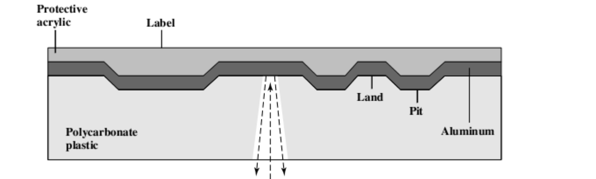

1. CD
2. CD-ROM(能够通过特定的仪器修改印错的内容)
3. CD-RW（特殊材料，能够被镭射灯改变反射性）
4. CD-R（有一个染色层，染色层能够被高强度辐射激活，这个disk能够被CD-R/CD-ROM读取）
5. DVD 可以刻印两面（bits的排列更紧密）

### Magnetic tape

## Error Correction

添加额外的信息来进行判断（额外的信息也可能出错）

Data in：从D生成校验码C，方法为f（f认为是不会出错的）

Data out：C拷贝出来，生成为C‘，然后D拷贝出来为D’，D'生成C‘’

### 奇偶校验：通过移位判断1和0的个数

方式：假设D=DM...D2D1

Data in:

Data out：

奇数校验：C和D中1的个数和为奇数

偶数校验：C和D中1的个数和为偶数

检验方式：

缺点:如果有偶数个数的位同时出错时，检验不出来/不能够发现什么地方出错

### Hamming Code

通过奇偶校验判断是否出错，但是对于01串分组，基本逻辑可认为：相交的组均出错，则基本认为错误来源是其相交的部分

- C'和C''异或之后的结果为syndrome word

- 希望通过syndrome word来表示错误的位数

- 假设syndrome word为K位，c为K位，D为m位，则应满足：2k>=m+k+1

- 通过改变异或的方式，来使得D中或C中的相应位数出错时，syndrome word有相应的表示

  

  

hamming code改善：加C5可判断两个位出错时的情况

### CRC：

cyclic redundancy check:在流的情况下处理数据

给长串的数据进行错误判断

基本逻辑：

从m位的D需要得到k+m的传输数据，生成一个k+1位的多项式，生成的k位的余数，余数即为生成的C，存储，然后将取出的k+m位的数据做同样的除法操作，余数应为k个0

从D到C的计算方式为多项式除法

## RAID

redundant array of independent disks

### RAID level 0

原理：使用多个磁盘处理多个请求时，可以多个磁盘同时处理，能够提高速率

- 更高的数据传输效率
- 更快的IO相应速度（IO请求调用的数据可能不在一个磁盘中）

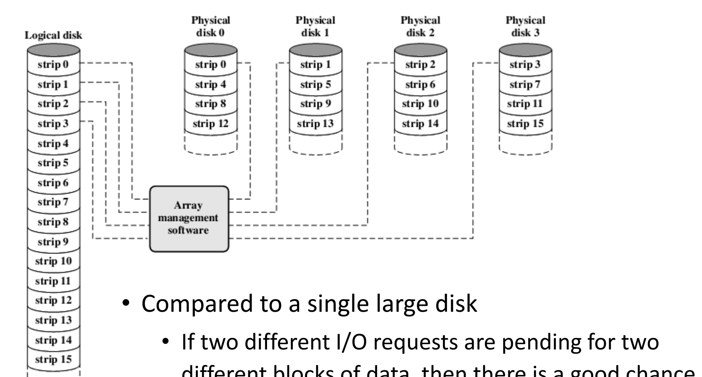

### RAID level 1

储存level 0的磁盘的数据复制，防止level 0的磁盘出错

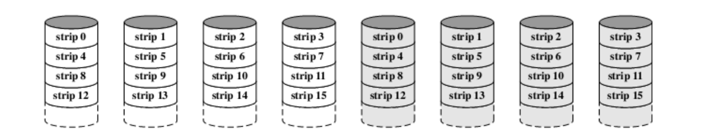

- RAID 1的读取会更快，因为两边同时读取，选最快的速度
- 写的时候要两边同时更新，但可以同时进行
- 缺点是耗费大

### RAID level 2 

将数据的校验码储存在其他磁盘中，磁盘在IO请求时强制所有的磁盘进行IO处理（输入输出校验码）

- 使用海明码校验
- 开发成本较高
- 磁盘的出错概率很小

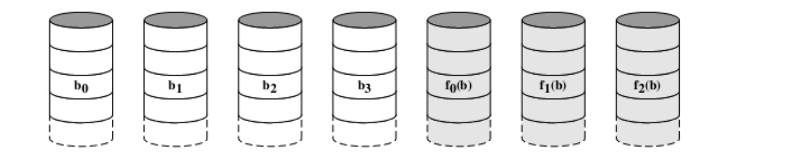

### RAID level 3

（某一个盘坏了，用奇偶校验的方式恢复改盘的数据）

### RAID level 4

将RAID分成多个单独的block,则可以独立的相应多个IO请求，同时使用level 3的奇偶校验的模式

（每次写的时候都要修改奇偶校验磁盘中相应位置的P，RAID磁盘能够独立处理IO请求，既可以多个盘同时处理多个请求，但奇偶校验的盘只能够同时处理一个请求，因此各磁盘没有办法相互独立）

### RAID level 5

- 没有办法控制读写的速率，最坏的情况是所有的盘读写的时间不是同时进行的，而是叠加的
- 所有的盘并不是完全独立的，如使用block 0时会影响到p16-19的修改，从而影响其他4个盘

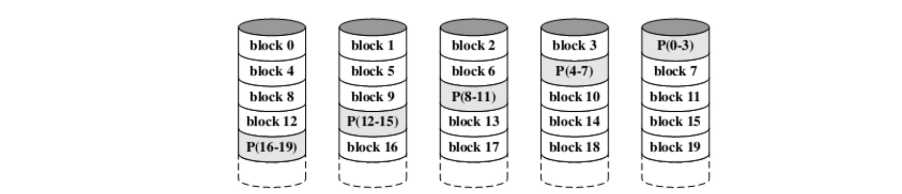

### RAID level 6

能够处理两个位出错时的状态

## Virtual Memory

memory management:多个程序进行时，每个程序分配的内存不足

### Solutions

1. 增加内存（不满足）
2.  Using exchange and overlap techniques 
3.  Virtual memory 

### 内存分区

#### fixed partition

分区方式：将内存分为大小不一样，但是大小不可变的内存区域

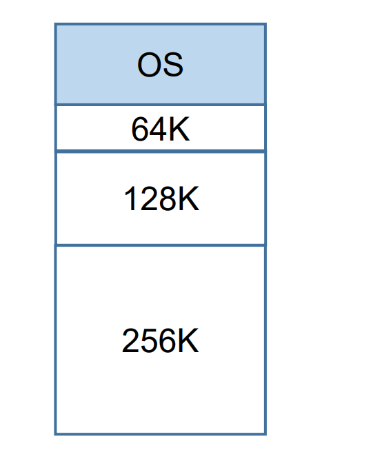

内存使用程序的原则：当前空白，能够放得下程序的最小的空间

#### Variable lenth partition

分区方式：内存的大小不固定，根据程序需要的内存空间来分配，但是在程序载入和调出后，容易在内存中存在多个小空，无法被使用，如图：

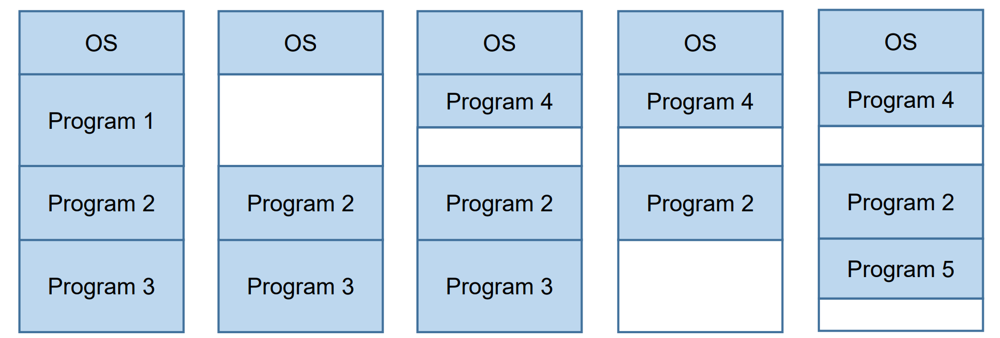

#### paging

程序并不知道程序的头和尾相差具体为多少：存在逻辑地址（逻辑地址应该是可以确定的）和物理地址（物理地址的头尾地址差不清楚）

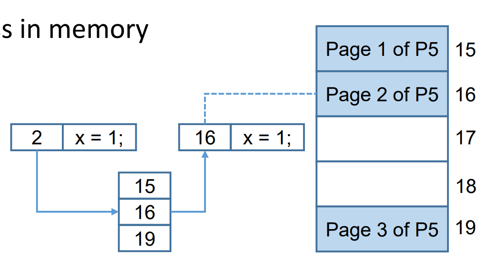

### Virtual Memory

#### 原理

是假设程序的所有部分都在内存中（方便程序的编写），但实际上程序仅有一小部分真正运行的部分存在于内存中（demand page），对于运行部分的调用和变换通过操作系统完成

#### 基本访问机制

硬盘中有一个部分专门用来放置即将运行的所有的程序的页面

cache比内存快10倍，内存比物理硬盘快10000倍（尽量减少对物理硬盘的访问）

#### 基于pages的虚拟内存

虚页（virtual pages）/实页（physical pages）

页表：包含了所有的虚页的信息

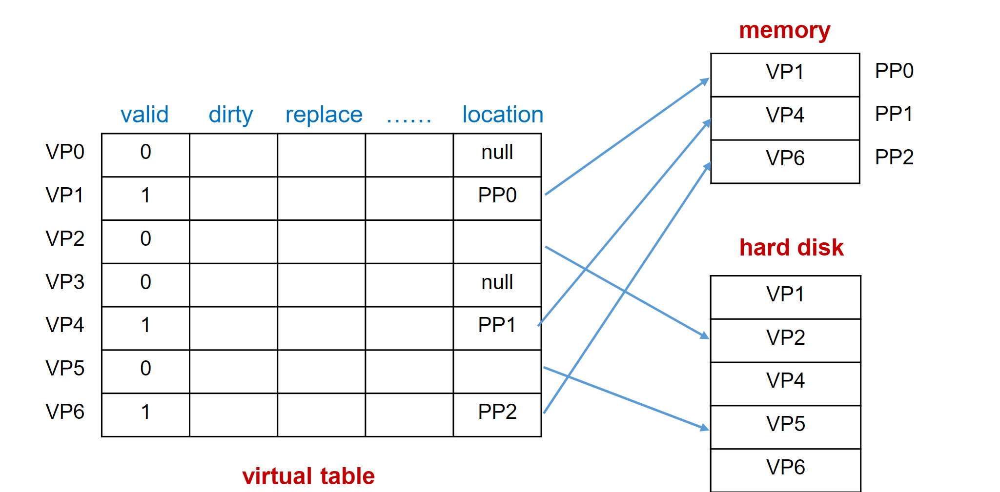

vaild有效位：为1时表明它被载入到物理内存中

#### translation lookaside buffer

从cpu中开始，如果需要的数据在块表中，去cache中找（进行cache的访问）如果不在块表中，在页表中找，页表中如果有，继续访问cache，如果没有实际的物理内存，再访问硬盘

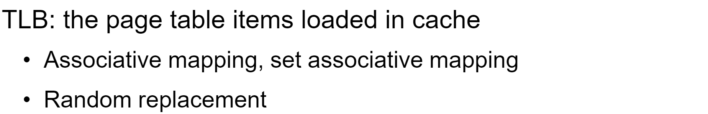

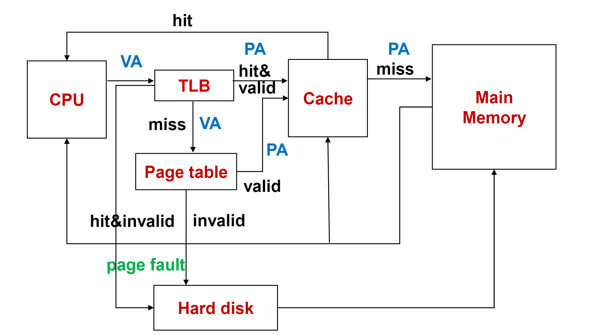

将虚拟的页号换成物理的页号，虚拟地址即变成了物理地址

#### segment based virtual memory

VP:segment number+offset in segment

## BUS

### 种类

1. Chip inner bus

   芯片内部总线，连接cpu/alu等

2. system bus

3. communication bus

### 组成：

- control line:不同的控制线传不同的控制信号，在多个设备冲突时确定总线传输什么数据

### 仲裁器：

#### Daisy chain

- 从高优先级到低优先级使用总线
- 总线在被占用时不可被其他的东西所占用

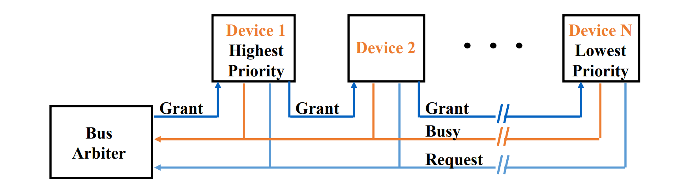

优势：

- 容易实现优先级的高低
- 能够比较容易加入新的设备

缺点

- 若在链式结构中，若有一个设备被破坏，则后续所有的其他设备都无法使用
- 获得总线许可时间慢，大量时间消耗在总线分布上

#### Query by a counter

仲裁器在发出许可要求的过程中（许可要求通过优先级的方法实现），持续性向前进行，当需要总线的设备发出许可时，则使用总线

（类似于导员报数然后学生接收报数，报数的策略可以不尽相同）

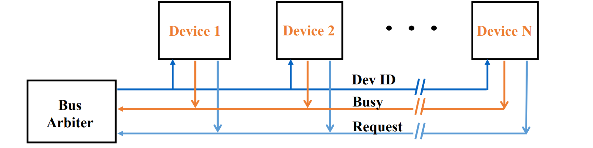

#### Independently request

仲裁器将发出请求的所有设备按照优先级排序，然后让最高优先级的设备使用总线

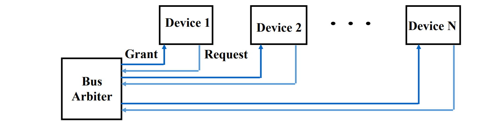

#### Self selection

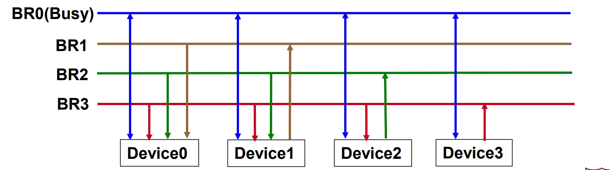

- 总线可以被设置为忙，因此和所有的设备之间都是为双向箭头
- 设备3的优先级最高，可以直接使用BR3，而剩余的设备如设备2在使用时，BR3有可能被设备3所使用的，因此需要返回信号

#### Collision detection

- 当两个设备同时发现总线不忙，且总线不被占用时，同时使用总线，发生冲突，冲突时两方均不使用总线
- 先发出请求的设备使用总线

### Timing：

#### 同步

存在一个外部时钟，同步时，所有的设备都使用相同的时钟周期，eg:约定好一个时钟周期发信息，再过两个时钟周期取消息

缺点：

- 总线较长时，时钟周期无法对准
- 所花的总时间取决于所有总线中最慢的设备

#### 异步

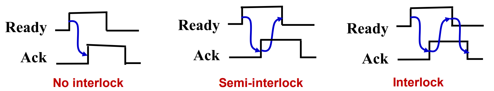

- 发送ready信息
- ack发送收到信息，当收到信息被收到时，再撤掉ready信息
- ready信息被撤掉时，收到信息才被撤掉

（一共发了两次信号，“准备好了”和“收到了”信号，然后有两个信号的撤回）

（握手的重点在于一件事发生在另一件事之前）

handshaking example

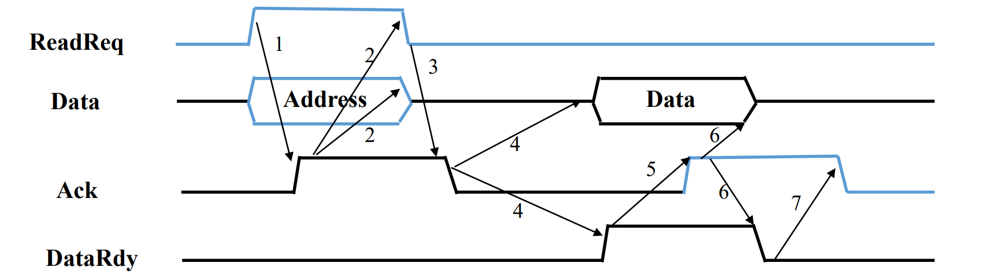

- 异步通知
- 内存释放出回应的线，然后将data ready来准备发出数据（信号4的作用是约束信号2的回应信号）
- 异步通知接收数据

#### 半同步

为了减少噪声对异步传输的影响，在异步过程中，使用时钟周期，规定某个信号的发起必须在某个时钟周期之前

#### 分割总线数

- 总线传输地址给设备，在设备准备数据的过程中释放总线，使得总线进行其他设备的数据传输
- 当数据准备好之后再发一次请求，使用总线
- 增加了总线的传输效率，但是降低了每个设备的传输效率以及增加了复杂度

**概念**：

总线带宽：瞬时最大传输率

数据传输率：实际情况下的数据传输率

### 改善：

#### 增加总线带宽：

- 增加时钟频率
- 增加总线宽度

#### 增加数据传输率：

- 降低准备时间
- 将地址与数据分成两条线，一起传输

### 总线层次结构

在cpu和主存之间增加一条总线——双总线结构

- single bus

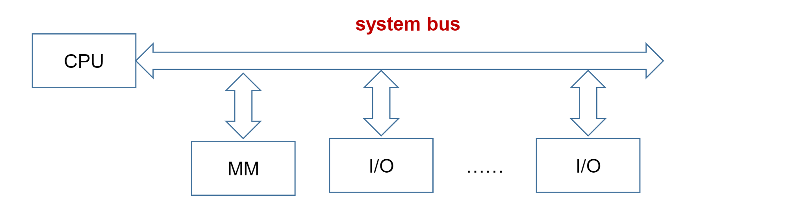

- double bus

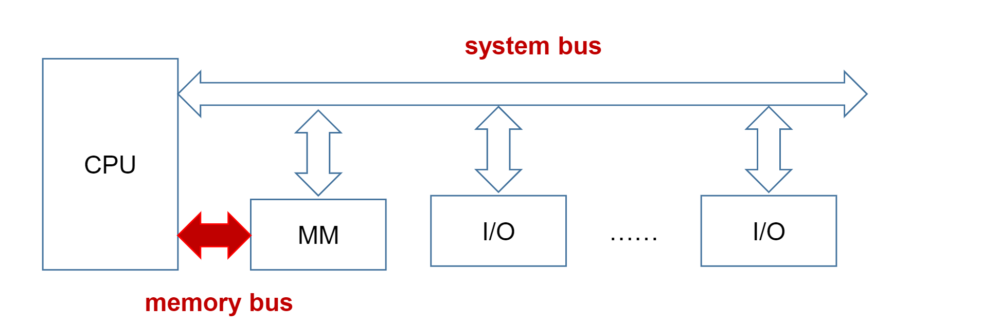

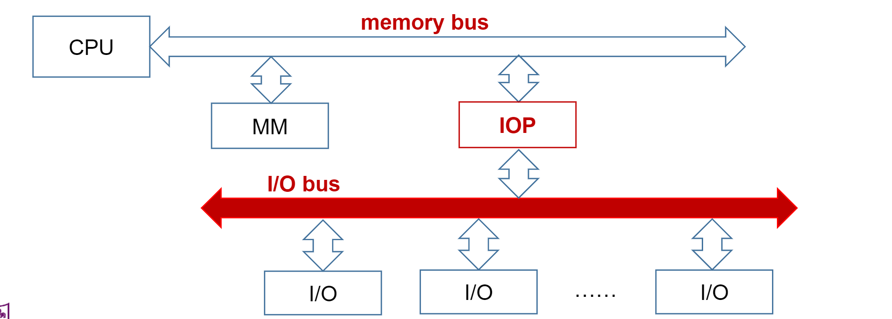

- multiple bus hierarchy

  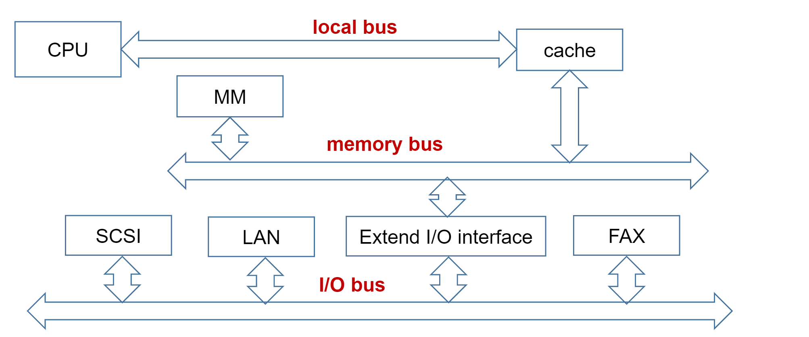

## instruction sets

### 指令

- 操作码（指令执行的内容）+操作数（要操作的对象）
- 多周期实现方案：
  - 取指令
  - 译码/取寄存器
  - 执行/有效地址/分支
  - 访问内存
  - 储存结果

#### 正常指令周期

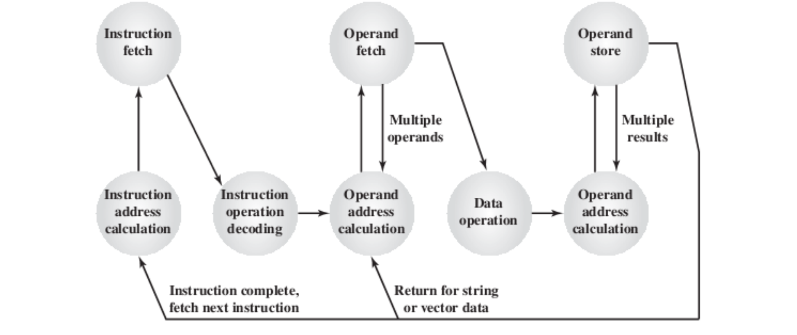

#### 中断处理

在每次指令执行完之后，先check是否有中断请求（如果有就处理中断），再来执行下一条指令

#### 指令要素

- 操作码
- 源操作
- 操作结果
- 下一条指令

### 操作

#### Transfer of control

- 分支
- 跳过
- 回调

**底层实现：**

- register：改变pc的位置（不能实现多层调用）

- start of called procedure：在每个函数的上一层函数的信息写在函数开始的前面

- 使用栈

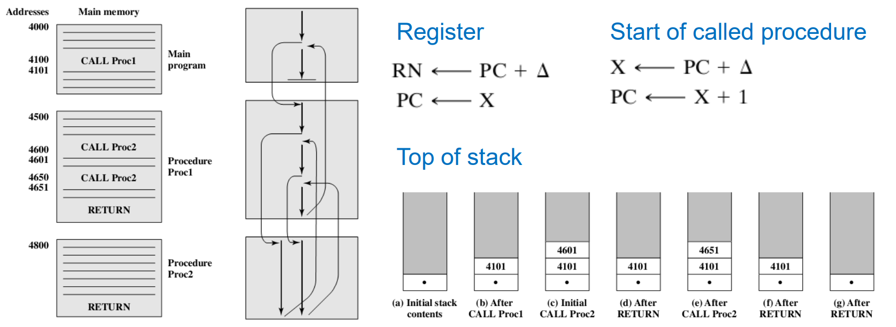

#### Address

双操作数的情况

- 两个源地址
- 结果存储地址
- 下一条指令的地址

可修改为三地址、两地址和单地址情况：

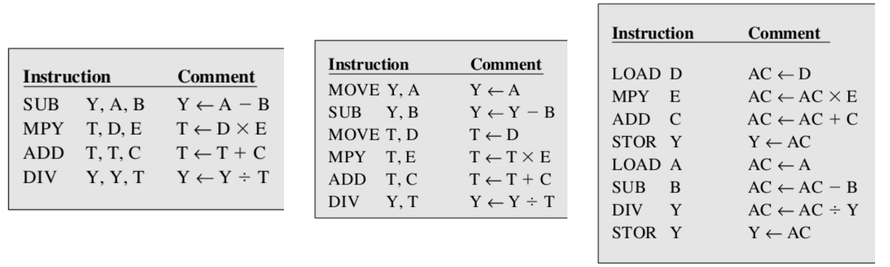

能够使访问的时间变短/但在做同一做事情时，做的事情变多

（适合CPU速度变快，但内存速度慢，取数据不方便时）

#### Big endian ordering and little endian ordering 

### 寻址模式

#### immediate addressing

- 获得操作数最快
- 操作数本身数值的范围会受到指令长度的限制

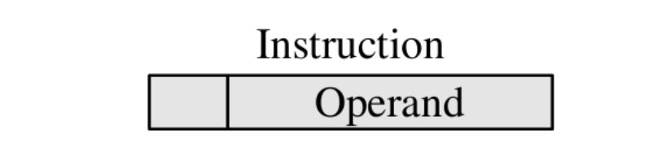

direct addressing 

- 可以访问到比较长的数据
- 同时能放置的个数比较有效，根据指令中的地址段的长度决定

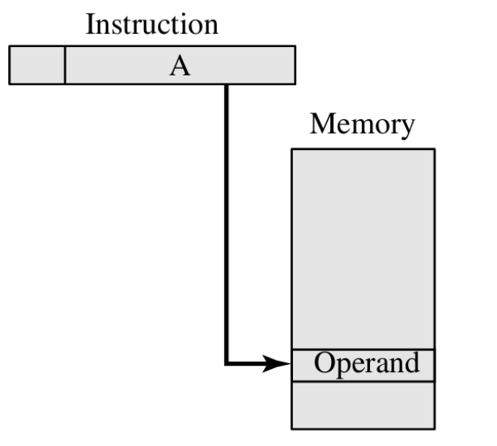

indrect addressing

- 先取得一个地址
- 再根据地址在内存中进行访问
- 可以访问大量的数据，但需要两次转换才能拿出数据

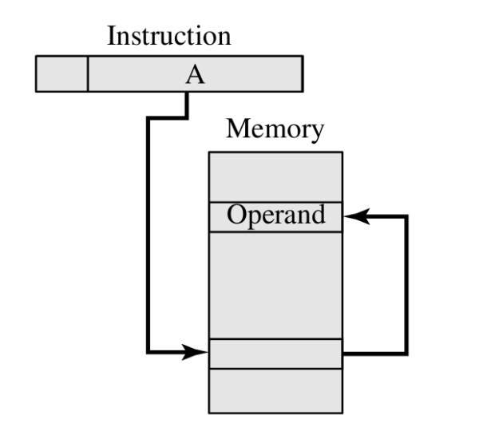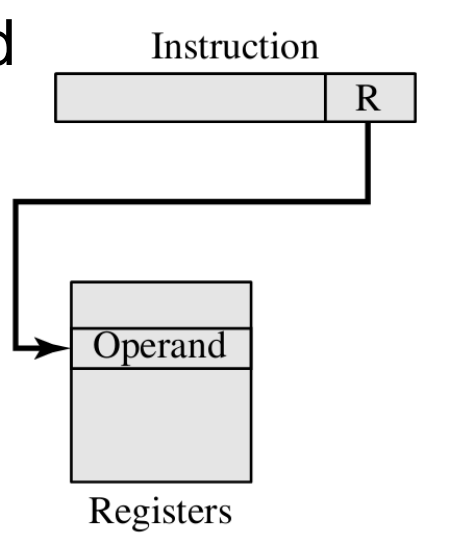

register addressing

寄存器存储，但代价较高

displacement addressing

relative addressing

- 通知PC离下一个指令有多远，即通知偏移量
- 程序执行有局部性，偏移量比较小，能节省指令空间

base-register addressing

- 偏移量是基于程序最开始的基址决定

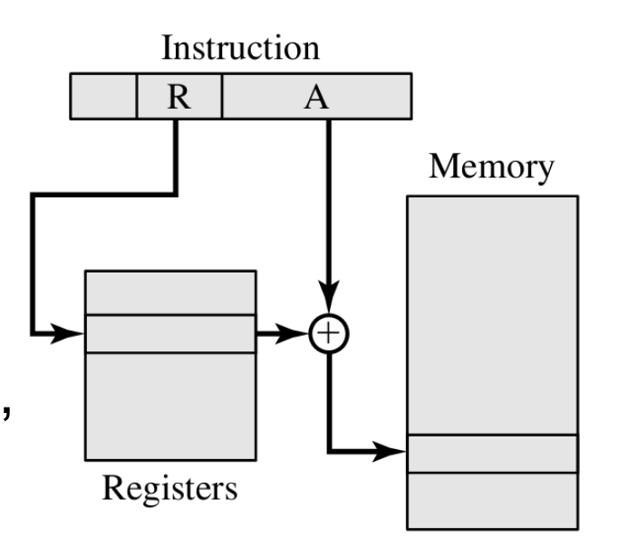

