# 计组

## ALU运算策略

### 整数乘法

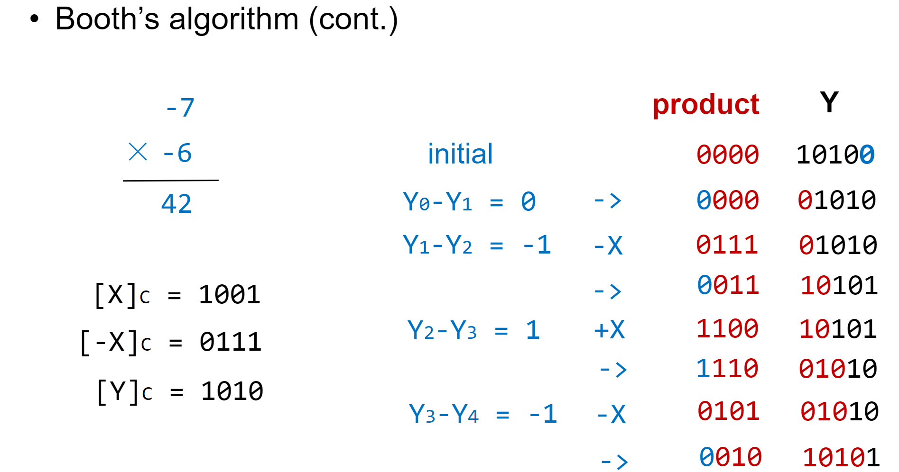

### 整数除法

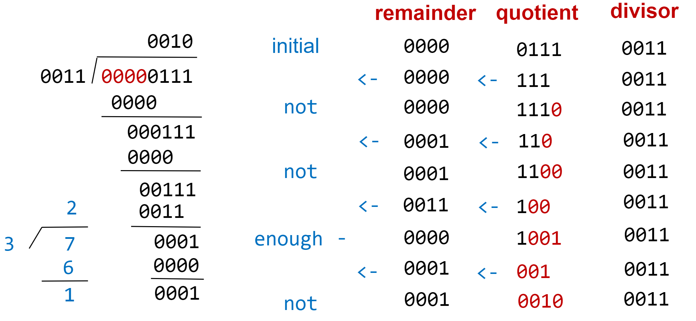

## cache

### direct mapping

内存地址直接通过address mod cacheline的方式来映射到cache上，因此在寻找cache时只需要找一行，对于这一行进行tag的对比即可

对于Tag的计算，总地址长度减去cache中一行的字长和cache行数，其余的部分即为tag

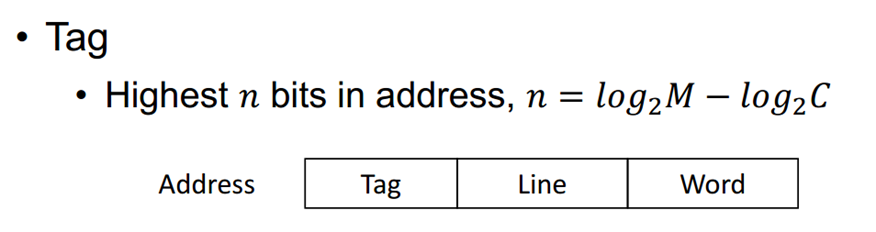

优点：寻找，写入比较快

缺点：当cache比较小时，很多块会对应同一行，所以会反复对同一行内容进行修改，发生抖动

### associate mapping 

内存能够加载到cache中的所有的行中，且是在任何有空的地方加载即可，因此搜索cache时需要搜索全部的cache直到搜索到该行

Tag的计算为地址长度减去字长

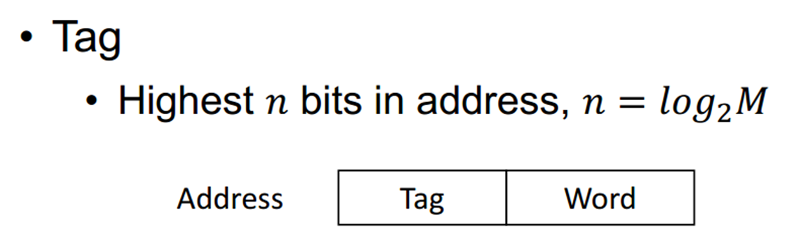

优点：能够避免抖动的发生

寻找方法：跟替换策略有关

### set aassociative mapping

- 将cache分成很多组，则该行对应到某一确定的组，但在组内定义到每行是随机的（相当于先直接映射，再随机映射）
- 因此内存中的地址映射到cache时直接通过address mod cacheGroup即可
- 四路组、二路组等的名称来源于一个组分为多少个块
- 组号不需要储存——原因类似于直接映射，中间一位为组中号

相关性：每一行在cache中可以存放的位置

### 替换算法：

（对于associate mapping 和set associate mapping算法，需要替换算法来执行当cache中的内容不足时来决定替换哪一行）

- 最不可能被用到的cache块，将其替换掉 LRU算法

- FIFO（先进来先被替换掉）

  

- least frequently used（最少使用的被替换掉） LFU算法

- random

### write policy：

为保存cache和主存的一致性，当cache被写入时也要写入主存，因此需要写回策略

- write through

  只要cache一被写过，就与主存联系，写回主存（降低写入速度）

- write back

  当cache被写过之后，使用dirty bit标记，然后再写回（最小化主存的修改，但控制会很复杂）

### Line size

（确定cache的line size应该为多少时比较合适）

由小变大时，hit 先会变大，因为一行中的数据变多，而一个程序调用集中在一起的数据的概率很大（局部性），但再变得更大时，hit可能会变小（依然是因为局部性），因为cache的总内容不变，行再变大时，减少了行数，替换变频繁反而降低了命中率

### Number of cache

一级命中了就返回，要是一级没有命中，则寻找二级中的内容，如果命中了，则返回，并且将一块内容写入一级cache，如果二级没有命中，则寻找三级，如果命中了则返回，并且写入一级二级，如果仍然没有命中，则寻找主存内容

## Internal memory

### **存储位元**

基本的存储单元，要有如下的特性

- 有0/1两种稳定的状态
- 可以至少被写入一次
- 可以被多次读取

### RAM

(random access memory)随机访问寄存器

特点：

- 可以简单的读取和写入数据
- 易失性

#### DRAM

**dynamic**

电容存储的寄存器，会随着时间流逝电量会逐渐消耗，电位可能会变化，因此需要刷新

#### SRAM

**static**

电位是稳定的，但是集成度低、价格高

DRAM多用于主存（便宜），SRAM多用于寄存器

#### SDRAM

synchronous DRAM 同步DRAM

- 会随着时钟信号来修改数据
- 在一个时钟周期中只能进行一次数据修改

#### DDR SDRAM

double data rate

- 在一个时钟周期中能够进行两次的数据修改

### ROM

read only memory

- 非易失
- 但只能够写一次，不能够重复修改
- 成本比RAM要高，且只能读取一次

可以应用在微编程、系统程序、函数表上

#### PROM

programmable ROM 可编程只读寄存器

- 非易失
- 只能写入一次，再次修改时需要特殊的电子环境且时间很长（20Min）

### Read-Mostly Memory

可多次写入，但读的次数比写的次数方便且一般比写的次数应用的多，非易失

#### EPROM

Erasible PROM 可擦出的可编程只读寄存器

- 可进行读写操作，但需要用紫外线擦除，且是整块擦除（较快）
- 比PROM贵

#### EEPROM

Electrically EPROM 可电擦除只读寄存器

- 可以写入，并且无需擦除数据，按字节覆盖即可
- 比EPROM贵

#### Flash-memory

闪存

- 电擦除
- 可以以块为单位擦除

### 从存储位元到主存

1. 几个相同的存储位元通过编制的方式组成一个地址单位（编制方式有Bytes（更常见）/words）
2. 多个地址集合组成存储的阵列
3. 存储阵列进一步的扩展，扩展方式有字扩展（字的结构不变，增加字数，相当于增加内存条）和位扩展（增加一个字中的位数）
4. 主存=RAM+ROM

## External memory

特性：使用频率不高，因此可以使用外部储存

种类：

- magnetic disk
- optical memory
- magnetic type
- USB flash disk,solid state disk(SSD):flash

### Magnetic disk

软盘：存储容量低

硬盘：硬盘驱动器与硬盘相连:movable head 能够读取磁盘上的信息

#### 磁盘结构：

如下结构为温氏磁盘：

- 磁盘磁头封装在一个无污染密闭的容器中
- 当磁盘不动时，磁头以气垫的形式轻停在磁盘表面
- 当磁盘旋转时，磁头因为气压的作用而上升，与盘面分离

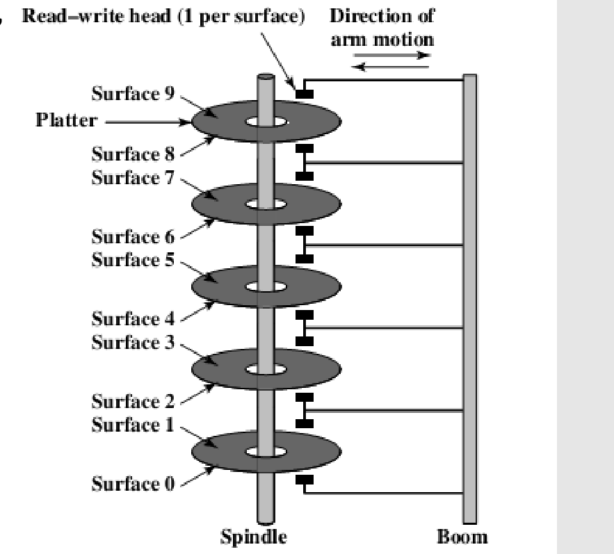

#### 盘面结构

每个同心圆为一个磁道；每个磁道会分为多个扇区——扇区中所储存的容量是一样大的，一般认为为512B

磁道最外面的编号为0

#### 扇区排列方式：

需要保证每一个扇区的容量相等

- 上面一种：当数据稳定读取时，因为其排列方式，所以读取磁道的角速度是稳定的

  好处：转动角速度相同

  坏处：磁道的分组比较复杂

- 下面一种：当数据读取稳定时，里面的转动角速度应该更快，才能保证读取扇区相同（分成很多个大环，大环内部角速度相同，大环之间角速度不同(一个大环里面的划扇区相同，可近似认为其弧长相等，但实际不等)）

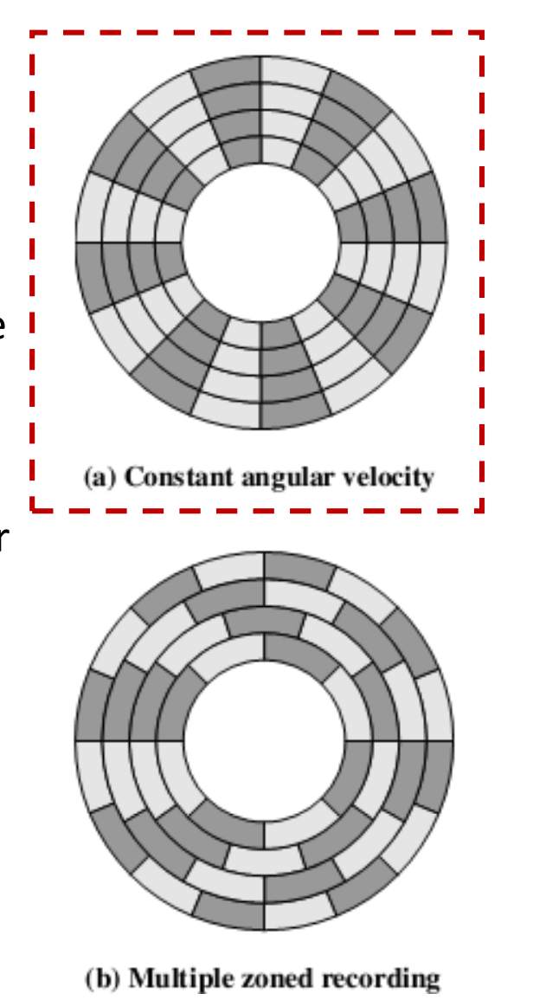

#### 磁盘微观结构

ID field：同步字节，磁道号，扇区编号

Gap:给处理信息之前的比对时间

Data field：数据区

格式化：加上一些额外数据使磁盘中某些数据不能被访问

#### 磁道访问的时间轴：

- seek 将磁头移到需要到达的磁道
- rotational delay 等待扇区的同步字节旋转到磁头的时间（读的时候旋转比写的时候快时，会造成扇区容易错过，需要再等一圈）
- data transfer 数据的传输时间 num of bytes to be tranfered/(num of bytes on the track*rotation speed)

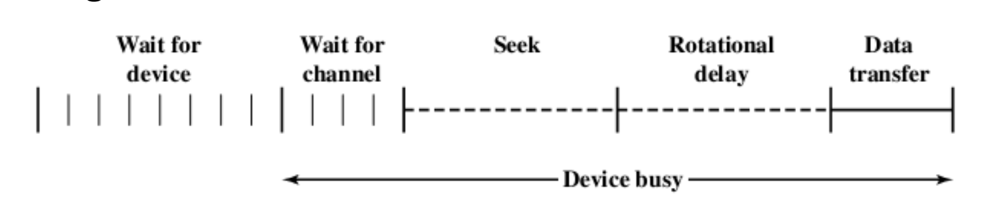

#### 磁盘的存储方式：

- 文件储存在连续的扇区内
- 文件随机储存

#### 寻道方式：

- FCFS first com first service(能够严格保证最开始的数据最先处理，但可能寻址很远)
- SSTF shortest seek time first(提高效率，但可能会有数据始终没有被处理或者很久以后才被处理)
- SCAN 从磁道0-n(来回扫描)
- C-SCAN 从磁道0-n（从n-0的过程为放空）
- LOOK 来回扫描但不一定到头

### optical disk

#### 光盘结构：

两面均为光滑的，中间的金属盘不平

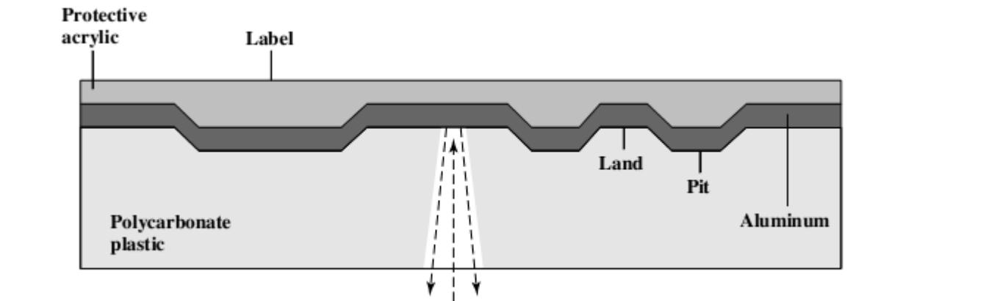

#### 光盘种类：

1. CD
2. CD-ROM(能够通过特定的仪器修改印错的内容)
3. CD-RW（特殊材料，能够被镭射灯改变反射性，可擦写）
4. CD-R（有一个染色层，染色层能够被高强度辐射激活，这个disk能够被CD-R/CD-ROM读取）
5. DVD 可以刻印两面，可以双面读取，反射层在中间（bits的排列更紧密）

### Magnetic tape

使用与磁盘相同的存储机制

容量大，存取快

## Error Correction

添加额外的信息来进行判断（额外的信息也可能出错）

Data in：从D生成校验码C，方法为f（f认为是不会出错的）

Data out：C拷贝出来，生成为C‘，然后D拷贝出来为D’，D'生成C‘’

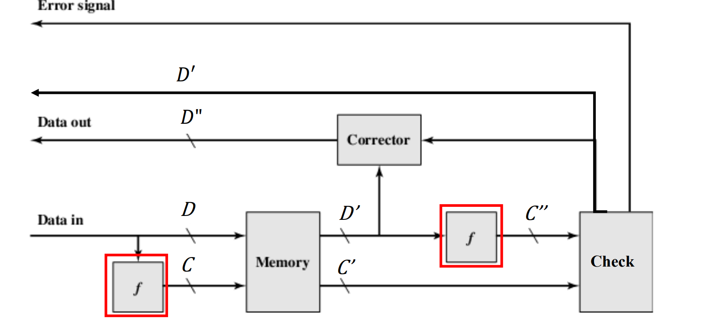

### 奇偶校验：通过移位判断1和0的个数

方式：假设D=DM...D2D1

Data in:

Data out：

奇数校验：C和D中1的个数和为奇数

偶数校验：C和D中1的个数和为偶数

检验方式：

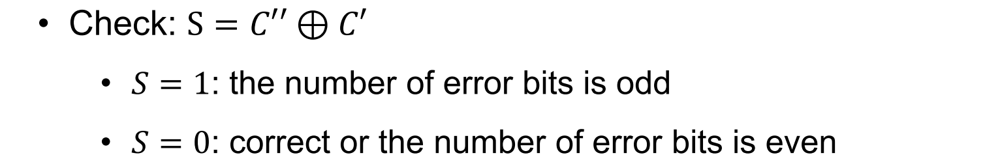

缺点:如果有偶数个数的位同时出错时，检验不出来/不能够发现什么地方出错

### Hamming Code

通过奇偶校验判断是否出错，但是对于01串分组，基本逻辑可认为：相交的组均出错，则基本认为错误来源是其相交的部分

- C'和C''异或之后的结果为syndrome word

- 希望通过syndrome word来表示错误的位数

- 假设syndrome word为K位，c为K位，D为m位，则应满足：2k>=m+k+1

- 通过改变异或的方式，来使得D中或C中的相应位数出错时，syndrome word有相应的表示

  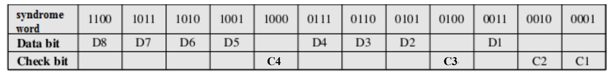

  

hamming code改善：加C5可判断两个位出错时的情况

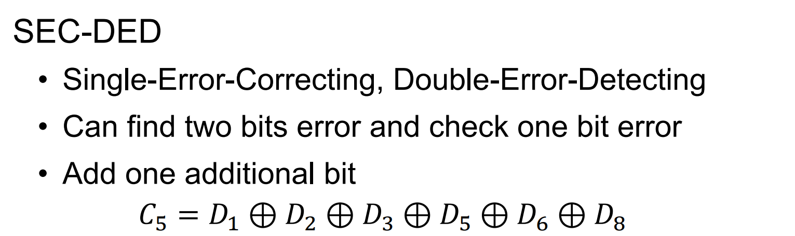

### CRC：

cyclic redundancy check:在流的情况下处理数据

给长串的数据进行错误判断

基本逻辑：

从m位的D需要得到k+m的传输数据，生成一个k+1位的多项式，生成的k位的余数，余数即为生成的C，存储，然后将取出的k+m位的数据做同样的除法操作，余数应为k个0

从D到C的计算方式为多项式除法

## RAID

redundant array of independent disks 磁盘冗余阵列

将单个或者多个I/O请求分配给多个盘，降低单个盘的负担

### RAID level 0

原理：使用多个磁盘处理多个请求时，可以多个磁盘同时处理，能够提高速率

- 更高的数据传输效率
- 更快的IO相应速度（IO请求调用的数据可能不在一个磁盘中）

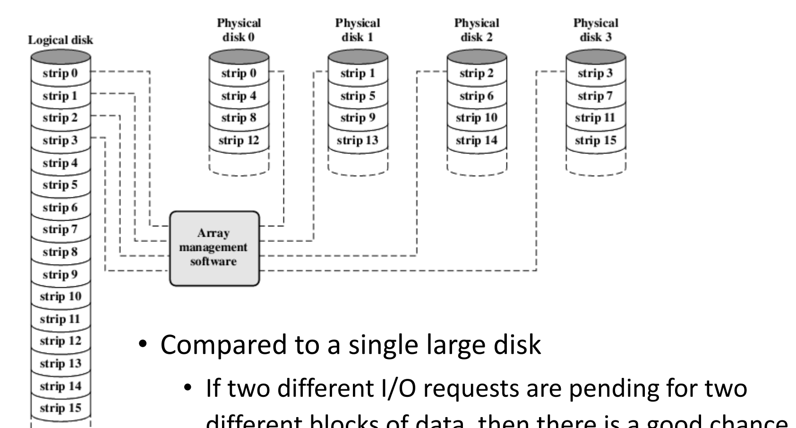

### RAID level 1

储存level 0的磁盘的数据复制，防止level 0的磁盘出错

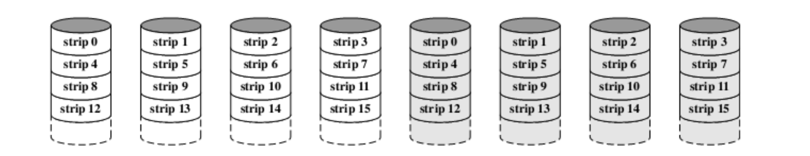

- RAID 1的读取会更快，因为两边同时读取，选最快的速度
- 写的时候要两边同时更新，但可以同时进行
- 缺点是耗费大

### RAID level 2 

将数据的校验码储存在其他磁盘中，磁盘在IO请求时强制所有的磁盘进行IO处理（输入输出校验码）

- 使用海明码校验
- 开发成本较高
- 磁盘的出错概率很小

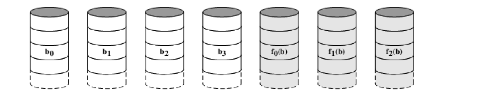

### RAID level 3

（某一个盘坏了，用奇偶校验的方式恢复改盘的数据）

### RAID level 4

将RAID分成多个单独的block,则可以独立的相应多个IO请求，同时使用level 3的奇偶校验的模式

（每次写的时候都要修改奇偶校验磁盘中相应位置的P，RAID磁盘能够独立处理IO请求，既可以多个盘同时处理多个请求，但奇偶校验的盘只能够同时处理一个请求，因此各磁盘没有办法相互独立）

### RAID level 5

- 没有办法控制读写的速率，最坏的情况是所有的盘读写的时间不是同时进行的，而是叠加的
- 所有的盘并不是完全独立的，如使用block 0时会影响到p16-19的修改，从而影响其他4个盘

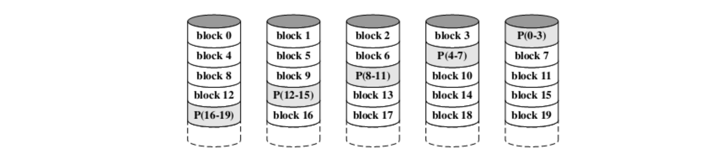

### RAID level 6

能够处理两个位出错时的状态

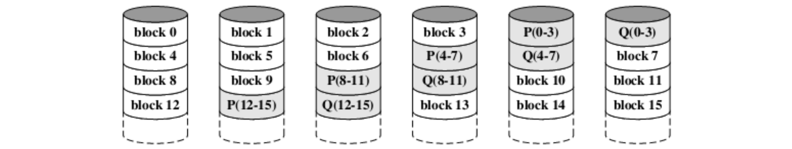

## Virtual Memory

memory management:多个程序进行时，每个程序分配的内存不足

### Solutions

1. 增加内存（不满足）
2.  Using exchange and overlap techniques 
3.  Virtual memory 

### 内存分区

#### fixed partition

分区方式：将内存分为大小不一样，但是大小不可变的内存区域

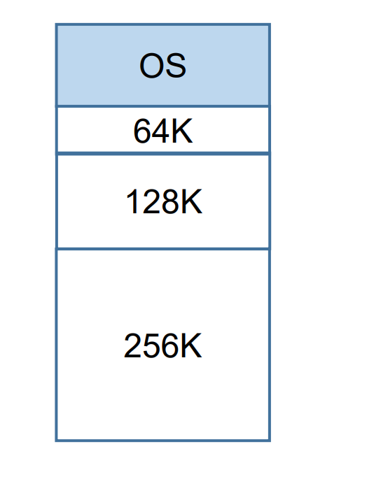

内存使用程序的原则：当前空白，能够放得下程序的最小的空间

#### Variable lenth partition

分区方式：内存的大小不固定，根据程序需要的内存空间来分配，但是在程序载入和调出后，容易在内存中存在多个小空，无法被使用，如图：

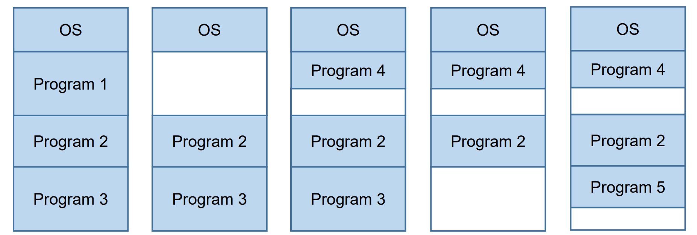

#### paging

程序并不知道程序的头和尾相差具体为多少：存在逻辑地址（逻辑地址应该是可以确定的）和物理地址（物理地址的头尾地址差不清楚）

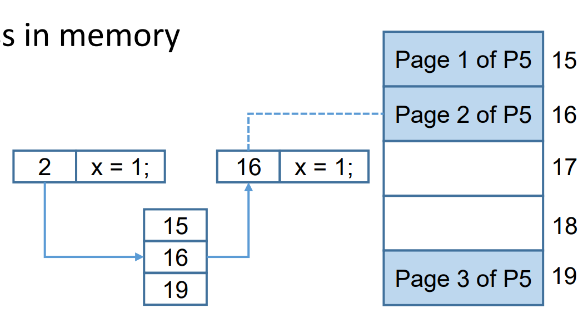

### Virtual Memory

#### 原理

是假设程序的所有部分都在内存中（方便程序的编写），但实际上程序仅有一小部分真正运行的部分存在于内存中（demand page），对于运行部分的调用和变换通过操作系统完成

#### 基本访问机制

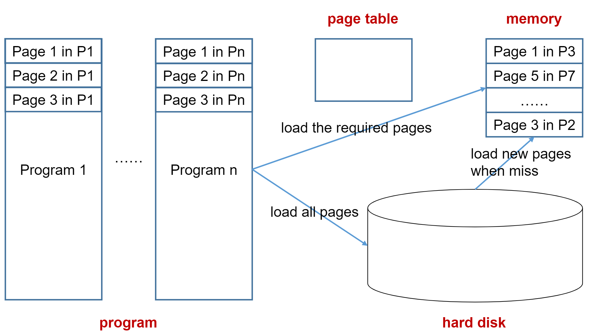

硬盘中有一个部分专门用来放置即将运行的所有的程序的页面

cache比内存快10倍，内存比物理硬盘快10000倍（尽量减少对物理硬盘的访问）

#### 基于pages的虚拟内存

虚页（virtual pages）/实页（physical pages）

页表：包含了所有的虚页的信息

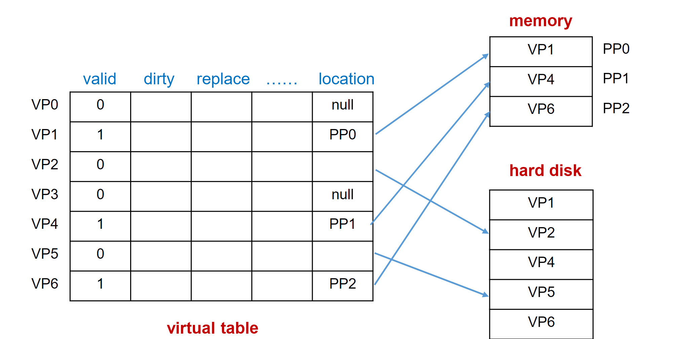

vaild有效位：为1时表明它被载入到物理内存中

#### translation lookaside buffer

从cpu中开始，如果需要的数据在块表中，去cache中找（进行cache的访问）如果不在块表中，在页表中找，页表中如果有，继续访问cache，如果没有实际的物理内存，再访问硬盘

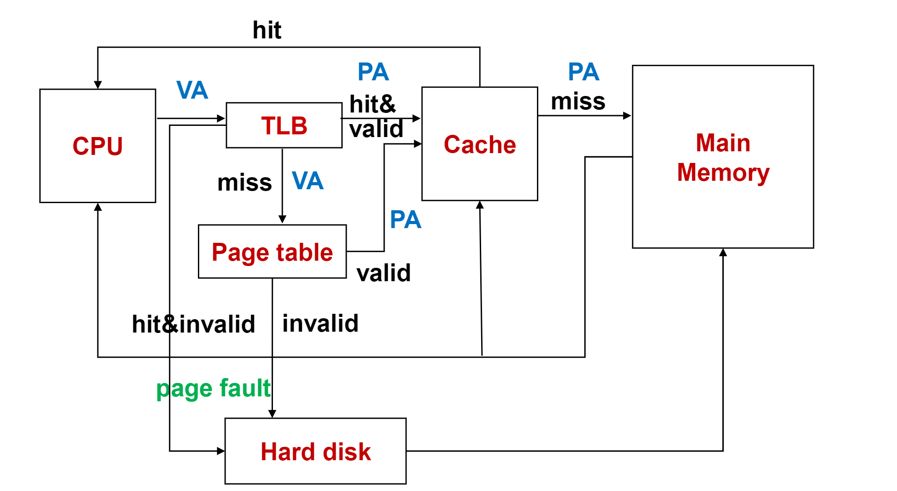

将虚拟的页号换成物理的页号，虚拟地址即变成了物理地址

#### segment based virtual memory

VP:segment number+offset in segment

## BUS

### 种类

1. Chip inner bus

   芯片内部总线，连接cpu/alu等

2. system bus

3. communication bus

### 组成：

- control line:不同的控制线传不同的控制信号，在多个设备冲突时确定总线传输什么数据

### 仲裁器：

#### Daisy chain

- 从高优先级到低优先级使用总线
- 总线在被占用时不可被其他的东西所占用

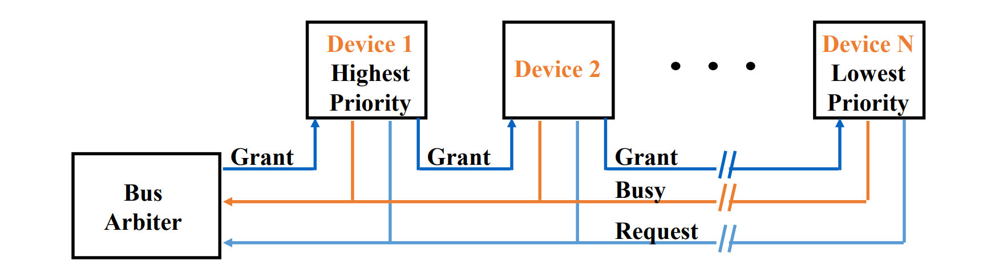

优势：

- 容易实现优先级的高低
- 能够比较容易加入新的设备

缺点

- 若在链式结构中，若有一个设备被破坏，则后续所有的其他设备都无法使用
- 获得总线许可时间慢，大量时间消耗在总线分布上

#### Query by a counter

仲裁器在发出许可要求的过程中（许可要求通过优先级的方法实现），持续性向前进行，当需要总线的设备发出许可时，则使用总线

（类似于导员报数然后学生接收报数，报数的策略可以不尽相同）

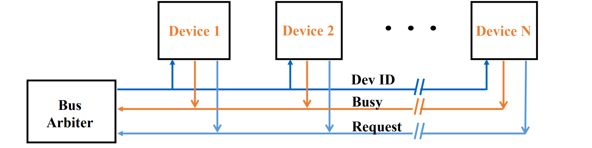

#### Independently request

仲裁器将发出请求的所有设备按照优先级排序，然后让最高优先级的设备使用总线

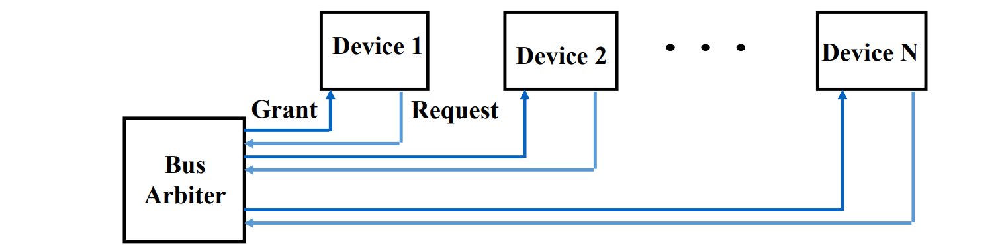

#### Self selection

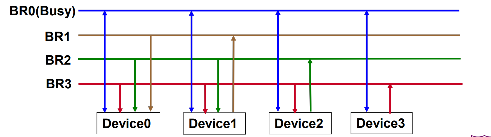

- 总线可以被设置为忙，因此和所有的设备之间都是为双向箭头
- 设备3的优先级最高，可以直接使用BR3，而剩余的设备如设备2在使用时，BR3有可能被设备3所使用的，因此需要返回信号

#### Collision detection

- 当两个设备同时发现总线不忙，且总线不被占用时，同时使用总线，发生冲突，冲突时两方均不使用总线
- 先发出请求的设备使用总线

### Timing：

#### 同步

存在一个外部时钟，同步时，所有的设备都使用相同的时钟周期，eg:约定好一个时钟周期发信息，再过两个时钟周期取消息

缺点：

- 总线较长时，时钟周期无法对准
- 所花的总时间取决于所有总线中最慢的设备

#### 异步

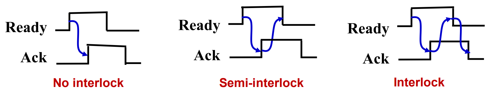

- 发送ready信息
- ack发送收到信息，当收到信息被收到时，再撤掉ready信息
- ready信息被撤掉时，收到信息才被撤掉

（一共发了两次信号，“准备好了”和“收到了”信号，然后有两个信号的撤回）

（握手的重点在于一件事发生在另一件事之前）

handshaking example

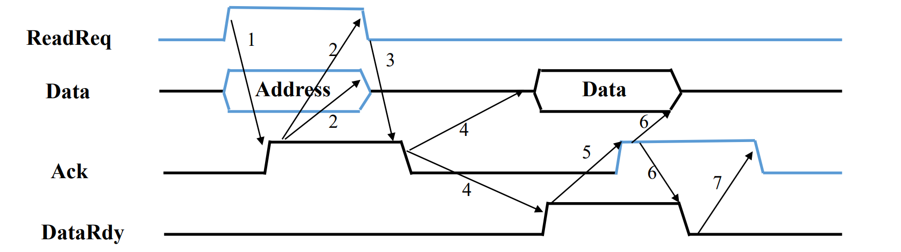

- 异步通知
- 内存释放出回应的线，然后将data ready来准备发出数据（信号4的作用是约束信号2的回应信号）
- 异步通知接收数据

#### 半同步

为了减少噪声对异步传输的影响，在异步过程中，使用时钟周期，规定某个信号的发起必须在某个时钟周期之前

#### 分割总线数

- 总线传输地址给设备，在设备准备数据的过程中释放总线，使得总线进行其他设备的数据传输
- 当数据准备好之后再发一次请求，使用总线
- 增加了总线的传输效率，但是降低了每个设备的传输效率以及增加了复杂度

**概念**：

总线带宽：瞬时最大传输率

数据传输率：实际情况下的数据传输率

### 改善：

#### 增加总线带宽：

- 增加时钟频率
- 增加总线宽度

#### 增加数据传输率：

- 降低准备时间
- 将地址与数据分成两条线，一起传输

### 总线层次结构

在cpu和主存之间增加一条总线——双总线结构

- single bus

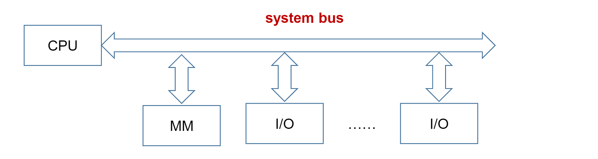

- double bus

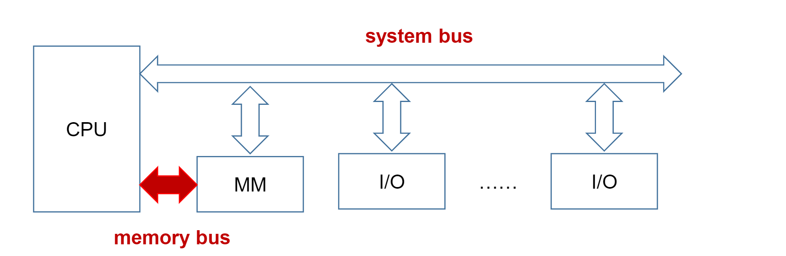

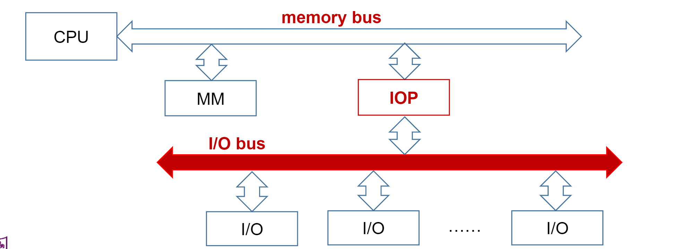

- multiple bus hierarchy

  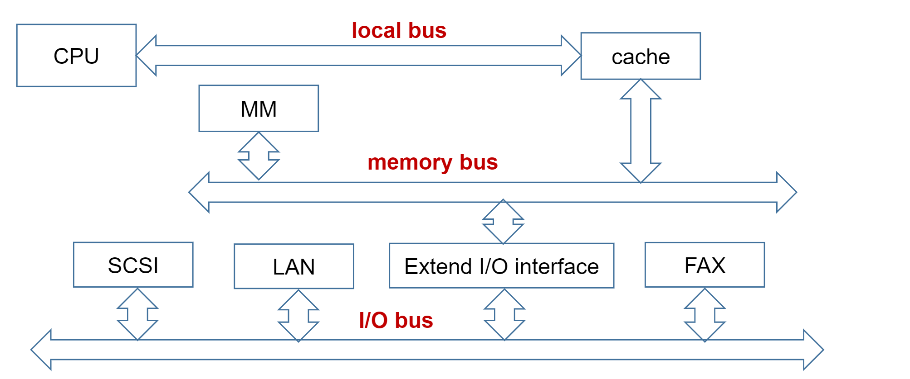

## instruction sets

### 指令

- 操作码（指令执行的内容）+操作数（要操作的对象）
- 多周期实现方案：
  - 取指令
  - 译码/取寄存器
  - 执行/有效地址/分支
  - 访问内存
  - 储存结果

#### 正常指令周期

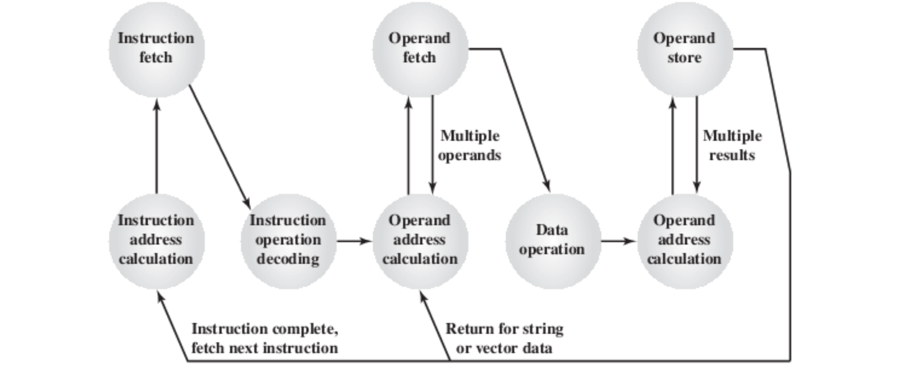

#### 中断处理

在每次指令执行完之后，先check是否有中断请求（如果有就处理中断），再来执行下一条指令

#### 指令要素

- 操作码
- 源操作
- 操作结果
- 下一条指令

### 操作

#### Transfer of control

- 分支
- 跳过
- 回调

**底层实现：**

- register：改变pc的位置（不能实现多层调用）

- start of called procedure：在每个函数的上一层函数的信息写在函数开始的前面

- 使用栈

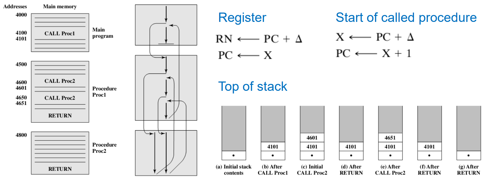

#### Address

双操作数的情况

- 两个源地址
- 结果存储地址
- 下一条指令的地址

可修改为三地址、两地址和单地址情况：

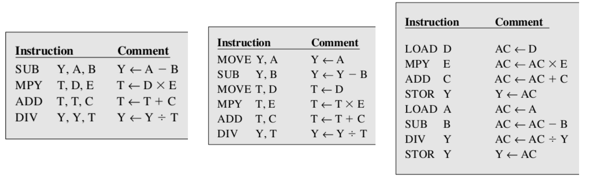

能够使访问的时间变短/但在做同一做事情时，做的事情变多

（适合CPU速度变快，但内存速度慢，取数据不方便时）

#### Big endian ordering and little endian ordering 

### 寻址模式

#### immediate addressing

- 获得操作数最快

- 操作数本身数值的范围会受到指令长度的限制

- 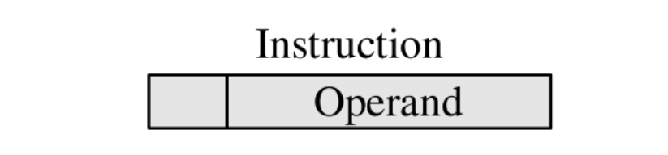

  direct addressing 

- 可以访问到比较长的数据

- 同时能放置的个数比较有效，根据指令中的地址段的长度决定

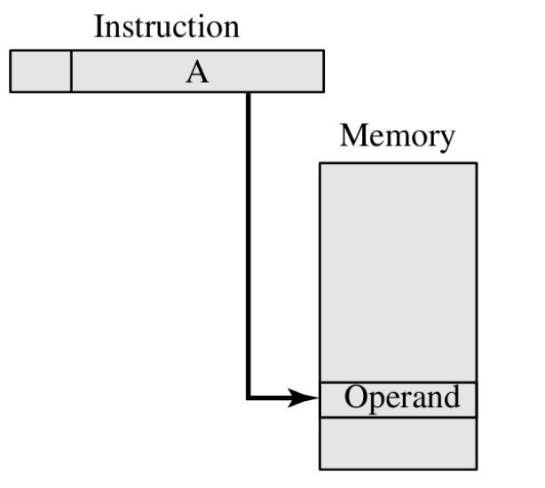

#### indrect addressing

- 先取得一个地址
- 再根据地址在内存中进行访问
- 可以访问大量的数据，但需要两次转换才能拿出数据

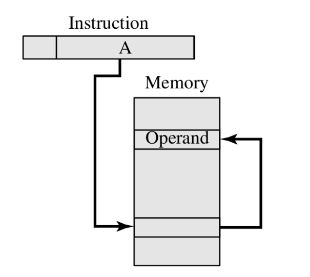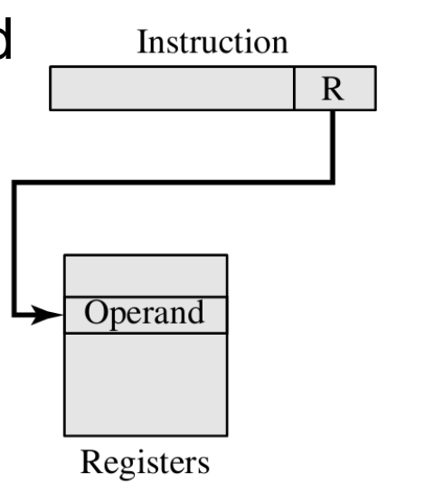

#### register addressing

寄存器存储，但代价较高

#### displacement addressing

##### relative addressing

- 通知PC离下一个指令有多远，即通知偏移量
- 程序执行有局部性，偏移量比较小，能节省指令空间

##### base-register addressing

- 偏移量是基于程序最开始的基址决定

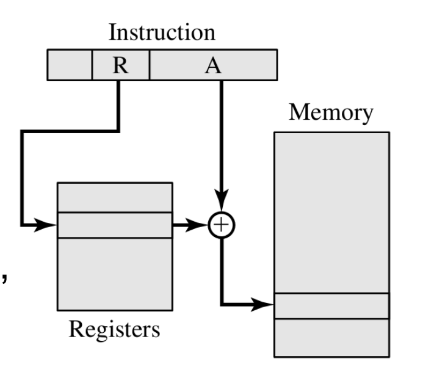

### Instrution set design

- 操作数不一定越多越好，根据需要设计
- 需要支持怎样的操作种类
- 指令的格式

### Instruction format

#### 指令长度相同

- 一个指令格式至少需要包含一个操作码，0或者1或者2操作数
- （方案一）如果一个指令集中操作码的种类为K2,则其总长度为log2k2向上取整+两倍操作数长度
- 有多种指令格式时，不能有二义性

#### variable length instructions

- 不定长时指令可能不完整

## CPU Structure and function

CPU处理器的结构：

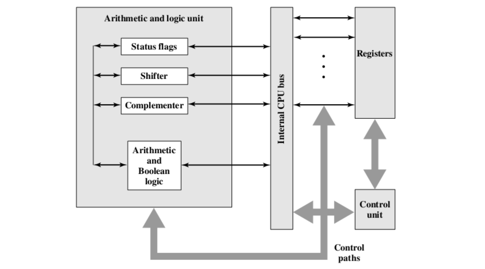

### Register

#### user-visible register

- General purpose register
- data register
- address register

##### 设计方式

- 寄存器较多时会增加费用，较少时操作复杂

##### store and recovery

- 对于一个回调函数而言，会自动地造成用户可见寄存器的储存

#### control and status register

##### 种类

###### PC

储存下一条指令的地址：program counter

###### IR

cpu的短暂储存器：instruction register

###### MAR

memory address register

###### MBR

memory buffer register

###### PSW

program status word：程序状态寄存（寄存器的每一位有特定的含义：是否为0，是否溢出，是否相等...）

###### Others（常用位置的地址）

- 储存栈顶位置的寄存器
- 页表位置的寄存器

##### 设计方式

- 操作系统的支持
- 控制状态信息很多，内存开头和寄存器都储存相应信息，如何分配相应的信息（寄存器越多，代价越高，肖略越高）

### Indirect cycle

间指周期

- 对于非直接寻址，当取完地址以后，就与直接寻址相同
- 对于完整指令周期，包括取址周期、间址周期、执行周期和中断周期

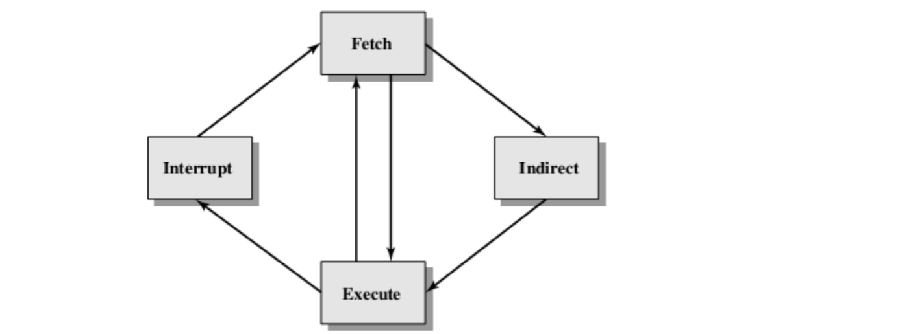

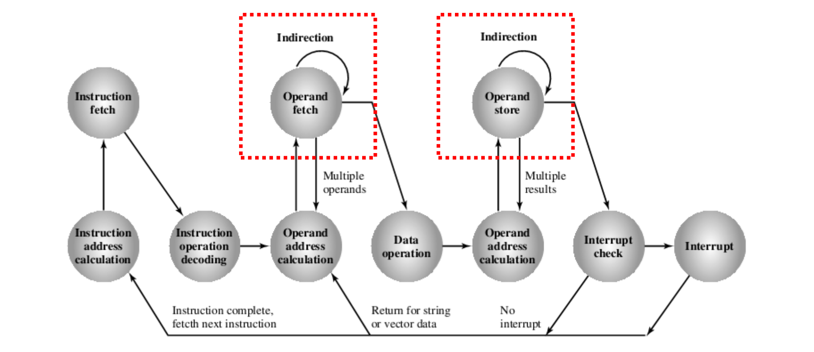

### Data flow

#### fetch cycle:

- MAR的每一位对应到地址线上的一根线（地址线上是否有点决定MAR的内容）
- MBR的每一位对应数据线
- 控制单元：给内存发控制信号（读请求，control bus中有多个线路，将读请求的线路设置为1即可），更新PC

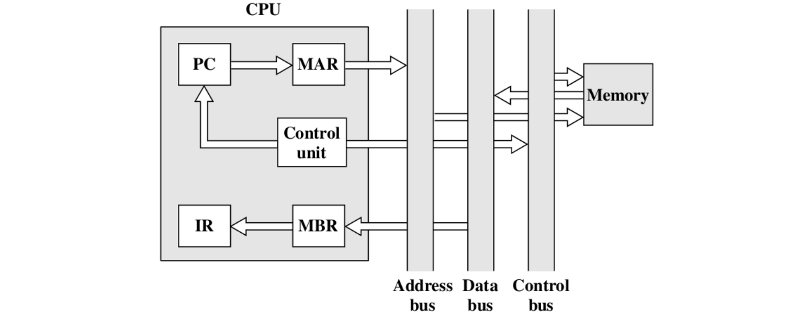

#### indirect cycle

- MAR中为A
- 控制单元中为读请求
- MBR中为EA，再将EA给MAR

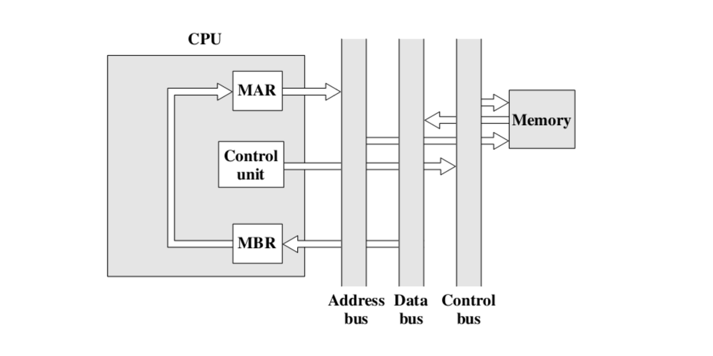

#### interrupt cycle

- 控制单元为写请求
- 写的地址为控制单元给出，写的内容为PC，写完后更新PC

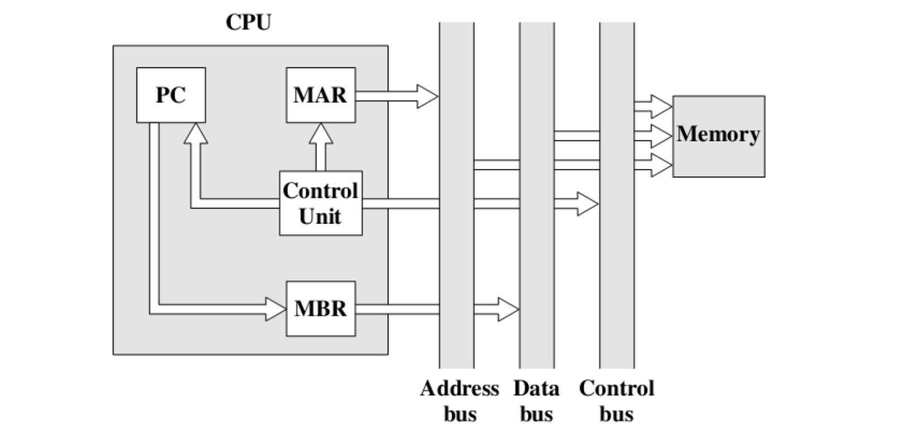

### Instruction pipelining

指令执行的流水线步骤，每一个部件固定做一件事，且保持高度运行状态

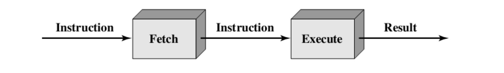

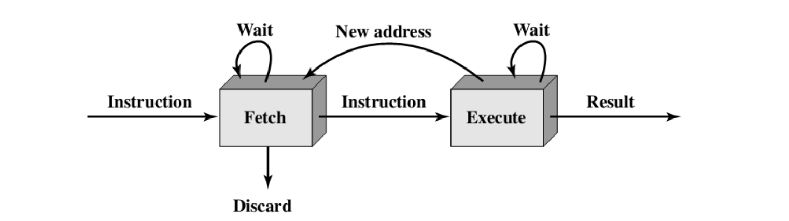

流水线问题在于：

- 执行的时间不等（将步骤分细，使每个步骤的时间尽量相等）

  对于6-9时间内，所有步骤都在进行，所花时间需要所有步骤中时间最长的

  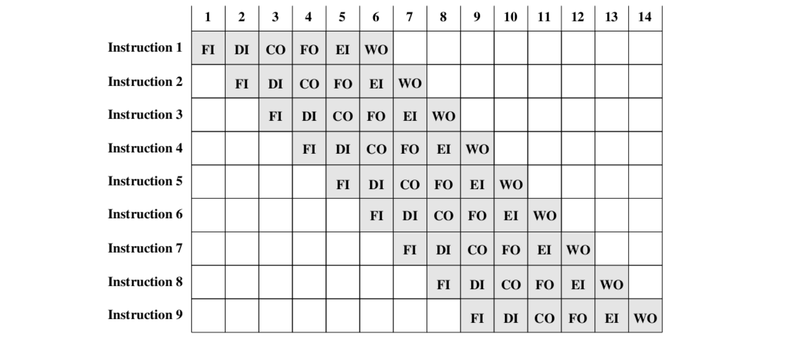

- 某个指令结束后，发现有中断，为了响应中断，需要其他的指令全都中断

  

#### 中断造成的时间损耗：


#### 加速比

使用流水线与不使用流水线的时间比——加速比大于1：

#### Hazard


##### 结构冒险：

- 在同一时间使用同一条数据等，造成冲突
- 解决方式可以为：增加一个数据

##### 数据依赖：

如下一条指令使用的操作数为上一条指令的结果（则下一条指令不能在上一条指令完成之前开始）


解决方式：

- 在中间添加空指令


- 庞路：当r1已经计算出来后，直接从ALU中作为其他ALU的输入


- 改变命令顺序

  

##### 控制冒险：

branch/loop等指令会改变指令顺序

- branch prediction

  预先猜测分支是否会进行

  - 会进行
  - 不会进行
  - 通过opcode进行预测

- 动态预测（状态机）

  

  基本逻辑为：预测进行跳转，如果继续跳转，则进行重复跳转，如果不继续跳转，则再进行一次跳转，如果还是不继续跳转，则进入预测不跳转状态（有两种持续状态，两种持续状态之间有两种过渡状态）

- 动态预测（根据历史数据进行统计）

  

## Control Unit Operation

### Micro-Operations


### Instruction cycle

#### Fetch cycle

t是运行中的时钟，要让t尽可能的少，且指令在同时进行时不会出问题

上下两种运行方式都可以

- MAR的操作必须在MBR之前，使得内存中有相应地址来取出数据
- MBR的写操作必须在MBR的读操作之前


#### Indirect cycle

如果采取了inditrct形式的取址，则将IR中放入原IR的地址中所对应的内容

#### Interrupt cycle

时间划分上，要注意先有MAR中的地址，才能有MBR和内存的内容传输

#### Execute cycle


#### 周期进行

通过设定一个两位的指令周期码


基本逻辑为：

- 先判断指令是否为间址，如果不是间址，直接跳到执行阶段，如果是，则进行间址阶段
- 执行后判断是否有中断，如果有则进行中断，如果没有则再次循环


### Function requirement of processor control

#### 基本元素


#### 进行的微操作


### Input/output of control unit


#### 输入

- 控制单元的返回控制信息：中断/异常等
- 时钟
- 指令寄存器
- ALU中此时的状态

#### 输出

- 控制ALU进行操作
- 挪动数据
- 对主存有控制信号

#### control signal

控制器在每一个时刻都控制所有的门的开关，因此需要在每个时钟都发出一个01串，0表示该门断开，1表示门合上


#### Minimal nature of control unit

将输入的01串通过固定的函数，生成输出的01串——真值表

#### CPU signal implementation

##### **hardwired** **implementation**

所有的请求直接通过连线连到CPU上，CPU通过解码，产生控制信号

- 标志位的每一位都是独立的

- 中断请求也是独立的

- 指令寄存器的操作码，时钟信号（是通过01串的组合形式来表示的，因此需要解码）

- 对于CPU的输入IR通过真值表直接解码，来控制CPU的输出

- 此时CPU的信号解码为将CPU使用改码的所有条件通过布尔函数表示出来，再将这些布尔函数并起来

  

##### **microprogrammed** **implementation**

- 将CPU所有需要执行的东西编成微程序
- 基本思想为：将所有步骤的控制信号记录下来，按照时钟信号往外发即可，对于如加法、减法等不相同的指令，也记录下来，然后判断是什么指令，执行相应指令对应的信号

基本执行方式如图：


- 对于每一个不同的操作，记录下不同的内容，然后在每个cycle最后判断进入哪一个部分的内容

- 控制线中有一位的是否跳转的信号，如果为0，则不跳转，继续执行，如果为1，则跳转，跳转进地址区域表示的地方（三种操作）

  

具体执行过程：


1. 控制地址寄存器从控制内存中读取一条指令
2. 控制地址寄存器根据这条指令生成控制信号，同时产生下一条指令的地址
3. 排序逻辑根据这条信息和ALU标志，将下一条指令装入该控制地址寄存器中

- 可以修改，但是比硬连线慢，且比硬连线代价更高

### Internal processor bus


页表的大小=页表项的大小*页表的数量

## Input/Output

### I/O module function

i/o模块需要和地址线、控制线、数据线都有控制信号的联系


I/O设备内部结构：


作用

- I/O设备信息：命令信息、数据信息、外围设备的状态信息、地址信息
- 控制和时间掌握
- 数据的缓冲区 data buffering 
- 数据校验 error correction

### I/O module strcuture

数据线：传输数据和状态信息


#### External interface

计算机系统内部为并行

I/O设备中接口中串联更多

**FireWire**并行：通过增加并行率来增加数据的传输率

**USB**串联

### I/O  operation technique

#### programmed I/O

- 接受命令（command 告诉I/O施行什么工作 instrcution 工作+地址）
- 检查状态直到准备完毕
- 将数据从I/O to CPU
- 再将数据写入内存


#### Interrupt driven I/O

CPU的速度比I/O版块快，因此使用programmed I/O会浪费CPU资源，所以使用I/O驱动对于CPU发出中断请求的方式

- 发出命令请求
- 准备，释放CPU
- 准备完后再发出请求

有一个中断控制器，五根线连到中断控制器上，所有的I/O模块共用一个请求线，最后由一个中断控制器来决定

中断控制器有：

- 轮询
- 链式
- 独立请求
- 总线争夺式
- 当优先级不固定时，可以分两相应优先级和处理优先级来进行处理

#### Interrupt driven I/O:response priority and processing priority


响应优先级：是最先开始进行排序的过程

处理优先级：如果有处理优先级高的部分，前面待处理的处理优先级低的部分会让位

——最后的中断处理是先根据响应优先级进行排序，然后根据处理优先级进行让位，“屏蔽”是指可以不进行让位的操作，处理优先级高的或者相等的可以屏蔽处理优先级低的

（在处理的时候，后面进行了一个处理优先级更高的中断，此时中断被打断/反之则可以屏蔽）

依据上例进行的中断屏蔽表和实际程序执行为：


#### Direct memory access

DMA和CPU都需要使用总线连接到内存，当DMA和CPU有数据冲突时，DMA传输数据到内存，因为此时DMA的数据传输过多，buffer容量可能不足，因此DMA有有限使用权


##### cycle stealing 

DMA在CPU的周期空隙进行总线的使用


##### alternate access

周期前半段给cpu，后半段给DMA


##### DMA的连接模式：

- 
- 
- 

##### 全过程：


