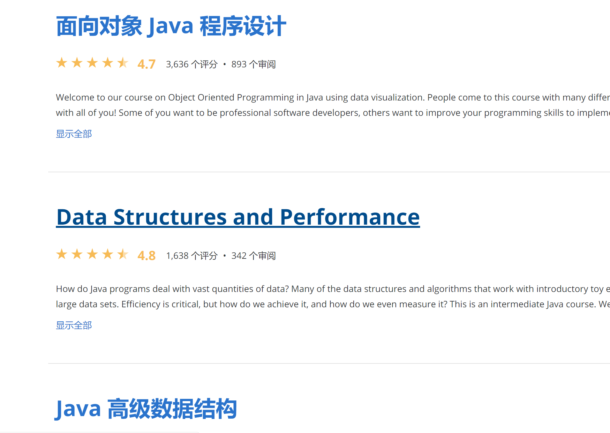
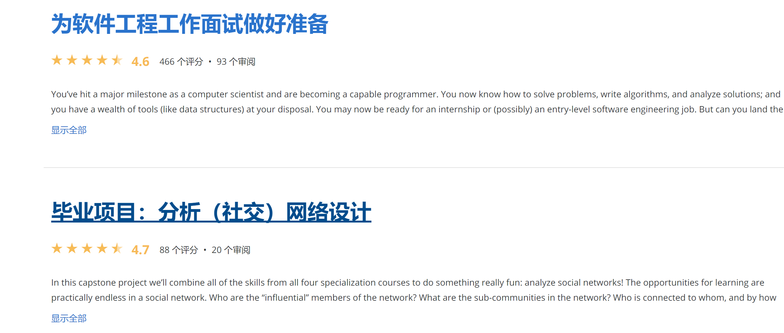
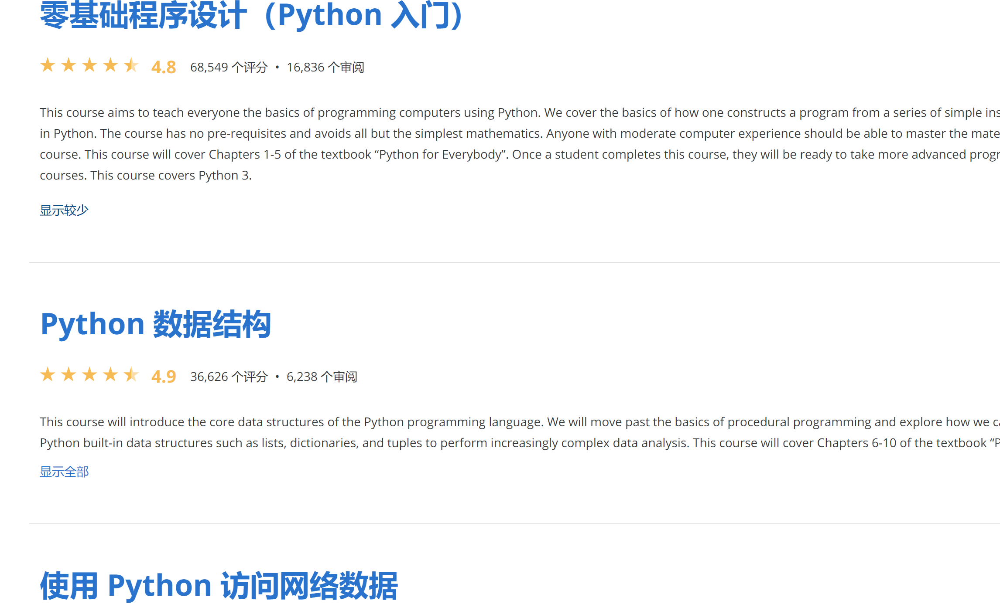
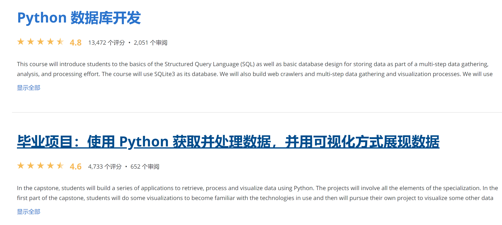

### java语言

1. programming fundation with javascript ,html,css

2. java软件设计原理

3. build a recomendation system

4. java程序设计进阶：

   

   

### python

1. 零基础python入门系列课程

   

   

2. 借助 Python 应用数据科学 专项课程

### 计算机操作系统课程

1. 南京大学计算机操作系统

### 函数式编程

1. programing language,part A
2. programing language,part B
3. programing language,part C