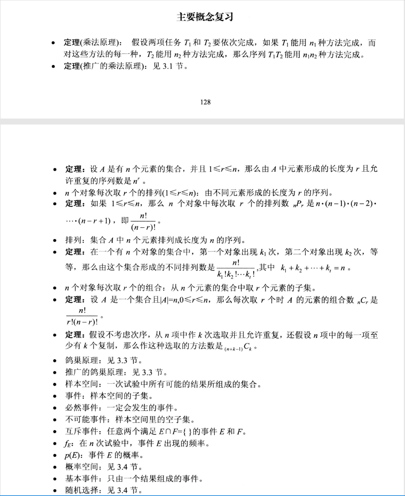
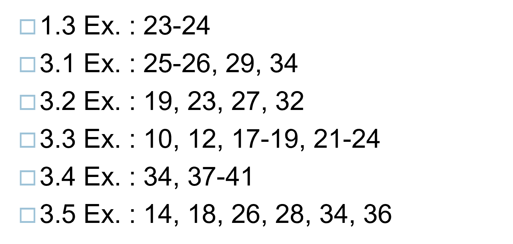
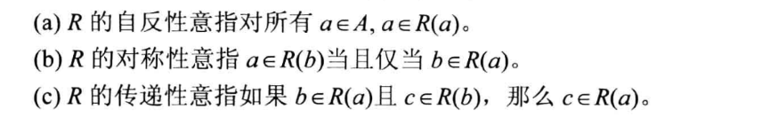
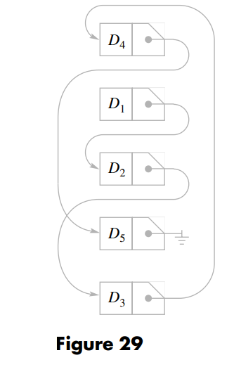
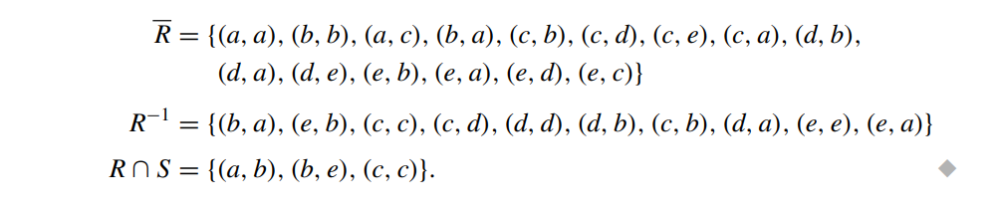
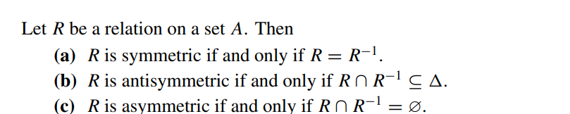
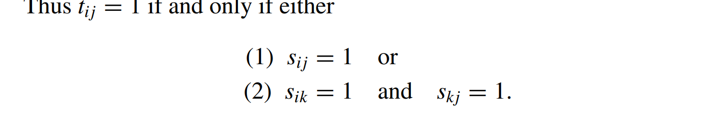
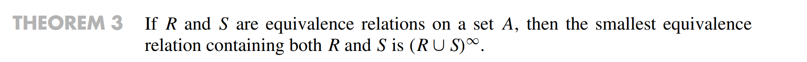
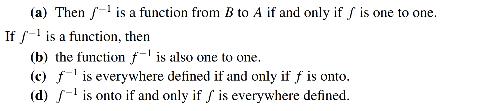
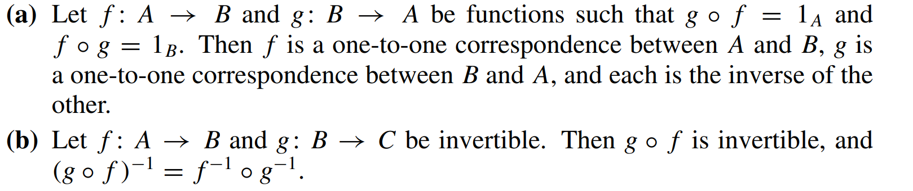

# 离散数学

### 第一章

主要概念：

### 第二章：逻辑

基本复习概念：p=>q真假性与~p∪q相同

### 第三章：计数

基本复习概念：排列组合；鸽巢原理（存在性证明）；概率；递归——特征根方程

### 第四章：relation and direction

对称关系的矩阵是：该矩阵的转置与该矩阵相等（双向通道）

非对称关系的矩阵是：Mij=0，则Mji=1；并且有Mii=0（单向通道，无环）

反对称关系的矩阵是：Mii=1或0，且Mij若i不等于j，则必有Mij=0或者Mji=0（单向通道，可能有环）

传递关系：当M平方包含M时，这个矩阵表示的关系就有传递关系

#### data structure of relations and graphs

1. 通过链表来表示的方式

   

2. 通过二维矩阵表示（因为二维矩阵能够表示relation，因此能够表示关系的指向）

3. 通过两个数组来表示edge的指向——数组分别储存edge的头和尾，还有一个数组储存NEXT来表示edge的变化（类似于链表的地址位），也可以对每一个节点增加一个VERT数组，在VERT数组的相应索引下，储存了离开该节点的一个edge的标号（没有指向其他节点的节点的该VRET位为0），根据NEXT和VERT的配合，能够遍历完离开某一节点的所有edge

   

算法：

1. 判断是否具有传递性：（对于二维数组进行操作）

   算法复杂度：

   

2. 在数组表示的方式中，添加edge的算法

   

   （头和尾都增加，同时next也增加一位，将next的这一位指向vert[i]指向的那个edge，再将新增加的next赋给vert[i]）

3. 在数组表示的方法中，检测是否有transive性质的算法：

   

   当edge数量较多时，用二维数组比较好；当edge数量较少时，用多个数组较好

#### operations on relations

则：

对于R和S的关系，有如下操作：

THEOREM 1

THEOREM 2

THEOREM 3

THEOREM 4

THEOREM 5

Composition

THEOREM 6

Closures：让R补充成满足自反性，对称性和传递性后补充的关系最少的一种R

THEOREM 7

矩阵乘法可交换

THEOREM 8

#### Transitive closure and Warshall's algorithm

##### Warshall algorithm

W算法即对于方向矩阵，从n=2开始不断扩展直到n=N，且扩展的方式从n-1到n时为Mn-1*Mn-1+Mn-1，最后直到扩展到N

### 第五章：函数

#### functions

mappings transformations

labeled digraph:所有的节点和edge都有实际意义的有向图

everywhere difined :定义域满

onto：值域满

one to one：一一对应，函数值不重复

invertible function：反函数

THEOREM 1

THEOREM 2

THEOREM 3

THEOREM 4

