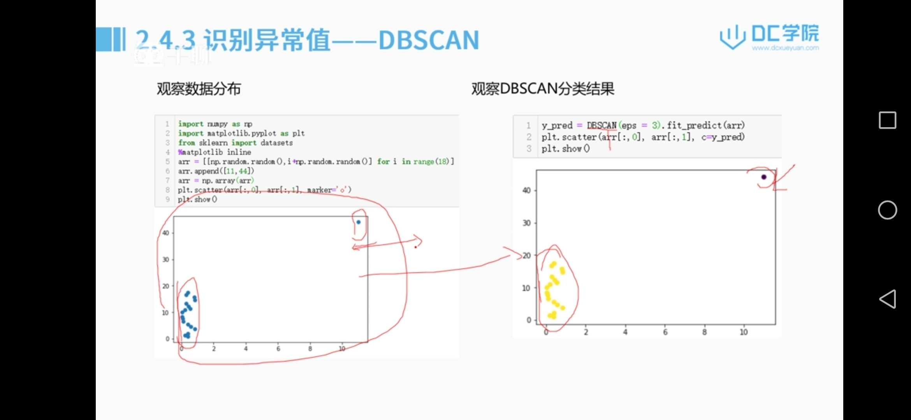

# 大数据项目

### 工程流程：

课题背景和目标——评估准则——认识数据——分析、预处理——特征工程——基于模型测试和优化——预期效果——记录模型和结果

### 认识数据和分析预处理：

#### 重复值、异常值处理：

import pandas as pd

import munpy as np

np.nan——数据缺失

缺失处理：df.dropna()(默认行删除)/df.dropna(axis=1,inplace=true)（将Nan行删除）

填充处理：df.fillna(-1)/df.fillna(df.mean())/df.fillna(method='pdf')(前一个值对后一个值做填充)/df.fillna(method='bfill')(后一个值对前一个值做填充)/df.interpolate()（插值法填充？）

删除重复行：x=x.drop_duplicates()

#### 特征缩放：

why特征缩放：平均所有的特征对于值的影响

怎么做特征缩放：

使用min max normalization方法

```py
from sklearn.preprocessing import MinMaxScaler

mm=MinMaxScaler(feature_range=(0,1))

data=mm.fit_transform(data)
```

均值缩放：

```py
import numpy as np
import pandas as pd
data=
df=pd.DataFrame(data)
(df-np.mean(df))/(np.max(df)-np.min(df))
```

标准化缩放：

```py
from sklearn.preprocessing import StandardScaler
std=StandardScaler()
data=
data=std.fit_transform(data)
data
```

#### 样本不均衡：

解决样本不均衡：

- 增加样本中数量较少的类别的数量

```python
(复制小样本数据)
from imblearn.over_sampling import RandomOverSampler
ros=RandomOverSample(random_state=0)
X_resampled,y_resampled=ros.fit_sample()X,y

print(sorted(Counter(y_sampled).items()))

(通过一定的规则生成新变量)
from imblearn.over_sampling import SMOTE(通过少数类样本的特性生成新的样本), ADADYN
X_resampled,y_resampled=SMOTE(kind='boderline1').fit_sample(x,y)

print(sorted(Counter(y_resampled).items()))
```

- 减少样本中数量较多的数量

```python
(减少一些多数类)
from imblearn.under_sampling import RandomUnderSampler
ros=RandomUnderSample(random_state=0)
X_resampled,y_resampled=ros.fit_sample()X,y

print(sorted(Counter(y_sampled).items()))

(根据新的样本生成一些样本替换多数样本)
from imblearn.under_sampling import ClusterCentroids
cc=ClusterCentroids(random_state=0)
X_resampled,y_resampled=cc.fit_sample(x,y)

print(sorted(Counter(y_sampled).items()))
```

- 设置权重（通常设置成与样本量成反比）
- 集成方法（分成多组样本进行训练，每组样本包含所有少数类样本和多数类样本的抽样）

```python
from imblearn.datasets import make_imbalance
ratio={}
X.resampled,y_resampled=make_imbalance(X,y,ratio=ratio)
print(sorted(Counter(y_sampled).items()))
(按ratio的比例抽取)
```

生成不平衡的样本

```python
from sklearn.datasets import make_classificaiton
form collections import Counter
x,y=make_classification(...)
Counter(y)
```

#### 识别异常值：

- 简单的统计分析
- 3 原则（正态分布：距离平均值3 之外的概率不超过0.003）


- 箱形图（大于或小于箱型图上界或者下届的数值为异常值）


- 聚类分析（基于密度的聚类方法，用于离群点检测）



### 特征工程

#### 特征处理：

##### 特征类型：

数值型（连续型和离散型），类别型（文本类型，枚举类型），时间型，文本类型，图形类型

##### 数值类型处理：

###### 连续变量的离散化——分箱

```python
bin_range=
bin_names=
df[]=pd.cut(np.array(df['Age'],bins=bin_ranges))
df[]=pd.cut(np.array(df['Age']),bins=bin_range,lable=bin_names)
```

###### 连续变量的离散化——自适应binning

```python
#基于四分位数的二进制方案
quantile_list=[0,.25,.5,.75,1]
quantiles=dt['income'].quantile(quantile_list)

#可视化这些分位数
fig,ax=plt.subplots()
df['income'].hist(bins=30,color='#A9C5D3',
                  edgecolor='black',grid=False)
for quantile in quantiles:
    qvl=plt.axvline(quantile,color='r')
```

##### 类别特征处理：

###### LabelEncoder:

```python
#对不连续的数字或者文本进行编号
from sklearn.preprocessing import LabelEncoder
x_data=pd.DataFrame()
x_data['gender']=np.array['male','famale','male','male','female']

le=LableEncoder()
le.fit(['male','female'])
x_data['gender_encode']=le.transform(x_data['gender'])
```

###### one-hot：

```python
#将离散的特征取值扩展到欧式空间(距离的计算或者相似度的计算)
from sklearn import preprocessng
enc=preprocessing.OneHoteEncoder(categories='auto')
df=pd.DataFrame(...)
enc.fit(df)
array=enc.transform(...).toArray()
```

##### 时间特征的提取：

```python
from pandas import to_datatime
a=np.array([...])
data=pd.DataFrame()
data['时间']=a

data['month']=data['时间'].apply(lambda x:int(x.split("-")[1]))
data['day']=data['时间'].apply(lambda x:int(x.split("-")[2]))
```

#### 特征构建：

1. 把已有的特征进行组合转换，组合的方式（一元，二元，多元算子）可以由用户自行定义，也可以使用库中自带的函数
2. 根据业务分析创建特征

##### 多项式：

```python
from sklearn.preprocessing import PolynomialFeatures
df=pd.DataFrame(np.random.randint(1,10,16),reshape(4,4))

poly=PolynomialFeatures(degree=2,interaction_only=True)
data=poly.fit_transform(df)
pd.DataFrame(data)
```

#### 特征选择

1. 过滤式：根据特征的方差或者相关系数对特征进行重要程度排序，方差越大，与目标变量相关系数越高，则特征越重要
2. 包裹式：每次选择一个效果最好的特征/每次删除一个效果最差的特征
3. 嵌入式：
   1. lasso回归，通过L1正则化，对特征进行选择
   2. GBDT，Xgboost，在不同数据抽样，不同样本抽样所得到的诸多蛋壳决策树中，重要的特征会有更高的概率出现在树中

##### SelectKBest运用：

```python
from sklearn.datasets import load_digits

form sklearn.features_selection import SclectKBest,chi2
x,y=load_digits(return_x_y=True)
x.shape
x_new=SelectKBest(chi2,k=20)fit_transform(x,y)
x_new.shape
#shape是被优化过的（进行特征选择过的）
```


