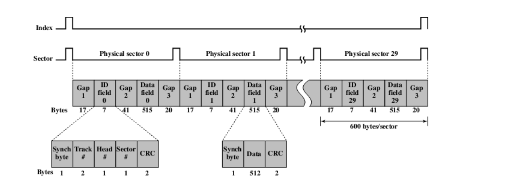
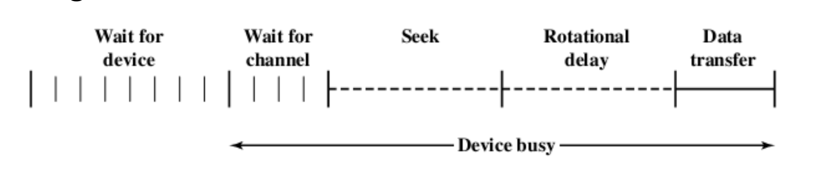

# 计组

## cache

### direct mapping

优点：寻找，写入比较快

缺点：当cache比较小时，很多块会对应同一行，所以会反复对同一行内容进行修改，发生抖动

### associate mapping 

内存能够加载到cache中的所有的行中

优点：能够避免抖动的发生

寻找方法：跟替换策略有关

### set aassociative mapping

- 将cache分成很多组，则该行对应到某一确定的组，但在组内定义到每行是随机的（相当于先直接映射，再随机映射）

- 四路组、二路组等的名称来源于一个组分为多少个块

- 组号不需要储存——原因类似于直接映射，中间一位为组中号

相关性：每一行在cache中可以存放的位置

### 地址计算方式：

计算tag:在地址最低的几位中，先去掉一行中的地址数所占用的数，再去掉取模的几位（这几位的行号是在对应过程中可以被省略），最后的剩余的即为tag

### 替换算法：

（对于associate mapping 和set associate mapping算法，需要替换算法来执行随机式的替换）

- 最不可能被用到的cache块，将其替换掉 LRU算法

- FIFO（先进来先被替换掉）

  

- least frequently used（最少使用的被替换掉） LFU算法

- random

### write policy：

- write through

  只要cache一被写过，就与主存联系，写回主存

- write back

  当cache被写过之后，使用dirty bit标记，然后再写回（最小化主存的修改，但控制会很复杂）

### Line size

（确定cache的line size应该为多少时比较合适）

由小变大时，hit 先会变大，因为数据变多（局部性），但再变得更大时，hit会变小（此时不满足局部性了），因为每一块内容很多，替换很频繁，且数据太多寻找很困难

### Number of cache

一级命中了就返回，要是一级没有命中，则寻找二级中的内容，如果命中了，则返回，并且将一块内容写入一级cache，如果二级没有命中，则寻找三级，如果命中了则返回，并且写入一级二级，如果仍然没有命中，则寻找主存内容

## External memory

特性：使用频率不高，因此可以使用外部储存

种类：

- magnetic disk
- optical memory
- magnetic type
- USB flash disk,solid state disk(SSD):flash

### Magnetic disk

软盘：存储容量低

硬盘：硬盘驱动器与硬盘相连:movable head 能够读取磁盘上的信息

#### 磁盘结构：

每个同心圆为一个磁道；每个磁道会分为多个扇区——扇区中所储存的容量是一样大的，一般认为为512b

#### 为保证扇区容量相等，有如下两种排列方式：

- 上面一种：当数据稳定读取时，因为其排列方式，所以读取磁道的角速度是稳定的
- 下面一种：当数据读取稳定时，里面的转动角速度应该更快，才能保证读取扇区相同（分成很多个大环，大环内部角速度相同，大环之间角速度不同）

#### 磁盘微观结构

格式化：加上一些额外数据使磁盘中某些数据不能被访问

#### 磁道访问的时间轴：

- seek 将磁头移到需要到达的磁道
- rotational delay 等待扇区的同步字节旋转到磁头的时间（读的时候旋转比写的时候快时，会造成扇区容易错过，需要再等一圈）
- data transfer 数据的传输时间 num of bytes to be tranfered/(num of bytes on the track*rotation speed)

#### 磁盘储存方式：

- 文件储存在连续的扇区内
- 文件随机储存

#### 寻道方式：

- FCFS first com first service(能够严格保证最开始的数据最先处理，但可能寻址很远)
- SSTF shortest seek time first(提高效率，但可能会有数据始终没有被处理或者很久以后才被处理)
- SCAN 从磁道0-n(来回扫描)
- C-SCAN 从磁道n-0（从0-n的过程为放空）
- LOOK 来回扫描但不一定到头

### optical disk

光盘结构：

两面均为光滑的，中间的金属盘不平

1. CD
2. CD-ROM(能够通过特定的仪器修改印错的内容)
3. CD-RW
4. CD-R
5. DVD 可以刻印两面