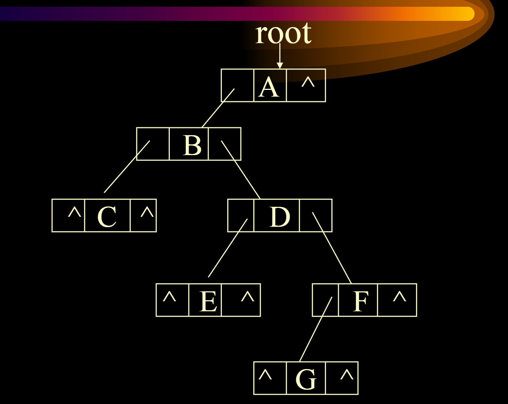

# 数据结构笔记

### 链表：

- List：线性表（每个元素的类型必须相同）——list基本操作与java中ArrayList基本相同
- simple array implementation of list——insert/removing
- Linked List——在java中由引用来使用link(link中的remove直接改变指针的指向即可)

listnode 代码

linkedListItr 链表游标——当前指针指向

linkedList类只含有一个全局变量，为header，若为带表头节点，则header指向表头节点，若为不带表头节点，则header指向第一个数据节点

通过游标遍历单链表：

双向链表：每个节点有两个指针，一个指针指向上一个节点，一个指针指向下一个节点，能够平均提升一倍的速度，但增加内存消耗

循环链表：最后一个指针指向第一个节点

##### 约瑟夫问题：

循环单链表=>每走m个next则将所在的次序退出，且输出该节点的序号=>到最后一个节点时结束

##### 多项式表示方法：

1. 用数组表示，每个数组单元的Index为多项式的次方，里面的值为多项式该次方的系数

   加法：

   

   乘法：

   

2. 用链表表示

   加法操作：

   

##### 静态链表：

链表的连接方式由程序员管理（管理内存所有空间）

- 初始化：将所有数据块串成单链表
- 分配内存：分配内存给对象后，将分配的内从从单链表中去除

##### 基数排序：

先把个位排序，通过链表储存，先进先出后，再把十位排序，把百位排序（同样方法），完成最终排序

### 栈：

#### 单链表：尾部为栈底，头部为栈顶

pick操作，取出数据，删掉top数据

#### 数组实现栈：

- 当有两个栈时，可以用同一块内存空间来放两个栈，一个起点为数组0位，一个起点为数组末端

#### 应用：括号matching 

基本逻辑为将左括号先push进栈中，然后遇到右括号时，将最近的一个左括号和此右括号进行匹配，匹配完即可

#### 应用：expression evaluation

- 中缀表达式和后缀表达式：操作符出现在操作数的中间和末尾

- 后缀表达式，不需要写括号，可直接通过栈处理

- 遇到操作数就直接进栈，遇到后缀操作符就取出两个值计算，计算完了之后再进栈

  

- 中缀表达式怎么转后缀表达式：

  

  
  
  （遇到操作数直接输出而遇到操作符不输出是因为操作符的另一半还没有被扫描到）
  
  （对于'('如果在栈中，则优先级为低优先级（为了防止提早弹出），但如果‘（’为当前符号，则为高优先级（防止栈中符号弹出））
  
  
  
  （对于所有的‘）’都弹到知道遇到‘（’，如果不是的话则比较优先级选择是否弹出，‘（’有两个优先级，然后直到当前的符号的优先级大于栈顶的优先级，再将最后pop出的栈顶元素压栈，当前元素压栈）
  
  

### 队列：

#### 队列的进队与出队：

- 出队：back=back+1 front=front+1都是O（1）的复杂度

- 

  将数组变为一个圈，实现方法为：

  

#### 应用：队列打印杨辉三角

（基本逻辑为：保证每一行的数都进入，然后打印出下一行的值，同时将下一行的值储存进队列中，最后打印成整个三角）

（不用队列实现时直接用二维数组实现，每一行的某个数字由上一行的对应数字相加而来）

#### 应用：路径寻找

主要分为两个过程，第一个过程为从a开始寻找到b的路径，按照到a的距离标号，然后从b开始回溯，每一次都找标号更小的位置

基本逻辑为：不断的在队列当中增加格子，当一个格子的所有四个方向已经全部被搜索完之后，删除队列中的该格子，然后再将视角换位下个队列中的格子，直到到达最后的终点

### 树：

#### 定义：

空树/树根+子树

degree of the node:the children is has

degree of the tree:the maximum of the degree of node in the tree

leaf/branch:the degree is 0/not 0

level:the root :0 		the elelment:the level of its parent +1

depth of the tree:the maximum of the level

#### Binary tree:

根节点+每个节点有左树和右树

##### 二叉树性质：

1. 二叉树有N个节点的时候，必然有N-1条边
2. 二叉树的第i层最多有2的i次方个节点
3. 二叉树高度为h，最少的节点数为h+1,最多的节点数为2h+1-1
4. 二叉树的叶的个数为n，二叉树中度为2的节点个数为n2,则有n=n2+1
5. 如果一个二叉树含有N个节点，高度最多为N-1,最少为[log2(n+1)]-1

##### 满二叉树：

高度为h时，节点数为2h+1-1

满二叉树标号：从高到低，从左到右递增

##### 完全二叉树：

对于满二叉树从标号的最后开始删除节点，得到的树为完全二叉树

###### 性质：

1. 完全二叉树中，对于任意i>0，其父节点的标号为[(i-1)/2]
2. 对于一个节点，其左子节点的标号为2i+1，如果2i+1>=n，则没有左子节点

##### 二叉树的实现：

1. 数组实现完全二叉树：按照标号储存进数组（调用左子节点和右子节点是通过2i+1,2i+2）

2. 非完全二叉树：在完全二叉树的表示中空出对应的节点

3. 链表表示二叉树

   

##### 二叉树的基本实现：

###### 二叉树创建：

###### 遍历二叉树：

VLR,LVR,LRV（递归访问）

preorder,inorder,postorder，level order

preorder:

inorder:

postorder类似

level order：

如果按数组方式实现：则直接下标递增再访问即可

如果按链表实现队列：FIFO队列，上一层先进入，在下一层使用时调用上一层的子节点，再将上一层节点排出，下一层节点进入

使用非递归方法实现中序遍历：

基本逻辑为：直到最左边的左子树为空的时候对于该节点，输出它的值，然后p调用他的右子树，重复这一过程。

使用非递归方法使用后序遍历：

基本逻辑为：P不为空时，一直将p导入进p的左子树，直到左子树为空，判断这个节点是不是右子树遍历完才回来的，如果是，则处理掉这个节点，同时调用他的上一个节点，直到上层节点的该节点是从左子树返回的，再将p指为其右子树，并将该节点设成tag为一。

###### 如何建立二叉树：

- 利用先序，中序唯一构造二叉树

  

- 利用二叉树的广义表示来构造一棵二叉树

  

- 利用二叉树的后缀表示来表示一棵二叉树

  

通过先序遍历和中序遍历的字符串构建二叉树：

- 基本逻辑为：通过先序遍历串确定树根，然后将t的左子树进行递归，将t的右子树进行递归
- 通过先序遍历和后序遍历/中序遍历和后序遍历也可以构建二叉树
- 通过这些方式构建的二叉树可能不唯一

##### 二叉树应用

###### 树的储存方式：

- 广义表示法为括号中为其子节点
- 双亲表示法为一个元素的element的值为其父节点
- 左子女——右兄弟表示法为左节点即为其子节点，其height加一，右节点为平行节点

###### 左子女右兄弟表示法的实现：

添加节点

遍历到其父节点，如果其父节点没有有左节点，则将该节点添加到其左节点，如果其父节点有左节点，则将从左节点开始沿着右节点走，直到最后，添加该节点

###### 创建多棵树：

先将各个树通过“左子女——右兄弟”的表示方法排列，再将其通过根节点的右节点联系起来

###### 树的遍历：

1. 深度优先遍历

   - 先序优先遍历

   - 后序优先遍历（后序遍历的顺序和将该树转化为左子女右兄弟之后的二叉树的中序遍历顺序相同）

2. 广度优先遍历

   宽度有限：先将每一层的所有节点遍历完，再深入下一层

###### 森林的遍历：

将森林转化为左子女右兄弟的二叉树，然后遍历二叉树

###### Thread Tree：线索化树

希望给节点一个额外的数据，直接指向中序遍历或者先序遍历的下一个节点，不需要用递归实现

- n个节点有2n个链域，且实际使用的只有n-1个链域

- 将右节点为null的设为中序遍历下一个节点的指针，左节点为null的设为中序遍历上一个节点的指针

- 需要标记——是原节点的指针还是中序遍历的指针（增加标记域）

  

- 中序线索化树的遍历：如果有线索，就根据其线索走，如果没有线索，则找其右节点的最左节点即可

  

  

- 对于已知二叉树构建中序遍历线索树

  将其通过中序遍历，但要保留一个pre游标，游标中始终为该节点的中序遍历前一个节点的指针，当左节点为null时，填充pre

###### 霍夫曼树：

1. 增长数的概念
   - 使二叉树的所有节点度数为2，新增加的全为叶节点，新增加的全为外节点，原来的节点全为内节点
   - 外通路的长度：根节点到每个叶节点的长度的总和
   - 内通路的长度：根节点到原树的长度的总和
   - 带权重的通路长度：每个节点可以设置权重，再来算通路的总长度
   
2. 霍夫曼树的目标：构建一个加权的外通路长度最短的树（给了叶节点的数量，对于一棵完全二叉树，其所有节点的数量是固定的）

3. 霍夫曼树的算法：
   - 先将权重从小到大排序
   - 将最小的两个权重做成一棵子树，将其放入权重排序中
   - 再取最小的两个权重做成子树，重复进行该过程，直到整个树建成
   
4. 霍夫曼编码

   

   

   译码过程为直接对于译码树开始解释，走到最后的叶子后，再开始下一个字符的译码（不需要做修饰）

### 搜索树：

#### Binary Search Tree

##### 二叉搜索树满足条件：

- 每个节点的key值是不相同的
- 每个节点左子树的每个key值比树根小，右子树的每个key值比树根大

##### Indexed binary search tree:

每个携带特殊内容：左子树的节点数+1，其实即为在整个二叉树中的Index大小

##### 查找算法:

每次去比较要查找的节点和该节点的值的大小

##### 插入算法：

- 如果二叉树为空树，直接往节点上增加
- 如果二叉树不为空树，递归查询（比树根的值大插入左子树中，比树根的值小插入右子树中）

##### 删除算法：

- 删除节点是树叶，则直接删除
- 删除节点有一个子节点，则用其子节点直接替代
- 删除节点有两个子节点，则用其左子树的最右边一个节点代替它（即刚好大于它的一个节点）

##### 复杂度

（时间复杂度主要由树高判断）

二叉搜索树的形状不能够自主控制：

- 时间复杂度可能变成O(n)，如果二叉树的形状为一条直线
- 时间复杂度可能变成O(log2n)，如果二叉树的形状为一棵平衡的树

#### AVL树（自平衡二叉树）

##### 定义

- 二叉搜索树
- 任意节点的左子树和右子树高度差不超过1

##### 数据结构

其中有一个平衡因子——高度差

时间的复杂度也是log2级别的

##### AVL树保持平衡的方法：

1. 左旋：

   

2. 先右旋，再左旋

   

- 破坏平衡性的节点添加如果在树的外沿，就需要旋转一次/如果在树的中间，就需要旋转两次

- 调整的方式是从最小不平等子树中，通过逐个回溯的形式做左旋或者右旋调整）

- 旋转的方式是往下看两层来判断是内侧还是外侧

##### AVL插入

基本逻辑为：递归插入在左子树上，此时左子树应该为平衡的，然后看根节点，如果根节点的左子树比右子树的高度差为2，则如果插入在左子树的左子树上，单旋，如果插入在左子树的右子树上，双旋

##### AVL删除

- 删除叶节点

  1. 如果删除叶节点后该子树的高度会不会减一，则不需要调整
  2. 如果删除之后子树的高度加一次，因此可能会影响该节点的根节点到树的根节点等一系列的节点子树高，因此需要进行一系列的调整（回溯保持平衡）

- 删除根节点

  1. 首先根据二叉树的删除做替换
  2. 原子树相当于删除了一个叶节点

  

#### B-trees

##### m路搜索树

每一个节点放不超过m-1个关键码的值，关键码之间两两有一个指针，因此有m个指针

每个节点中的关键码值储存为——从k1到kp从小到大排列

###### 插入

直接插入，如果满了之后则添加一个key的子树

###### 删除

直接删除一个key值，如果此时要删掉一个叶节点，则删除该叶节点;如果此时要删除一个根节点，则删除该根节点并将其左子树的最大值或者右子树的最大值替代原位置

最多节点数：

最少节点数：h

##### B树

###### 性质

在m路的搜索树上满足：

1. 所有的外节点在同一层
2. 根节点至少有两个key值
3. 每个节点最少有（m/2）向上取整个key值

###### 二阶B树

必然是一棵满二叉树

###### 三阶B树

每个节点中必然含有一个key值或者两个key值

- 外节点树=B树总key值数加1

###### 查询

和m路搜索树的查询算法相同

###### 节点个数：

最少情况——节点最少，高度最高的情况（第一层仅有两个key值，其余层节点数最少）

Key值为n时，二叉树的高度范围：

###### 插入

1. 先做一次查询，找到插入的位置

   B树的叶节点：最下层的节点的key值

2. （当B树的节点key值不满时）直接插入

3. （当B树的节点key值满后）拆成两个节点插入，即将B树的该节点裂成两个节点，然后上一层增加一个关键码值，使得叶节点有多个

4. 当在插入的过程中需要增加树根数时，处理方法为将树根再次拔高，增加树的高度，形成一个新的树根

   

   

算法分析

h（读取h个节点）+2s（将节点分开的次数）+1（写新的节点）

###### 删除

1. 删除叶节点key值

   - 如果删除key值后叶节点的key值过少，则向相邻节点（借）
   - （借）的过程为，将最大的key值拉上去，将上节点的key值拉下来，如果相邻节点也无法借节点，则将其与相邻节点合并（父节点的一个key值被拉下来）
2. 删除中间节点的Key值

   取左边子树的最大key值来替换被删掉的key值，其余的过程相当于删掉一个叶节点的key值

### Hashing

#### 主要思路

散列表的设计目标：存取数据加快

存取复杂度：

##### 方法：

- 做一次散列函数
- 如果没有冲突解决，即将数据存到散列函数的结果数组中

##### 冲突基本概念：

散列表的一格中有多个数据

装填因子：n（数据总数）/b（散列表长度）

装填因子越大，越可能发生冲突

#### hash函数

##### 取余法

H（key）=key%M

M一般取基本区长度的最大质数:取偶数时冲突率比较大（如果key有一些特殊性质）

##### 平方取中法

H（key）=key2的中间部分

取尽量不易冲突且覆盖所有散列表的部分

##### 乘法杂凑函数

乘一个比较非常见的数，并取其小数部分

M为表长

##### 字符串hash函数

1. 将字符串的ascii码相加，然后对hash散列表的大小取模

2. 使用多项式的方式处理ascii码

   

#### 冲突解决

##### linear probing 

仍然维持散列表是一个线性列表，当原位置被占时，直接在延后位置存

linear probing代码表示

- 由两个数组表示：ht和empty，ht中有一个key E，empty有一个标志位 k（可以通过对象来扩展数组，也可以用两个数组来表示）
- 当ht的相应位置元素不有效时，empty的相应位置为true

线性探测快速探测容易发生堆积

##### Quadratic probing

二次探测：在探测时，如果有冲突发生，则向后探测1,4,9...等位置，即向后探测平方项的探测，防止堆积过于密集造成复杂度过高

java实现方式：

寻找元素：

但是如上代码会在哈希表为full且元素不在哈希表中时出现死循环

##### double hashing 

当第一个散列函数冲突时，即取第二个散列函数（使得两个散列函数的重复程度很低）

##### rehashing

一般来说散列表很少放满（很多空间浪费），但时间复杂度理论上降低到O（n）

rehashing的过程：

当原数组快满时，增加散列表的容量

##### Seperating chaining

在散列表的数组中，每个数组为一个链表的开头指针来实现冲突的解决

### Priority queue

每个元素都有一个优先级的队列，元素进队时有一个优先级，出队时出优先级最小/大的元素

#### Linear list representation

- 每次加入时在末端加入元素O(1)
- 每次取数据时复杂度为O（n），相当于做一轮Max

#### heap

##### 定义

- 完全二叉树
- 有最大堆和最小堆
- 对于最大堆有：二叉树的每个节点都对应优先级，每个节点的优先级都比子树的优先级大或相等，最小堆类似

堆保存成一个数组的形式，完全二叉树在数组中的储存形式为广度优先

##### 插入操作

先将数据插入到二叉树的最后，然后跟父节点比，如果比父节点大，就上浮（迭代进行该操作）

代码操作如下，具体逻辑其实为和父节点比较，在数组中即为i和i/2比较然后判断是否交换

##### 删除操作

将根节点拿掉，然后将数组的最后一个元素来替换根节点，然后进行下滤（先比较左子节点和右子节点，将节点和比较大的节点进行替换，递归进行此操作直到该节点重新形成这个堆）

##### 初始化堆

开始下标为n/2，从2/n到1的每个节点分别进行下滤

