columbia university

录取的话感觉今年又扩招了，大概250-300人，国人有50-60%的样子，印度人有30-40%。录取比较偏好名校高三维的同学，88+105+325就挺有希望的。感觉身边厉害的同学很多，陆本来自清北华五北邮北航的同学不少，还有很多很多的海本。

CMU

CMU INI MSIT—MOB是CMU INI (Information Networking Institute)的项目之一，INI主要分为

- MSIT (M.S. in Information Technology)(项目主要优势为第一年在匹兹堡，第二年在硅谷，就业很好)
- MSIN (M.S. in Information Networking) MSIT又分3个子track: MSIT-Mob (Mobility), MSIT-IS (Information Securuity)和MSIT-SM (Software Management)。CMU INI 的强项是Information Securuity  (选课自由度比较高，工学院毕业，经济学有必修学分（我觉得挺好？）)
- MSIS
- MISM（这玩意好像在澳洲的一个校区？）

CMU ISR——institute for software engneering 

- Master of Software Engineering - Scalable Systems (MSE-SS)
- Master of Software Engineering - Embedded Systems (MSE-ES)
- ~~private engneering (MSIT-PE)~~

CMU LTI——language and information

- MCDS 主要为data analysis和system方面，难申请（GPA90+）
- MIIS
- BIC项目，隶属于CMU的LTI和SCS项目组，主要内容为计算机学院的核心课程，待遇不错（纯professional项目）（√）

CMU——human computer interaction institute

- MHIC 注重人机交互方面，代码量不大，重点在用户研究和交互上，申请竞争较大，背景复杂，一年制

CMU——SE SV

三个track:software engeering/design/analysis/systems（课程有比较大的项目工程量，能够很好地积累项目经验，出路会有Linkedin,Google,Facebook等）

可考虑项目：

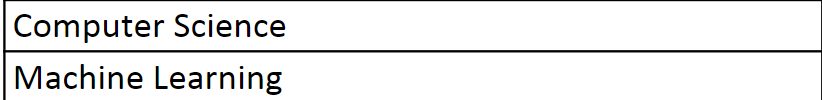

machine learning 毕业率超低，谨慎（人少）

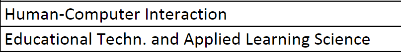

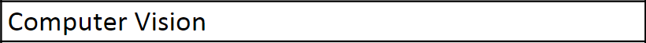

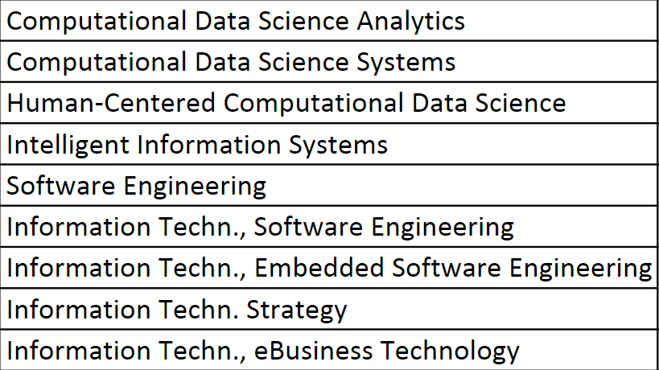

CMU课程积累：

 **Financial Accounting (95-715, 6 units)**：这门课和finance是同一个老师。老师的品行极差，一言难尽。每周一次小测，迟到记为0分。期中期末两次考试。一周一次extra credit，只要按时去上课都能拿满。小测和考试基本是上课内容。身边同学反应拿A不难。
**Principles of Finance(95-716, 6 units)**：拥有跟Accounting一模一样的课程设置，周测，每周一次extra credit。期中期末两次考试，复习PPT和HW即可。
**Economic Analysis(95-710, 6 units)**：老师是Karen Clay，特别喜欢出应用题，结合Eco与具体问题分析。Exam 60%，HW 30%，Quiz则是10%。拿A不难。
**Organizational Design & Implementation(94-700, 6 units)**：这门课有两个版本，David Krackhardt和Lassman。期中期末两次考试，作业是哈佛商学院的案例分析。一次pre，我的小组第一周就被抽到了，之后只需要给其他小组的pre写点评。由于期中期末都是解答题，拿A难度相当大。
**Professional Speaking(95-718, 6 units)：**专业口语，顾名思义，这是一节纯pre课。总共五次个人pre：Convince me，Teach me, 两次Studio，Final。Teach me，教大家做一件事情，譬如喂老鹰，发明新的语言等。Convince me, Studio和Final以围绕一个选题内容展开的。选题比较思辨，譬如如何解决贫穷，如何看待中国社会的诚信机制。抛出的观点必须有evidence作为支撑，这是本课最大的难点。譬如你想论证美国枪击事件频发，你简单援引媒体上“美国2018年大规模枪击事件XXX起”的报道是不充分的。“大规模枪击”的定义是什么？你得弄清楚opinion, truth 和fact的区别。Labash给分慷慨，但随机性大。如果班上native speaker较多，得A会难一些。
**Object Oriented Programming in Java(95-712, 12 units)**：Heinz的必修语言课，总评92.5以上就能拿A。lab是编程题，每周当堂完成。Lecture上每周一次quiz。两次期中一次期末，都是编程题。重点考察java语言基础，而不是数据结构与算法。这门课无论从课程质量还是教学态度上，都非常不错。
**Intermediate Database Management(95-813, 6 units)**：12分的数据库的中阶版本，主要内容是schema和normalization。难度跟本科数据库差不多，但未涉及事务管理、数据库引擎等概念。五次hw和一次final，拿A不难。
**Statistics for IT Management(95-796, 6 units)**：说来惭愧，本科没学过概率论与数理统计。课程难度对于中国学生来说很低，拿A+要少多花些心思，拿A没有难度。补了一下假设性检验和常见概率模型，为下学期上机器学习铺路。

 **Foundation of Computer systems(18-613, 12 units)：**必修课；学院要求必须修研究生课程（课程编号第三位是5以上数字），这门课与15-513，15-213和18-213一起上课。有10节额外的lectures，一次额外实验和期中期末额外一道大题。这门课内容非常丰富，涉及了计算机体系结构，计算机网络，编译原理，操作系统的最基础内容。教材是《深入理解计算机体系结构》。前三次实验不需要写代码，考察位运算，汇编以及栈缓冲区攻击。Cache和proxy比较简单，malloc和shell两次实验花了挺多时间，周耗时18小时左右。
**Introduction to Machine Learning(10-601, 12 units)：**必修课；为了平衡workload而选的课，本以为之前接触过机器学习会学的相当轻松，但课程涵盖的知识点超越预期。从决策树，KNN，线性回归和逻辑回归这类基础统计，讲到神经网络，隐马尔可夫链，增强学习，PAC学习理论。高美丽老师对教学尽心尽力，课程资源安排得紧紧有条。这门课期末会curve，据说一半的同学能拿A。九次作业，5次作业有编程任务，编程语言不限，都是造轮子，自己实现算法。
**Professional Writing(95-717, 6 units)**：必修课；专业写作是指如何写职场邮件，brief summary和proposal。Haylee老师特别强调课堂参与，想拿A-以上的同学，每堂课至少发言一次。不然老师会感受不到你的存在感。Office hour要常去混个脸熟，。这门课拿A-就很不错了，身边大多数中国人是B或B+。
**Design and Implementation of Intelligent Information Systems(11-791, 12 units)**：SCS的LTI下软件工程课，主要教怎么工程化设计智能系统，设计pipeline。前半学期讲[系统设计](http://https//www.educative.io/courses/grokking-the-system-design-interview?affiliate_id=5749180081373184/)，后半学期就是在教室里做project。每个礼拜要present进度，有问题在课堂上随时找老师。Nyberg教授为人nice，也很注重大家水平不大一样。这门课用的是python，自然语言处理一块的内容基本用调包，不用自己写。但这课不太适合之前没接触过软件开发的同学，因为教授只引导方向，不会手把手教具体操作。
**Distributed Systems for Information Systems Management(95-703, 12 units)**：Heinz学院的分布式系统课，教材是《Distributed Systems Concept and Design》。教学按着课本走。六次大作业，涉及HTML网页设计，数字签名与加密，区块链，云应用开发，MapreduceSpark以及JMS。相比于SCS的分布式系统，Heinz版本偏软件工程，更接近实际的企业开发，是学习如何用轮子。期中两次考试占10%和12%，期末占25%。 

 偏应用的课：web应用开发（17637），云计算（15619）
偏系统的课：15213，并行运算（15618），高级云计算（15719），高级存储系统（15746），操作系统（15605），分布式系统（15640，如果你免修我们院的分布式系统的话可以上，不然不推荐上两门重复课），数据库系统（15645，这门课据说是实现一个数据库，不是sql语言课）
偏算法的课：搜索引擎（11642），机器学习（10601or10701）深度学习（11785），计算机视觉（15685）
上面罗列了一些在cmu课程评价不错的课。我们学院修算法或应用课程的比较多。根据你的兴趣来吧。讲真，sde方向修课不如刷题重要。 

科研？（无关系列）： 个人认为选导师的方法就是去ratemyprofessor这个网站去查，如果清一色好评，说明这个老师教学比较好，这样的老师要不就是科研比较差，要不就是比较负责任，个人操守比较好，任何一种都比较少变态。 

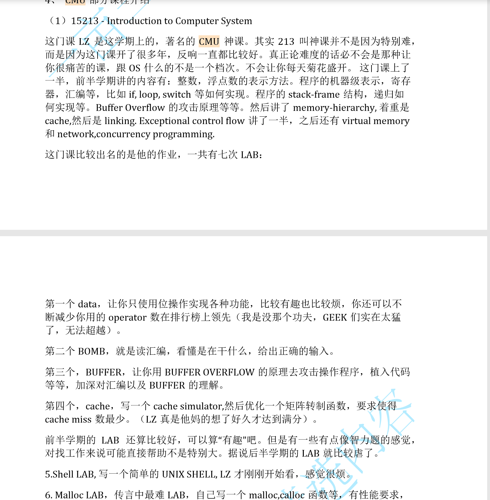

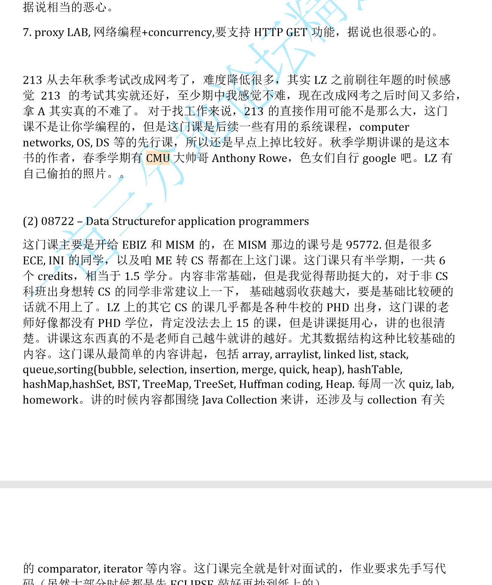

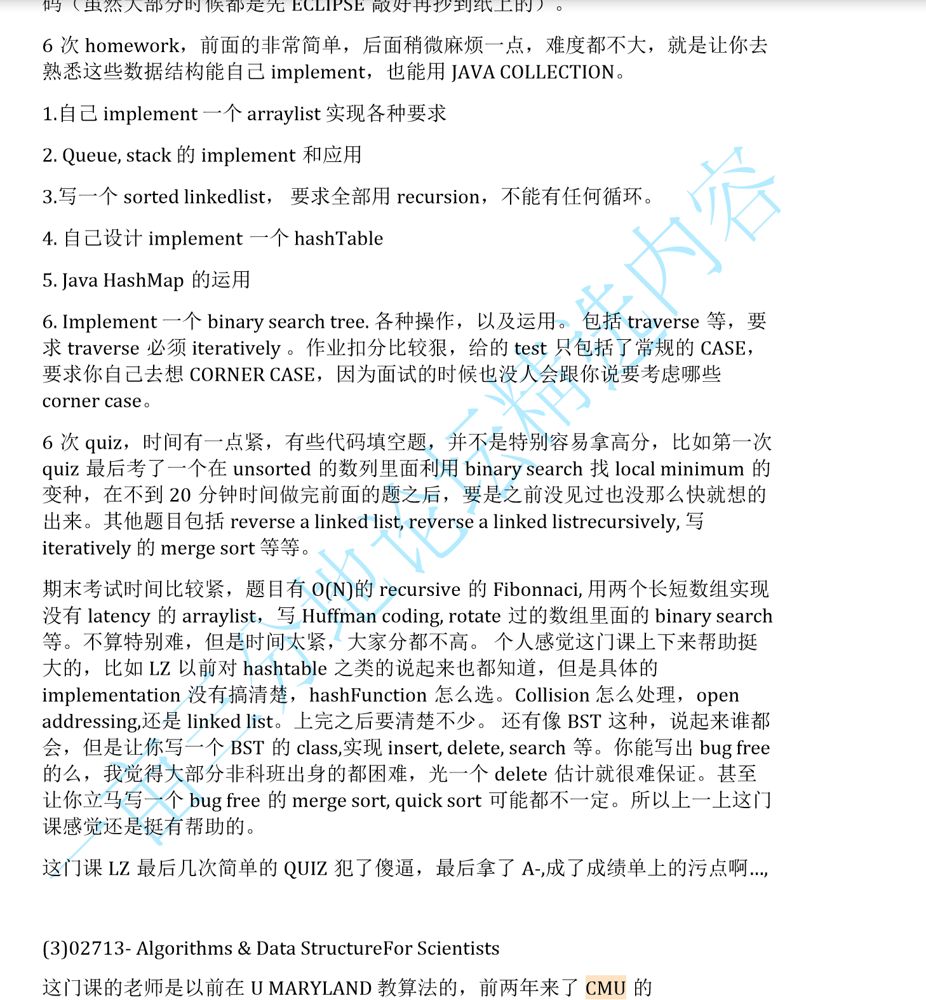

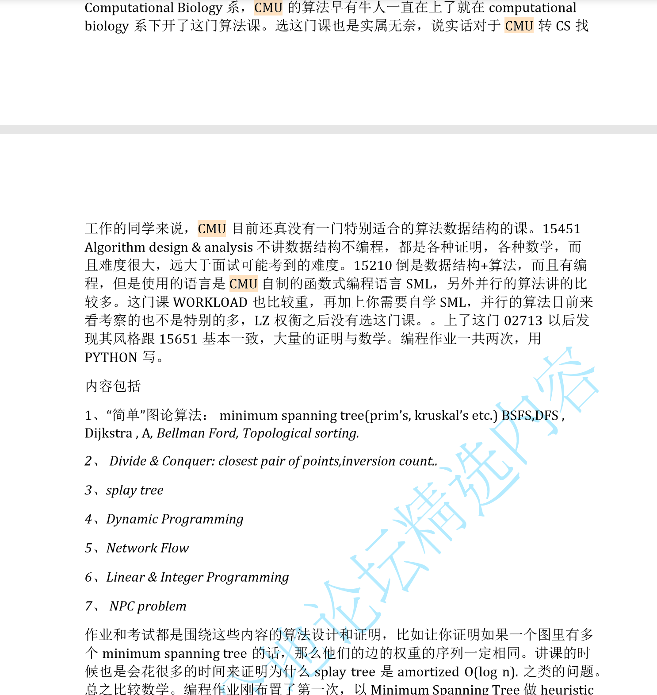

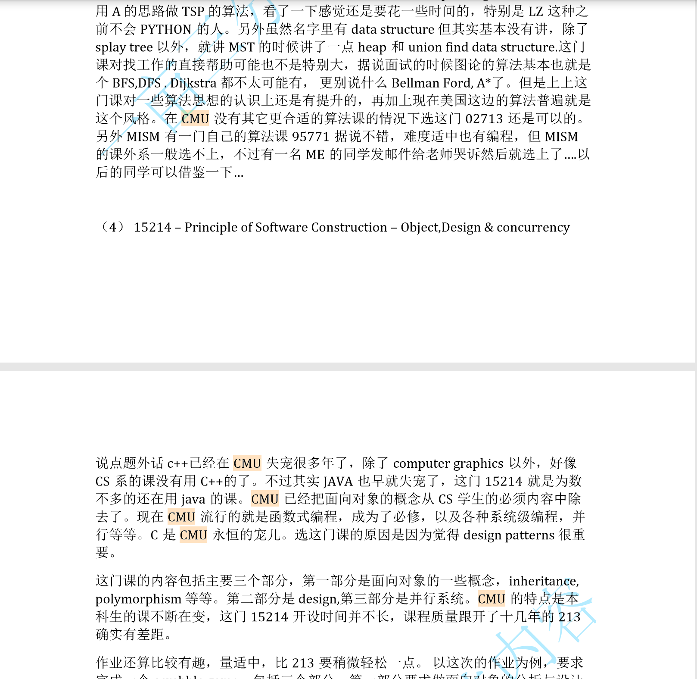

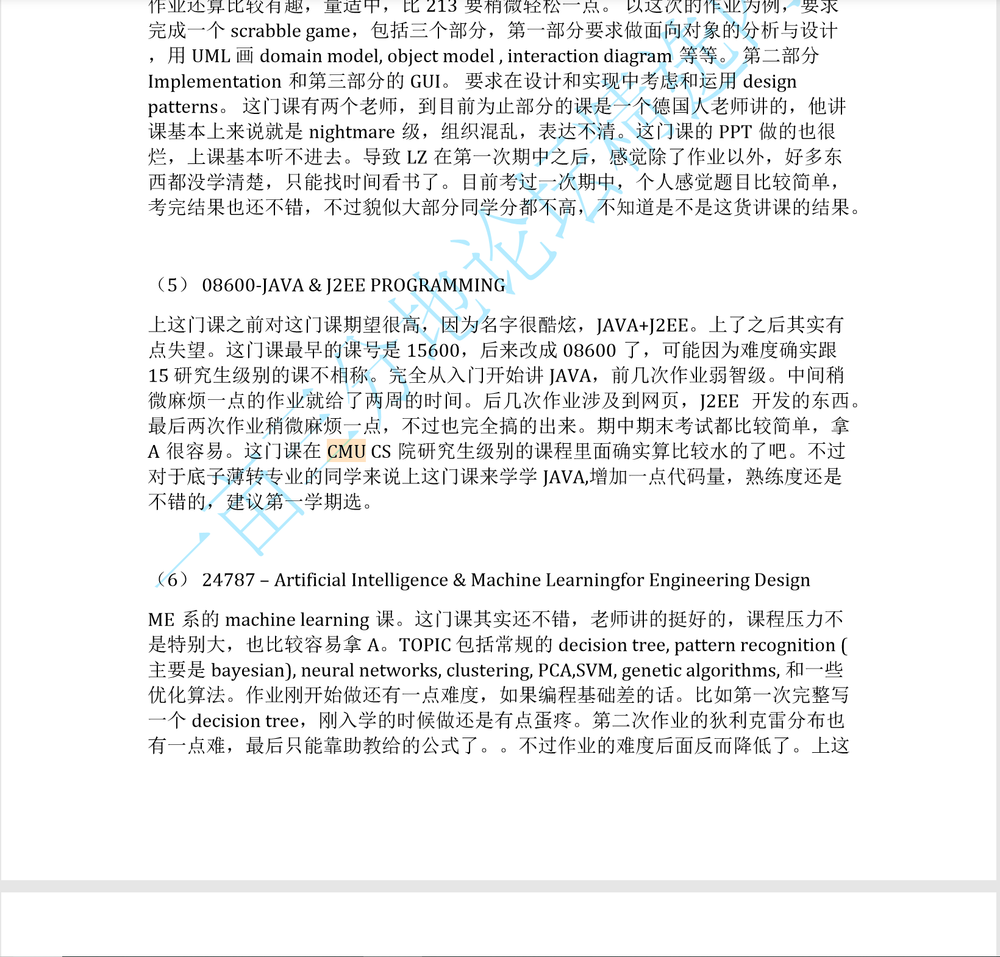

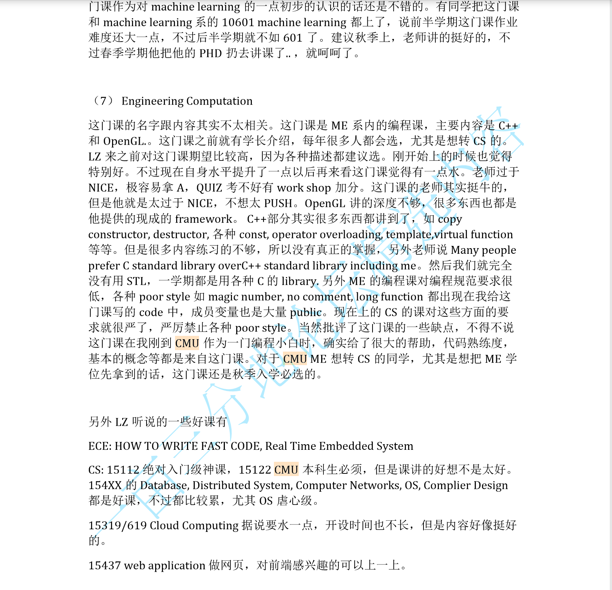

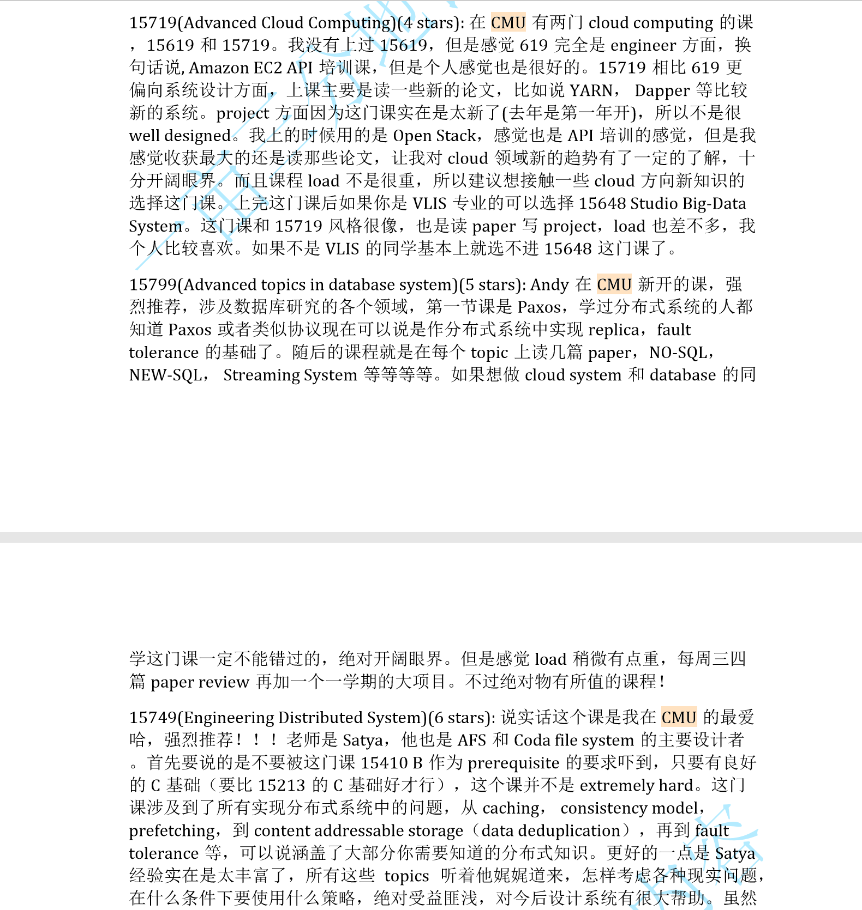

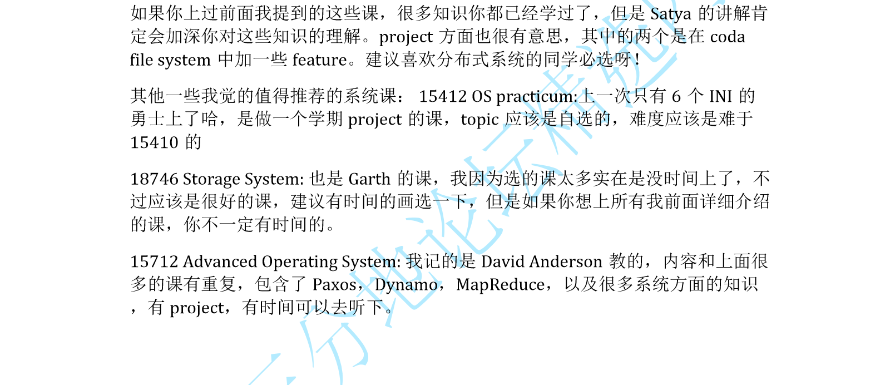